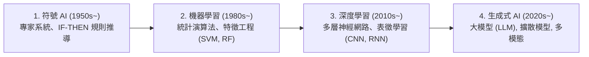

# Ch01 人工智慧導論與大型語言模型 (AI Fundamentals & LLM)

> [!NOTE] 課程資訊與學習目標
> - **授課教師**：温敏淦
> - **核心目標**：理解人工智慧自符號邏輯到生成式 AI 之演進歷程、掌握 ANI / AGI / ASI 智慧階層劃分、深入大型語言模型（LLM）次文字預測與 Transformer 自注意力機制直覺。

---

## 1. 人工智慧演進四大浪潮

---

## 2. 人工智慧智慧層級分類

1. **弱人工智慧 (Artificial Narrow Intelligence, ANI)**：
   - 專門針對單一特定領域任務進行最佳化（例如：AlphaGo 下圍棋、人臉辨識、車牌辨識、語音轉文字）。目前商業落地皆屬於 ANI。
2. **通用人工智慧 (Artificial General Intelligence, AGI)**：
   - 具備跨領域自主學習、推理、規劃與解決問題的能力，達到與成年人類相當的全面智慧水平。
3. **超人工智慧 (Artificial Super Intelligence, ASI)**：
   - 在科學創造、策略規劃、哲學思辨等幾乎所有領域，皆全方位大幅超越全體人類智慧總和的假想智慧形態。

---

## 3. 大型語言模型 (Large Language Models, LLM) 核心直覺

- **自回歸語言模型 (Autoregressive LM)**：核心目標是**「次文字預測 (Next-Token Prediction)」**。給定前方脈絡文字（Context），預測下一個最可能出現的詞元（Token）之機率分佈：
  $$P(w_t \mid w_1, w_2, \dots, w_{t-1})$$
- **Transformer 架構突破**：
  - 放棄了傳統 RNN 必須逐字循序處理的時間限制，實現全序列的大規模 GPU 並行運算。
  - **自注意力機制 (Self-Attention)**：讓模型能動態計算序列中每個詞與其他所有詞之間的語意關聯權重，具備捕捉長距離語意相依的能力。
- **現代 LLM 訓練三大階段**：
  1. **Pre-training (無監督預訓練)**：吞下網際網路數兆詞元文字，學習語言文法與世界知識（耗費數千張 GPU）。
  2. **Supervised Fine-Tuning (SFT / 監督微調)**：以高品質問答對教導模型理解指令格式。
  3. **RLHF (人類反饋強化學習)**：利用獎勵模型（Reward Model）與人類價值觀（安全、誠實、有用）對齊。

---

## 📌 隨堂註記 / 老師口述補充

> [!NOTE] 隨堂筆記區
> - 上課即時補充重點區。
