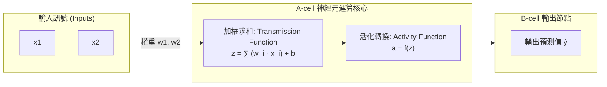
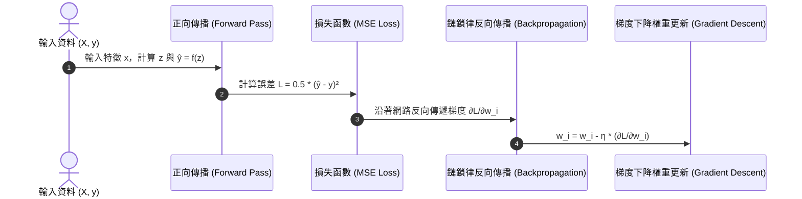

# 🤖 Ch01 Python 語法基礎、開發環境與神經網路傳輸模型

> **授課教師**：溫敏淦 教授  
> **對應教材**：`F1700_ch00.pptx`、`人工智慧簡介.pptx`、課堂手繪原稿 `人工智慧筆記_260920_142102.png`  
> **重點導讀**：聚焦於 Python 核心語法組成規則（敘述、分行、併行、大小寫敏感性）、直譯器執行機制與 IPython/Spyder 工具指令，並深入剖析單一神經元數學傳輸模型（Transmission & Activity Function）、反向傳播（Chain Rule 鏈鎖律）、梯度下降權重更新三部曲及純 Python 手刻神經網路實作。

---

## 📌 1. Python 程式核心組成與語法規則 (Syntax & Rules)

Python 是一種高階、直譯式、動態型別的程式語言。撰寫程式時必須遵循以下基本語法結構與規則：

### 1-1. 程式的最小執行單元：敘述 (Statement)
* **定義**：敘述是直譯器執行指令的最小獨立單位。一行程式碼通常就是一個完整的敘述。
* **常見敘述類別**：
  * **指派敘述 (Assignment Statement)**：如 `x = 10`。
  * **運算敘述 (Expression Statement)**：如 `x + 5`。
  * **函式呼叫敘述 (Call Statement)**：如 `print("你好！Python")`。
  * **複合敘述 (Compound Statement)**：如包含區塊與縮排的 `if`、`for` 結構。

### 1-2. 敘述的分行規則 (Line Continuation)
在 Python 中，通常以換行符號（Newline）作為敘述的結束標誌。若敘述過長或為提高可讀性，需遵守以下兩大分行規則：

#### ① 顯式分行 (Explicit Line Continuation)
* **語法**：使用反斜線 `\` 作為行尾延續字元。
* **規則**：
  * 反斜線可放置於運算子、逗號前後，甚至可直接在字串內部拆行。
  * **嚴格限制**：反斜線 `\` 後方**不得有任何字元（包括空格或 Tab）**，否則會觸發 `SyntaxError: unexpected character after line continuation character`。
* **範例程式**：
```python
# 顯式分行範例：在運算子與字串內部換行
print \
('目前敘述被\
分成', 4, \
'行了')

# 數值長算式分行
total = 100 + \
        200 + \
        300
        
```
> **輸出**：
> ```text
> 目前敘述被分成 4 行了
> ```

#### ② 隱式分行 (Implicit Line Continuation) —— ★ 官方推薦
* **語法**：在小括號 `()`、中括號 `[]` 或大括號 `{}` 內部進行換行。
* **重要規則與優勢**：
  * 括號內的逗號 `,` 之後可以直接換行，不需要額外加上反斜線 `\`。
  * **每行末尾皆可自由加上獨立的 `# 註解`**（顯式分行使用 `\` 時行尾不可加註解）。
* **範例程式**：
```python
# 隱式分行範例：每行後方皆可附加註解
print(1,   # 此種方式在各分行
      2,   # 的後面都可加
      3)   # 註解
```
> **輸出**：
> ```text
> 1 2 3
> ```

---

### 1-3. 敘述的併行規則 (Statement Concatenation)
* **語法**：使用分號 `;` 可將多個獨立敘述寫在同一行。
* **範例程式**：
```python
# 以分號 ; 分隔的多個敘述
print(1); print(2); print(3)
```
> **輸出**：
> ```text
> 1
> 2
> 3
> ```
* **使用守則**：
  * 適合於快速測試或互動式終端機中簡化輸出。
  * 正式專案與 PEP 8 風格規範**強烈建議一行只寫一個敘述**，以確保除錯時行號精準定位。

---

### 1-4. 大小寫敏感性 (Case Sensitivity) 與常見除錯
* **核心規則**：Python 嚴格區分英文大小寫（Case-sensitive）。所有的關鍵字、內建函式及變數名稱，大小寫不同即代表完全不同的物件。
* **經典錯誤示範**：
```python
# 正確寫法：小寫 print
print("Hello World")

# ❌ 錯誤寫法：首字大寫 Print
Print("Hello World")
```
* **報錯訊息剖析**：
```text
NameError: name 'Print' is not defined
```
> **原因分析**：直譯器在目前命名空間中找不到名稱為 `Print` 的函式。內建函式必須全小寫 `print`。

---

## 📌 2. 直譯器機制與開發工具操作 (Interpreter & Tools)

### 2-1. CPython vs IPython 直譯核心
* **CPython**：Python 官方預設直譯器，將 `.py` 原始碼編譯為 Bytecode（位元組碼，快取於 `__pycache__` 的 `.pyc` 檔），再由 Python 虛擬機器 (PVM) 逐行直譯執行。
* **IPython**：CPython 的強化互動版本，也是 **Jupyter Notebook** 與 **Spyder** 的底層直譯核心。

### 2-2. IPython 互動輔助指令
在 IPython 或 Jupyter Notebook 的單元格中，可使用以下高效查詢語法：

| 指令語法 | 功能說明 | 實用範例 |
|:---|:---|:---|
| `?名稱` 或 `名稱?` | 快速查詢物件、函式之簽名、Docstring 說明文件 | `?print` 或 `len?` |
| `??名稱` 或 `名稱??` | 顯示該函式/類別之完整底層原始碼（若可用） | `??math.sin` |
| `Tab` 鍵 | **智慧自動補全**：自動補齊變數名、函式名或列出物件的所有屬性/方法 | 輸入 `pr` 後按 `Tab` 自動列出 `print` |

### 2-3. Anaconda 開發環境核心工具
1. **Spyder 整合開發環境**：
   * **Editor（左側編輯窗格）**：撰寫長篇 `.py` 腳本，具備語法檢查與行號。
   * **Variable Explorer（變數瀏覽窗格）**：即時檢視所有已宣告變數的名稱、型別 (Type)、大小 (Size) 與當前數值 (Value)。
   * **Help 窗格**：選取物件時自動顯示官方 API 說明。
   * **IPython Console（右下控制台）**：交談式命令執行與即時運算測試。
2. **Jupyter Notebook**：
   * 網頁互動式分格執行（`.ipynb` 格式），結合 Markdown 筆記、代碼與視覺化圖表。
   * **核心快捷鍵**：`Shift + Enter`（執行當前 Cell 並跳至下一格）、`Ctrl + Enter`（執行當前 Cell 並停留）。

---

## 📌 3. 單一神經元數學傳輸模型 (Neuron Model)

依據溫敏淦教授課堂架構，單一神經元計算可嚴格拆解為傳輸函數與活化函數：



### 3-1. 加權求和 (Transmission Function)
$$z = \mathbf{w}^T \mathbf{x} + b = \sum_{i=1}^{n} w_i x_i + b$$
* $\mathbf{x} = [x_1, x_2, \dots, x_n]^T$：輸入特徵向量。
* $\mathbf{w} = [w_1, w_2, \dots, w_n]^T$：權重向量（決定輸入對輸出的影響力權重）。
* $b$：偏差值 (Bias，提供平移空間，讓決策邊界不需強行通過原點)。

### 3-2. 活化函數 (Activity Function)
為線性求和結果注入非線性特徵映射能力：
1. **Sigmoid 函數**：
   $$f(z) = \frac{1}{1 + e^{-z}}$$
   * 輸出範圍限制在 $(0, 1)$，常用於二元分類之機率預測。
   * **導數特性**：$f'(z) = f(z) \cdot (1 - f(z))$（微分極為簡潔，利於反向傳播）。
2. **ReLU (Rectified Linear Unit)**：
   $$f(z) = \max(0, z)$$
   * 現代深層網路預設採用，運算快速且在正半區導函數為 $1$，有效緩解梯度消失問題。

---

## 📌 4. 權重微調三部曲：模型學習機制 (Learning Mechanics)

神經網路的訓練本質是透過微積分求解極值，令預測值 $\hat{y}$ 逼近真實標籤 $y$：



### 步驟 1：定義損失函數 (Loss Function)
使用均方誤差 (Mean Squared Error, MSE)：
$$L = \frac{1}{2} (\hat{y} - y)^2$$

### 步驟 2：微積分鏈鎖律反向傳播 (Backpropagation via Chain Rule)
從輸出端依序往前求導（從最後一層向前傳遞）：
$$\frac{\partial L}{\partial w_i} = \frac{\partial L}{\partial \hat{y}} \cdot \frac{\partial \hat{y}}{\partial z} \cdot \frac{\partial z}{\partial w_i}$$
* $\frac{\partial L}{\partial \hat{y}} = \hat{y} - y$
* $\frac{\partial \hat{y}}{\partial z} = f'(z) = \hat{y}(1 - \hat{y})$ （以 Sigmoid 為例）
* $\frac{\partial z}{\partial w_i} = x_i$
* 綜合梯度：
  $$\frac{\partial L}{\partial w_i} = (\hat{y} - y) \cdot \hat{y}(1 - \hat{y}) \cdot x_i$$
  $$\frac{\partial L}{\partial b} = (\hat{y} - y) \cdot \hat{y}(1 - \hat{y})$$

### 步驟 3：梯度下降更新 (Gradient Descent)
利用學習率 $\eta$ (Learning Rate) 沿著負梯度方向修正權重：
$$w_i \leftarrow w_i - \eta \cdot \frac{\partial L}{\partial w_i}$$
$$b \leftarrow b - \eta \cdot \frac{\partial L}{\partial b}$$

---

## 📌 5. 純 Python 手刻單一神經元演算法完整實作

本範例展示不用任何高階框架（如 PyTorch、TensorFlow），僅用純 Python 實作正向傳播、鏈鎖律與權重更新：

```python
# ==============================================================================
# 範例程式 1-1：純 Python 手刻神經元訓練（邏輯 OR 閘分類）
# 說明：驗證正向加權總和、Sigmoid 活化、反向傳播鏈鎖律與梯度下降
# ==============================================================================
import math

class SimpleNeuron:
    """單一神經元學習器"""
    def __init__(self, num_inputs: int, learning_rate: float = 0.5):
        # 1. 初始化權重與偏差
        self.weights = [0.1] * num_inputs
        self.bias = 0.0
        self.lr = learning_rate
        self.inputs = []
        self.z = 0.0
        self.output = 0.0

    @staticmethod
    def sigmoid(z: float) -> float:
        """Sigmoid 活化函數 (含數值防溢位裁剪)"""
        z_clamped = max(min(z, 50.0), -50.0)
        return 1.0 / (1.0 + math.exp(-z_clamped))

    @staticmethod
    def sigmoid_derivative(output: float) -> float:
        """Sigmoid 導數：f'(z) = output * (1 - output)"""
        return output * (1.0 - output)

    def forward(self, inputs: list[float]) -> float:
        """正向傳播 (Forward Pass)：計算加權總和與活化輸出"""
        self.inputs = inputs
        # 加權求和 (Transmission Function)
        self.z = sum(w * x for w, x in zip(self.weights, inputs)) + self.bias
        # 活化輸出 (Activity Function)
        self.output = self.sigmoid(self.z)
        return self.output

    def train_step(self, inputs: list[float], target: float) -> float:
        """單步反向傳播與權重更新 (Backward Pass & Update)"""
        pred = self.forward(inputs)

        # 計算 MSE 損失：L = 0.5 * (pred - target)^2
        loss = 0.5 * (pred - target) ** 2

        # 鏈鎖律求梯度：d_error = (dL/d_output) * (d_output/dz)
        d_error = (pred - target) * self.sigmoid_derivative(pred)

        # 梯度下降更新權重：w_i = w_i - lr * (d_error * x_i)
        for i in range(len(self.weights)):
            self.weights[i] -= self.lr * d_error * self.inputs[i]
        
        # 梯度下降更新偏差：b = b - lr * d_error
        self.bias -= self.lr * d_error

        return loss

# 測試訓練：訓練神經元學習邏輯 OR 運算規則
if __name__ == "__main__":
    neuron = SimpleNeuron(num_inputs=2, learning_rate=0.5)
    
    # 訓練資料集：(輸入 x1, x2), 目標 y
    dataset = [
        ([0.0, 0.0], 0.0),
        ([0.0, 1.0], 1.0),
        ([1.0, 0.0], 1.0),
        ([1.0, 1.0], 1.0),
    ]

    print("=== 開始神經元反向傳播訓練 (1000 週期) ===")
    for epoch in range(1000):
        total_loss = sum(neuron.train_step(x, y) for x, y in dataset)
        if (epoch + 1) % 200 == 0:
            print(f"Epoch {epoch+1:04d} -> 累積損失 Loss: {total_loss:.6f}")

    print("\n--- 訓練成果驗證 ---")
    for x, y in dataset:
        pred = neuron.forward(x)
        result = "✅ 通過" if round(pred) == y else "❌ 失敗"
        print(f"輸入: {x} -> 目標: {y:.0f} | 預測機率: {pred:.4f} ({result})")
    
    print(f"\n最終學習權重: {[round(w, 4) for w in neuron.weights]}, 偏差: {round(neuron.bias, 4)}")
```

---

## 📌 6. 過擬合問題 (Overfitting) 與正規化對策

* **問題本質**：模型過度擬合訓練集中的雜訊，導致在未見過的測試資料上誤差顯著攀升（泛化能力喪失）。
* **四大經典對策**：
  1. **資料擴增 (Data Augmentation)**：透過幾何旋轉、縮放增加資料多樣性。
  2. **Dropout（隨機丟棄）**：訓練週期中隨機將一定比例神經元輸出置零，迫使網路學習魯棒分散式特徵。
  3. **L1 / L2 正規化 (Weight Decay)**：在損失函數附加權重絕對值或平方和懲罰項，抑制權重極端化。
  4. **提早停止 (Early Stopping)**：監控 Validation Loss，連續多個 Epoch 未改善時終止訓練。

---

## 📌 7. 三大核心深度學習架構特性對比

| 神經網路架構 | 核心運算機制 | 關鍵結構優勢 | 典型應用場景 |
|:---|:---|:---|:---|
| **DNN** (深度全連接網路) | 全連接層矩陣乘法 | 捕捉任意全域非線性特徵關聯 | 結構化數值表格預測、簡單迴歸分類 |
| **CNN** (卷積神經網路) | 局部卷積核 (Kernel) + 池化 (Pooling) | **平移不變性 (Translation Invariance)**、大幅減少參數量 | 影像辨識、目標檢測、車牌辨識 |
| **RNN / LSTM** (循環神經網路) | 時序隱藏狀態 (Hidden State) + 門控機制 | 處理可變長度之時序前後依賴關係 | 自然語言處理、語音識別、股價走勢預測 |
| **Transformer** (注意力模型) | **自注意力機制 (Self-Attention)** | 全平行計算，長程依賴關係建模能力極強 | 現代大型語言模型 (LLM)、多模態生成式 AI |

---

## 📎 課堂手繪原稿對照存檔
> 溫敏淦教授課堂手繪神經網路傳輸與微調模型原圖：
> 
