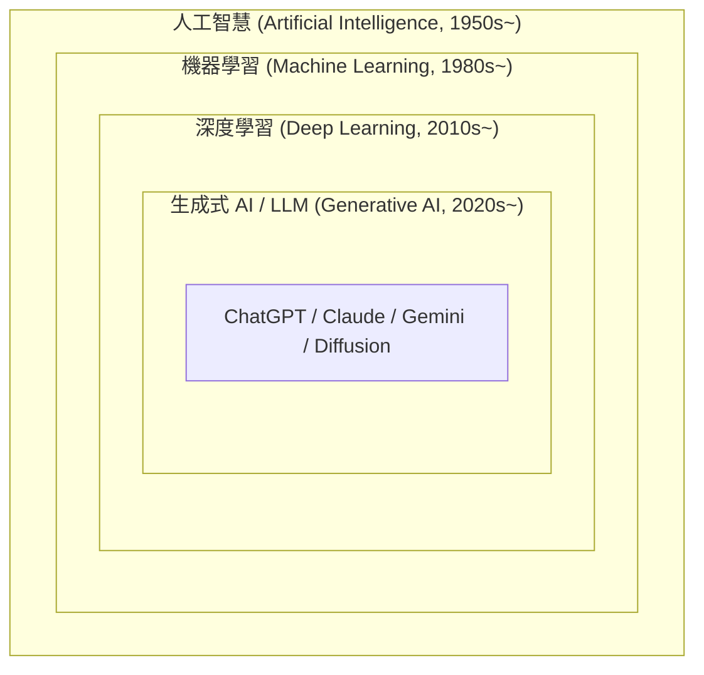
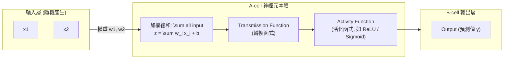

# 🤖 Ch01 人工智慧導論、神經網路架構與開發環境建置

> **授課教師**：溫敏淦 教授  
> **對應簡報**：`F1700_ch00.pptx`、`人工智慧簡介.pptx`、課堂手繪原稿 `人工智慧筆記_260920_142102.png`  
> **重點導讀**：梳理人工智慧三大發展浪潮、機器學習三大類別、神經元數學傳輸模型（A-cell / B-cell / 活化函數）、反向傳播（Chain Rule 鏈鎖律）與梯度下降權重微調三部曲、三大深度學習架構（DNN, CNN, RNN/LSTM, Transformer）、過擬合 (Overfitting) 防護、Anaconda 虛擬環境配置，以及純 Python 手刻神經網路訓練演算法。

---

## 📌 1. 人工智慧 (AI) 的發展脈絡與架構階層



### 三大技術範疇之包含關係：
1. **人工智慧 (Artificial Intelligence, AI)**：
   - 廣義定義：透過計算機模擬人類智能行為的科學（包含早期規則系統、專家系統、啟發式搜尋）。
2. **機器學習 (Machine Learning, ML)**：
   - 「不需顯式編寫所有規則，而是讓電腦從經驗與數據中自我學習模型」。
   - **三大主流分支**：
     - **監督式學習 (Supervised Learning)**：數據具備特徵 $X$ 與標籤 $y$（分類 Classification、迴歸 Regression）。
     - **非監督式學習 (Unsupervised Learning)**：無標籤數據，探索潛在結構（分群 Clustering、降維 PCA）。
     - **強化學習 (Reinforcement Learning)**：代理人 (Agent) 透過與環境 (Environment) 互動獲得獎懲 (Reward) 學習最佳策略 (Policy)。
3. **深度學習 (Deep Learning, DL)**：
   - 以**多層人工神經網路 (Multi-Layer Neural Networks)** 為基礎，自動進行階層式特徵提取（如 CNN 卷積處理影像、RNN/Transformer 處理序列與語言）。
4. **生成式 AI 與大型語言模型 (Generative AI & LLM)**：
   - 運用百億至兆級參數之預訓練模型（如 GPT、Gemini、Llama），具備上下文理解、代碼生成與多模態推論能力。

---

## 📌 2. 單一神經元數學傳輸模型 (Neuron Model)

依據溫敏淦教授課堂手繪架構，單一神經元的運算可拆解為三個連續步驟：



1. **加權總和 (Transmission Function)**：
   $$z = \mathbf{w}^T \mathbf{x} + b = \sum_{i=1}^{n} w_i x_i + b$$
2. **活化函數 (Activity / Activation Function)**：
   為模型注入非線性（Non-linearity）能力（若無活化函數，多層神經網路疊加依然只是單純的線性變換！）。
   - **Sigmoid**：$f(z) = \frac{1}{1 + e^{-z}}$（將輸出壓縮至 $[0, 1]$ 之間，適合二元分類）。
   - **ReLU (Rectified Linear Unit)**：$f(z) = \max(0, z)$（解決深層網路梯度消失 Gradient Vanishing 問題，現代主流）。

---

## 📌 3. 權重微調三部曲：模型如何學習？ (Learning Process)

> [!IMPORTANT] 課堂手繪筆記最精華重點
> 模型的學習目標是：**調整權重 $\mathbf{w}$ 與偏差 $b$，使預測輸出 (Output) 完美逼近真實標籤 (Ground-truth)！**

### 權重調整三部曲：
1. **Loss Function (損失函數)**：
   - 計算預測值 $\hat{y}$ 與真實標籤 $y$ 之間的誤差距離。例如均方誤差 (MSE)：
     $$L = \frac{1}{2} (\hat{y} - y)^2$$
2. **Backpropagation (反向傳播 / 倒傳遞法)**：
   - **核心數學工具：微積分鏈鎖律 (Chain Rule)**。
   - **計算方向：從最後一個神經元依序往前計算（Backward: Output $\rightarrow$ Hidden $\rightarrow$ Input）**：
     $$\frac{\partial L}{\partial w_i} = \frac{\partial L}{\partial \hat{y}} \cdot \frac{\partial \hat{y}}{\partial z} \cdot \frac{\partial z}{\partial w_i} = (\hat{y} - y) \cdot f'(z) \cdot x_i$$
3. **Gradient Descent (梯度下降)**：
   - 沿著梯度的反方向更新權重以最小化損失：
     $$w_i \leftarrow w_i - \eta \cdot \frac{\partial L}{\partial w_i}$$
   - 其中 $\eta$ 為學習率 (Learning Rate)。

---

## 📌 4. 純 Python 手刻神經網路反向傳播實戰

```python
# ==============================================================================
# 範例程式 1-1：純 Python 手刻神經網路訓練（展示正向傳播、鏈鎖律與梯度下降）
# 說明：對應課堂手繪神經元模型，不依賴任何外部深度學習框架
# ==============================================================================
import math

class SimpleNeuron:
    """單一神經元學習器"""
    def __init__(self, num_inputs: int, learning_rate: float = 0.1):
        # 1. 隨機初始化權重與偏置 (A-cell)
        self.weights = [0.2] * num_inputs
        self.bias = 0.1
        self.lr = learning_rate

    @staticmethod
    def sigmoid(z: float) -> float:
        """活化函數 (Activity Function)"""
        return 1.0 / (1.0 + math.exp(-max(min(z, 50), -50)))

    @staticmethod
    def sigmoid_derivative(output: float) -> float:
        """Sigmoid 導數：f'(z) = f(z) * (1 - f(z))"""
        return output * (1.0 - output)

    def forward(self, inputs: list[float]) -> float:
        """正向傳播 (Forward Pass)"""
        # 加權總和 Transmission Function
        self.inputs = inputs
        self.z = sum(w * x for w, x in zip(self.weights, inputs)) + self.bias
        # 活化輸出 B-cell
        self.output = self.sigmoid(self.z)
        return self.output

    def train_step(self, inputs: list[float], target: float) -> float:
        """單步反向傳播與梯度下降權重更新 (Backward Pass & Gradient Descent)"""
        # 1. 正向計算輸出
        pred = self.forward(inputs)

        # 2. 計算損失 (MSE): 0.5 * (pred - target)^2
        loss = 0.5 * (pred - target) ** 2

        # 3. 反向傳播計算梯度 (Chain Rule)
        # dLoss/dOutput = (pred - target)
        # dOutput/dZ = sigmoid_derivative
        d_error = (pred - target) * self.sigmoid_derivative(pred)

        # 4. 梯度下降更新權重與偏置
        for i in range(len(self.weights)):
            # dLoss/dWi = d_error * Xi
            self.weights[i] -= self.lr * d_error * self.inputs[i]
        self.bias -= self.lr * d_error

        return loss

# 測試訓練：學習邏輯 OR 運算
neuron = SimpleNeuron(num_inputs=2, learning_rate=0.5)
training_data = [
    ([0.0, 0.0], 0.0),
    ([0.0, 1.0], 1.0),
    ([1.0, 0.0], 1.0),
    ([1.0, 1.0], 1.0),
]

print("=== 開始神經元反向傳播訓練 (1000 週期) ===")
for epoch in range(1000):
    total_loss = 0.0
    for x, y in training_data:
        total_loss += neuron.train_step(x, y)
    if (epoch + 1) % 200 == 0:
        print(f"週期 {epoch+1:04d} -> 總損失 Loss: {total_loss:.5f}")

print("\n--- 訓練完成預測結果驗證 ---")
for x, y in training_data:
    pred = neuron.forward(x)
    print(f"輸入 {x} -> 目標: {y} | 預測: {pred:.4f} ({'✅ 正確' if round(pred) == y else '❌ 錯誤'})")
```

---

## 📌 5. 過擬合問題 (Overfitting) 與解法

- **痛點**：模型在訓練資料上表現近乎完美，但在未見過的測試資料上誤差極大（過度記憶雜訊，失去泛化能力）。
- **四大核心對策**：
  1. **資料擴增 (Data Augmentation)**：平移、翻轉、縮放增加訓練樣本多元性。
  2. **Dropout（丟棄法）**：在訓練期間隨機讓特定比例（如 20%~50%）的神經元休眠，防止神經元共適應 (Co-adaptation)。
  3. **L1 / L2 權重正規化 (Weight Decay)**：在損失函數中加入懲罰項，抑制權重數值過大。
  4. **提早停止 (Early Stopping)**：當驗證集損失 (Validation Loss) 連續數個週期不再下降時強制終止訓練。

---

## 📌 6. 三大核心深度學習架構比較

| 神經網路架構 | 全名與核心機制 | 關鍵特色與優勢 | 典型應用領域 |
|:---|:---|:---|:---|
| **DNN** | Deep Neural Network (深度神經網路) | 隱藏層彼此**全連接 (Fully Connected)** | 表格型數值資料、基礎分類與迴歸 |
| **CNN** | Convolutional Neural Network (卷積神經網路) | 透過**卷積核 (Kernel)** 萃取局部特徵、**池化 (Pooling)** 降維 | **影像辨識、視訊分析、空間局部特徵** |
| **RNN / LSTM** | Recurrent Neural Network (循環神經網路) | 具備**時序隱藏狀態 (Hidden State)** 與遺忘門/輸入門機制 | **時間序列、股價走勢、語音訊號** |
| **Transformer**| Transformer Architecture | 具備**自注意力 (Self-Attention)** 機制，徹底突破循序運算瓶頸 | **現代大型語言模型 (LLM)、ChatGPT、多模態大模型** |

---

## 📎 課堂手寫原稿對照存檔
> 課堂手寫神經網路模型架構原圖已收錄於 `assets/`：
> ![[人工智慧筆記_260920_142102.png]]
