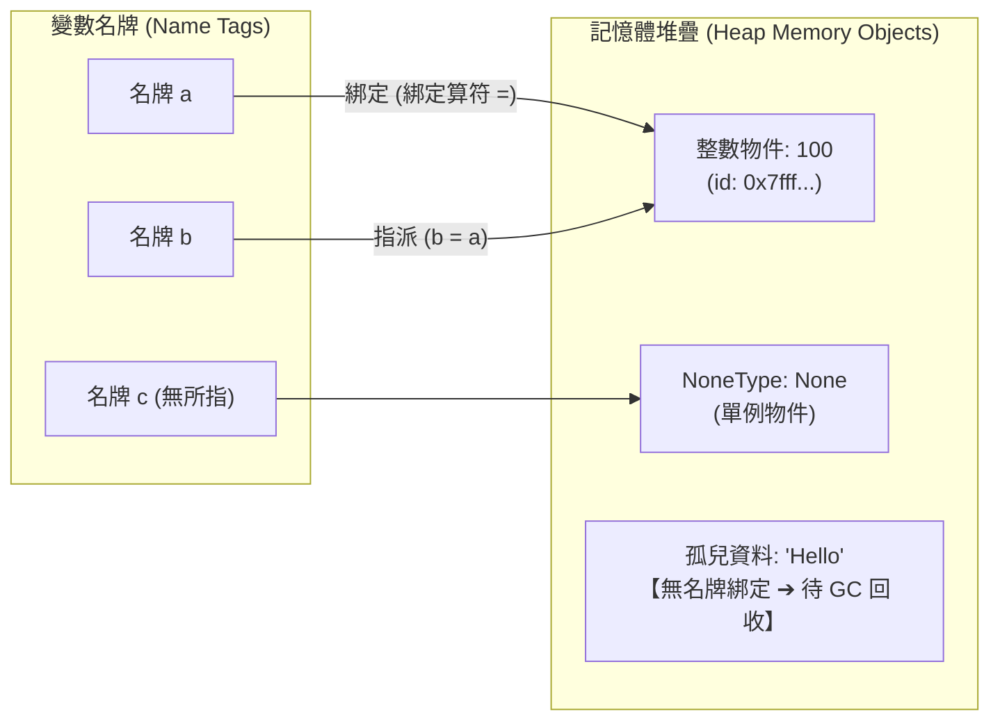
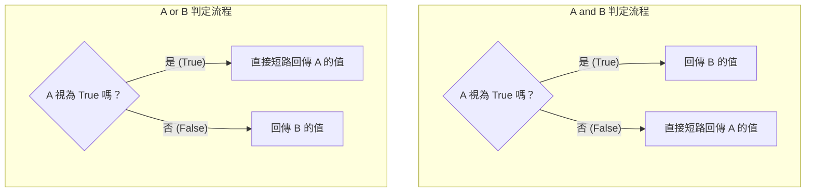

# 🔢 Ch02 Python 資料型別、變數名牌模型與運算子深度指南

> **授課教師**：溫敏淦 教授  
> **對應教材**：`F1700_ch01.pptx`  
> **重點導讀**：聚焦於 Python 資料型別的底層分類、變數「名牌 (Name Tag)」記憶體參考機制、垃圾回收 (Garbage Collector) 與 `id()` 位址檢視、變數命名合法性與保留字限制、顯式/隱式型別轉換規則（真假值 Truthy/Falsy）、算術/比較/邏輯運算子之**非布林短路求值規則**、運算子優先順序表，以及銀行家捨入法 (`round`)、多進制轉換、脫逸字元與位元運算子等進階核心規則。

---

## 📌 1. 資料型別分類與純量型別 (Data Types)

Python 是一種**動態強型別語言 (Dynamically and Strongly Typed)**：
* **動態型別 (Dynamic)**：變數不需要事先宣告資料型別，變數的型別由其所綁定的物件動態決定。
* **強型別 (Strong)**：型別檢查嚴格，不同型別之間不會隨意隱性轉換（例如 `'5' + 5` 會直接拋出 `TypeError`，必須顯式轉換）。

### 1-1. 最基礎的四大純量型別
| 型別名稱 | Python 類別 | 特性說明與範圍 | 範例語法 |
|:---|:---:|:---|:---|
| **整數** | `int` | 任意精度整數（支援無限大位數，僅受限於電腦可用記憶體） | `42`, `-100`, `10**50` |
| **浮點數** | `float` | 雙精度浮點數（遵循 IEEE 754 標準，具備小數點） | `3.14159`, `-0.001`, `1e-4` |
| **布林值** | `bool` | 邏輯真假值，`int` 的子類別（`True` 等價於 1，`False` 等價於 0） | `True`, `False` |
| **字串** | `str` | 不可變（Immutable）的 Unicode 字元序列 | `'Hello'`, `"AI"`, `'''多行'''` |

---

## 📌 2. 變數本質：名牌模型 (Name Tag) 與記憶體機制

在 C 或 Java 等靜態語言中，變數常被比喻為「盒子 (Box)」，數值被放進盒子中；然而在 Python 中：



### 2-1. 名牌綁定與多重參照
1. **指 (綁) 定算符 `=`**：
   * `a = 100` 的本質並非「把 100 塞進 a」，而是「在記憶體中建立一個值為 100 的物件，並把名牌 `a` 貼到該物件上」。
2. **多個名牌綁定同一資料**：
   * 執行 `b = a` 時，是把另一張名牌 `b` 貼在現有物件 100 上，**不會複製兩份 100**。
3. **名牌不綁在任何實體資料上：`None`**：
   * 當名牌暫時不需要綁定有效資料時，其值為 `None`（屬於 `NoneType` 型別，代表「空」或「無」）。
   * `x = None`

### 2-2. 垃圾回收機制 (Garbage Collection, GC)
* **孤兒物件 (Orphaned Object)**：當一塊資料身上的所有名牌都被撕下（例如重新賦值或被刪除），該資料的參考計數 (Reference Count) 降為 0，表示程式再也無法指名存取它。
* **Python 環保車**：Python 直譯器的垃圾回收機制會不定時啟動，自動釋放這些無名牌資料佔用的記憶體空間。

### 2-3. `id()` 函式與記憶體位址
* **`id(object)`**：傳回物件在記憶體中的唯一整數識別碼（在 CPython 中即為物件的記憶體虛擬位址）。
```python
# ==============================================================================
# 範例程式 2-1：名牌模型與 id() 記憶體位址追蹤
# ==============================================================================
a = 100
b = a
print(f"a 的記憶體 id: {id(a)}")
print(f"b 的記憶體 id: {id(b)}")
print(f"a 與 b 是否綁定相同位址: {id(a) == id(b)}")   # True

# 當 a 重新綁定新物件時
a = a + 1
print(f"修改後 a 的新 id: {id(a)}")  # 產生全新位址
print(f"b 的 id 是否保持不變: {id(b)}") # 仍指向原本的 100
```

---

## 📌 3. 變數命名規則與保留字 (Naming Rules & Keywords)

### 3-1. 命名三大合法性規則
1. **合法字元**：只能包含**大小寫英文字母**、**數字**及**底線 `_`**（Python 3 支援中文命名，但業界實務強烈不建議）。
2. **開頭字元**：**第 1 個字元絕對不可為數字**（例如 `1st_score` 為非法語法，`score_1st` 為合法）。
3. **大小寫不同**：變數名稱嚴格區分大小寫（`total`, `Total`, `TOTAL` 是 3 個互不相干的獨立變數）。

### 3-2. 嚴格禁用 Python 保留字 (Keywords)
保留字是 Python 直譯器保留給語法架構使用的特殊單字，**絕對不能作為變數名稱**：

```text
False      await      else       import     pass
None       break      except     in         raise
True       class      finally    is         return
and        continue   for        lambda     try
as         def        from       nonlocal   while
assert     del        global     not        with
async      elif       if         or         yield
```
> [!WARNING] 切勿覆蓋內建函式 (Built-in Shadowing)
> Python 允許將變數命名為內建函式名（例如 `print = 10` 或 `id = "A01"`），但這樣會**覆蓋掉系統內建函式**，導致後續程式呼叫 `print()` 或 `id()` 時引發 `TypeError: 'int' object is not callable` 災難！

### 3-3. 自我詮釋 (Self-documenting) 命名慣例
* 變數名稱應具備描述性（例如用 `student_count` 代替 `sc`，用 `is_authenticated` 代替 `flag`）。
* 多單字組合採用蛇形命名法（Snake Case，如 `max_temperature`）。

---

## 📌 4. 型別轉換規則與真假值判斷 (Type Casting & Truth Value)

### 4-1. 四大顯式型別轉換函式
1. **`int(x)`**：
   * 浮點數轉整數會**直接截斷小數部分（無條件捨去小數）**：`int(3.99) -> 3`、`int(-3.99) -> -3`。
   * 字串轉整數必須為純整數字串：`int("123") -> 123`；傳入 `int("3.14")` 會拋出 `ValueError`！
2. **`float(x)`**：
   * 整數轉浮點數補零：`float(10) -> 10.0`。
   * 支援科學記號字串：`float("1e-3") -> 0.001`。
3. **`str(x)`**：
   * 將任意資料物件轉換為人類可讀的字串表示。
4. **`bool(x)`**：
   * 將數值或容器判定為邏輯真假。

### 4-2. 真假值判定標準 (Truthy vs Falsy)
在 Python 中，所有資料物件都可以轉換為布林值。**只有以下「空」或「零」的狀態會被判定為 `False` (Falsy)，其餘全為 `True` (Truthy)**：

| 資料類別 | 判定為 `False` 的值 (Falsy) | 判定為 `True` 的值 (Truthy) |
|:---|:---|:---|
| **常數值** | `None`, `False` | `True` |
| **數值類** | `0`, `0.0`, `0j` | 任何非零數字（如 `1`, `-5`, `0.001`） |
| **字串類** | `""`（空字串） | 任何非空字串（包含只含空格的 `" "`） |
| **序列與容器** | `[]`（空串列）、`()`（空元組）、`{}`（空字典/空集合） | 任何包含元素之容器 |

---

## 📌 5. 運算子全解析與短路求值規則 (Operators & Short-Circuit)

### 5-1. 算術運算子 (Arithmetic Operators)
| 算符 | 功能名稱 | 語法範例 | 運算結果 | 核心規則 |
|:---:|:---|:---:|:---:|:---|
| `+` | 加法 | `7 + 2` | `9` | 字串使用代表串接 |
| `-` | 減法 | `7 - 2` | `5` | 可作為負號單元算符 |
| `*` | 乘法 | `7 * 2` | `14` | 字串/串列乘整數代表重複倍數 |
| `/` | **真除法** | `7 / 2` | `3.5` | **運算結果保證永遠是浮點數 `float`** |
| `//` | **整數除法 (地板除法)** | `7 // 2` | `3` | 取不大於除法結果的最大整數（向下取整） |
| `%` | **取餘數 (Modulo)** | `7 % 2` | `1` | 常用於檢查奇偶數或循環索引 |
| `**` | **次方 (Power)** | `2 ** 3` | `8` | 優先權極高 |

### 5-2. 比較運算子 (Comparison Operators)
* 符號：`>`、`<`、`>=`、`<=`、`==` (等於)、`!=` (不等於)。
* **字串比較規則**：
  * **從第 0 個字元開始逐一比較其 ASCII / Unicode 數值**，直到分出勝負。
  * 若前綴相同但長度不同，**較短（先結束）的字串比較小**（例如 `'cat' < 'caterpillar'` 為 `True`）。
* **連續比較運算**：Python 支援數學連續不等式 `10 <= x < 20`，等價於 `(10 <= x) and (x < 20)`。

### 5-3. 邏輯運算子與「非布林值」短路求值規則 (Short-Circuit Evaluation)
> [!IMPORTANT] 簡報第 31~34 頁核心考點
> 邏輯運算子 `and` 與 `or` 並非單純回傳 `True` 或 `False`！當運算元不是布林值時，**會直接傳回最後決定結果的運算元本身**。



#### ① `A and B` 運算規則
* 若 $A$ 判定為 `False`，則發生**短路（Short-circuit）**，直譯器**完全不理會 $B$**，直接傳回 $A$。
* 若 $A$ 判定為 `True`，則運算結果取決於 $B$，因此傳回 $B$。
```python
print(0 and 2)        # 輸出: 0 （A 為 False，短路回傳 A）
print(1 and 2)        # 輸出: 2 （A 為 True，回傳 B）
print("" and "apple") # 輸出: ""（空字串為 False，短路回傳 A）
```

#### ② `A or B` 運算規則
* 若 $A$ 判定為 `True`，直接短路傳回 $A$（完全不執行 $B$）。
* 若 $A$ 判定為 `False`，則傳回 $B$。
```python
print(1 or 2)              # 輸出: 1 （A 為 True，短路回傳 A）
print(0 or 2)              # 輸出: 2 （A 為 False，回傳 B）
print("" or "預設值")       # 輸出: '預設值'（常用於簡潔設定預設值！）
```

#### ③ `not A` 運算規則
* `not` 運算子必定將結果轉為標準布林值 `True` 或 `False`。
* `not 0 -> True`，`not "hello" -> False`。

### 5-4. 複合指派算符 (Augmented Assignment)
* 語法：`a op= n` 等價於 `a = a op n`。
* 支援全部算術算符：`+=`, `-=`, `*=`, `/=`, `//=`, `%=`, `**=`。

---

## 📌 6. 運算子優先順序表 (Operator Precedence)

當一個運算式中有多個算符時，直譯器依據以下優先順序由高至低運算：

| 優先權 | 運算子類型 | 符號表示 | 說明 |
|:---:|:---|:---|:---|
| **1（最高）** | **括號分組** | `( )` | 強制最高優先權（程式碼可讀性首選） |
| **2** | **指數次方** | `**` | 右結合性（例：`2**3**2 = 2**9 = 512`） |
| **3** | **正負單元號** | `+x`, `-x`, `~x` | 正號、負號、按位元取反 |
| **4** | **乘除類** | `*`, `/`, `//`, `%` | 乘法、真除法、地板除法、取餘數 |
| **5** | **加減類** | `+`, `-` | 加法、減法 |
| **6** | **位移運算** | `<<`, `>>` | 按位元左移、右移 |
| **7** | **位元 AND** | `&` | 按位元交集 |
| **8** | **位元 XOR** | `^` | 按位元互斥 |
| **9** | **位元 OR** | `\|` | 按位元聯集 |
| **10** | **比較運算** | `==`, `!=`, `<`, `<=`, `>`, `>=`, `is`, `in` | 關係與成員運算 |
| **11** | **邏輯 NOT** | `not` | 邏輯非 |
| **12** | **邏輯 AND** | `and` | 邏輯與 |
| **13** | **邏輯 OR** | `or` | 邏輯或 |
| **14（最低）**| **指派賦值** | `=`, `+=`, `-=`, `*=` 等 | 賦值運算 |

---

## 📌 7. 簡報進階議題：捨入法、進制轉換與字串脫逸

### 7-1. 四捨六入五成雙：`round()` 銀行家捨入法 (Banker's Rounding)
* **核心規則**：當欲捨去的數值**恰好為 5** 時，Python 的 `round()` 會向**最接近的「偶數」**取整（目的是在統計大數據累計時消除向上進位的統計偏差）。
```python
# ==============================================================================
# 範例程式 2-2：銀行家捨入法展示
# ==============================================================================
print(round(1.5))  # 輸出: 2  (向最近偶數 2 取整)
print(round(2.5))  # 輸出: 2  (向最近偶數 2 取整，而非傳統的 3！)
print(round(3.5))  # 輸出: 4  (向最近偶數 4 取整)
print(round(4.5))  # 輸出: 4  (向最近偶數 4 取整，而非 5！)

# 保留特定小數位數
print(round(3.14159, 2))  # 輸出: 3.14
print(round(2.675, 2))    # 輸出: 2.67 (因浮點數二進位微小精度誤差)
```

### 7-2. 脫逸字元 (Escape Characters) 與原始字串 (Raw String)
在字串中若需包含特殊控制字元，需在前面加上反斜線 `\`：
* `\\`：印出反斜線本體 `\`。
* `\'`、`\"`：在引號字串中嵌入單引號或雙引號。
* `\n`：換行 (Line Feed)。
* `\t`：水平定位 Tab (8 字元縮排)。
* `\r`：歸位字元 (Carriage Return)。
* **原始字串 `r"..."` 或 `R"..."`**：
  * **令所有反斜線 `\` 失去脫逸作用**，保持原始字元。
  * 適用場景：Windows 檔案路徑與正規表達式 (Regex)。
```python
# 檔案路徑使用原始字串防止 \ 脫逸
normal_str = "D:\note\test.txt"   # \n 會被當成換行符號！
raw_str    = r"D:\note\test.txt"  # 保留字元原貌，安全無虞
print(raw_str)                    # 輸出: D:\note\test.txt
```

### 7-3. 多進制整數表示與轉換函式
Python 支援四種進制表示法，並提供對應轉換內建函式：
```python
# ==============================================================================
# 範例程式 2-3：多進制整數宣告與相互轉換
# ==============================================================================
# 1. 前綴宣告
b_num = 0b1111   # 二進位 1111 (前綴 0b 或 0B) -> 15
o_num = 0o17     # 八進位 17   (前綴 0o 或 0O) -> 15
h_num = 0x0F     # 十六進位 F  (前綴 0x 或 0X) -> 15

print(f"二進位轉十進位數值: {b_num}") # 15
print(f"八進位轉十進位數值: {o_num}") # 15
print(f"十六進位轉十進位:   {h_num}") # 15

# 2. 轉換函式：將十進位數轉換為進制字串表示
val = 15
print(bin(val))   # 輸出: '0b1111'
print(oct(val))   # 輸出: '0o17'
print(hex(val))   # 輸出: '0xf'
```

### 7-4. 位元運算子 (Bitwise Operators)
直接對整數的二進位位元（Bit）進行底層運算：
| 算符 | 功能 | 規則說明 | 範例 (以 4 位元為例) |
|:---:|:---|:---|:---|
| `&` | 位元 AND | 兩者對應位元皆為 1 時才為 1 | `0b1100 & 0b1010 -> 0b1000` (8) |
| `\|` | 位元 OR | 兩者對應位元任一為 1 即為 1 | `0b1100 \| 0b1010 -> 0b1110` (14) |
| `^` | 位元 XOR | 對應位元相異為 1，相同為 0 | `0b1100 ^ 0b1010 -> 0b0110` (6) |
| `~` | 位元 NOT | 反轉位元符號（等價於 `~x = -(x + 1)`）| `~15 -> -16` |
| `<<` | 左移 (Left Shift) | 位元向左位移 $n$ 格（等價於乘以 $2^n$）| `3 << 2 -> 12` ($3 \times 4$) |
| `>>` | 右移 (Right Shift) | 位元向右位移 $n$ 格（等價於除以 $2^n$ 取地板商）| `16 >> 2 -> 4` ($16 \div 4$) |

---


## 📌 8. 實用數值內建函式速查表

| 函式語法 | 傳回值與功能 | 範例與結果 |
|:---|:---|:---|
| `abs(x)` | 傳回數值 $x$ 之絕對值 | `abs(-15.6) -> 15.6` |
| `pow(x, y [, z])` | 計算 $x^y$（若提供 $z$ 則計算 $(x^y) \pmod z$） | `pow(2, 3) -> 8`, `pow(2, 3, 5) -> 3` |
| `divmod(a, b)` | 同時計算整數商與餘數，傳回元組 `(a // b, a % b)` | `divmod(17, 5) -> (3, 2)` |
| `type(x)` | 傳回資料物件的資料型別類別 | `type(3.14) -> <class 'float'>` |
| `id(x)` | 傳回資料物件在記憶體中的唯一標識位址 | `id(a) -> 14072345...` |
