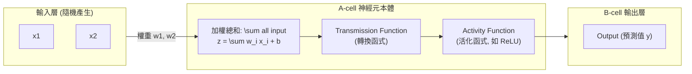

# Ch02 神經網路架構與反向傳播 (Neural Networks & Backpropagation)

> [!NOTE] 課程資訊與學習目標
> - **授課進度**：手寫核心精煉筆記（★ 深度融合課堂手繪圖稿）
> - **核心目標**：精通單一神經元數學傳輸模型、掌握 DNN 拓撲、深入理解反向傳播（Chain Rule 鏈鎖律）與梯度下降權重微調、辨析 CNN、RNN/LSTM 與 Transformer 架構差異、掌握 Overfitting 克服機制。

---

## 1. 單一神經元數學傳輸模型 (Neuron Model)

依據課堂手寫筆記架構，神經元的運算可拆解為三個連續步驟：

- **線性組合**：$z = \mathbf{w}^T \mathbf{x} + b$（其中 $\mathbf{x}$ 為 Input，$y$ 為 Output，$w$ 為權重，$b$ 為偏差 bias）。
- **活化函數 (Activation Function)**：為模型注入非線性（Non-linearity）能力（若無活化函數，多層網路疊加依然只是單純的線性變換！）。常用函數包含 ReLU ($f(z) = \max(0, z)$)、Sigmoid、Tanh。

---

## 2. 權重微調三部曲：模型如何學習？ (Learning Process)

> [!IMPORTANT] 課堂手繪筆記最精華重點（★ 手寫原汁原味）
> 模型的學習目標是：**調整權重，使 Output（預測值）完美達成 Ground-truth（真實標籤）！**

### 權重調整三部曲：
1. **Loss Function (損失函數)**：
   - 計算模型 Output（預測值）與 Ground-truth（真實標籤）之間的誤差距離（如均方誤差 MSE、交叉熵 Cross-Entropy）。
2. **Backpropagation (反向傳播 / 倒傳遞法)**：
   - **核心數學工具：微積分鏈鎖律 (Chain Rule)**。
   - **計算方向：從最後一個神經元依序往前計算（Backward: Output $\rightarrow$ Hidden $\rightarrow$ Input）**。
   - 計算各層權重對總誤差的影響程度（偏微分梯度 $\frac{\partial \text{Loss}}{\partial w}$）。
3. **Gradient Descent (梯度下降)**：
   - 根據計算出的梯度向量，利用優化器（Optimizer，如 SGD、Adam）微調各神經元的權重：
     $$w_{\text{new}} = w_{\text{old}} - \eta \cdot \frac{\partial \text{Loss}}{\partial w}$$
   - 其中 $\eta$ 為學習率（Learning Rate）。

---

## 3. 過度擬合問題 (Overfitting Problem)

- **手寫筆記直指痛點**：
  > *"Overfitting problem: 過度修正 transfer function，無法容錯 $\rightarrow$ 如何學習？"*
- **本質**：模型過度記憶訓練資料中的雜訊與細節，導致在訓練集表現完美，但面對從未見過的測試資料時誤差暴增（缺乏泛化能力）。
- **解法**：
  - 增加訓練資料量與資料擴增（Data Augmentation）。
  - Dropout（隨機讓部分神經元休眠）。
  - L1/L2 權重正規化（Weight Decay）。
  - 提前停止訓練（Early Stopping）。

---

## 4. 三大核心深度學習架構家族比較

| 神經網路架構 | 全名與核心機制 | 關鍵特色與優勢 | 典型應用領域 (手寫標註) |
|:---|:---|:---|:---|
| **DNN** | Deep Neural Network (深度神經網路) | 隱藏層彼此**全連接 (Fully Connected)** | 表格型資料、基礎分類與迴歸 |
| **CNN** | Convolutional Neural Network (卷積神經網路) | 透過**卷積層 (Convolutional Layer)** 萃取局部特徵、**池化層 (Pooling)** 降低維度 | **影像處理、視訊分析、空間局部特徵萃取** |
| **RNN / LSTM** | Recurrent Neural Network (循環神經網路) | 具備**時序隱藏狀態 (Hidden State)** 與門控記憶機制 | **時間序列、語音訊號、具時序前後關聯之資料** |
| **Transformer**| Transformer Architecture | 具備**自注意力 (Self-Attention)** 機制，徹底突破循序運算瓶頸 | **現代大型語言模型 (LLM)、多模態大模型** |

---

## 📎 課堂手寫原稿對照

> [!NOTE] 手寫講義原稿存檔
> 課堂手寫神經網路模型架構原圖已收錄於 `assets/`：
> ![[人工智慧筆記_260920_142102.png]]

---

## 📌 隨堂註記 / 老師口述補充

> [!NOTE] 隨堂筆記區
> - 上課即時補充重點區。
