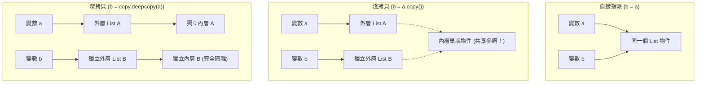

# 📦 Ch03 核心資料結構、序列操作與記憶體模型

> **授課教師**：溫敏淦 教授  
> **對應教材**：`F1700_ch02.pptx`  
> **重點導讀**：系統化解析 Python 四大原生資料結構（串列 List、元組 Tuple、集合 Set、字典 Dict）之語法規範、切片（Slicing）與切片賦值、單元素元組逗號陷阱、元組內嵌可變物件的可變性、雜湊限制 (Hashable / Key 限制)、短路查找、集合運算符與方法、字典更新與安全取值，以及淺拷貝 (Shallow Copy) vs 深拷貝 (Deep Copy) 的底層記憶體參照機制。

---

## 📌 1. 四大內建資料結構特性全景對比

| 資料結構 | 語法宣告表示 | 可變性 (Mutability) | 順序性 (Ordered) | 元素重複性 | 索引方式 | 元素/Key 限制 |
|:---:|:---:|:---:|:---:|:---:|:---:|:---|
| **串列 (List)** | `[1, "a", 3.14]` | **可修改 (Mutable)** | 有序 (保留插入順序) | 允許重複 | 整數索引 `list[i]` | 無限制（可放任何型別） |
| **元組 (Tuple)** | `(1, "a", 3.14)` | **不可修改 (Immutable)** | 有序 (保留插入順序) | 允許重複 | 整數索引 `tuple[i]` | 無限制 |
| **集合 (Set)** | `{1, 2, 3}` | **可修改 (Mutable)** | **無序 (Unordered)** | **唯一（自動去重）** | 無索引（用 `in` 檢查） | **元素必須不可變 (Hashable)** |
| **字典 (Dict)** | `{"k1": v1, "k2": v2}` | **可修改 (Mutable)** | 有序 (3.7+ 保留順序) | **Key 唯一**，Value 可重複 | 鍵索引 `dict[key]` | **Key 必須不可變 (Hashable)** |

---

## 📌 2. 串列 (List)：動態序列與切片賦值

串列是 Python 中最靈活的序列容器，以中括號 `[]` 或建構函式 `list(iterable)` 建立，索引從 `0` 起算。

### 2-1. 索引與切片 (Slicing) 完整規則
* **基本切片**：`list[m:n]` 代表擷取索引 $m \le i < n$ 的子序列（**包含 $m$，不包含 $n$**）。
* **間隔切片**：`list[m:n:k]`，其中 $k$ 代表步進間隔 (Step)。$k$ 為負值代表由尾向首**反向步進**。
* **省略規則**：
  * $m$ 省略：預設從頭（索引 0）開始。
  * $n$ 省略：預設取至末尾。
  * `a[::-1]`：將整個串列快速反轉。

### 2-2. 切片賦值 (Slicing Assignment) —— 批量更新與替換
切片不僅能取值，還能**直接原地更新串列內容**，甚至替換的元素數量可以與原切片長度不相等：
```python
# ==============================================================================
# 範例程式 3-1：切片操作與切片賦值
# ==============================================================================
a = [0, 1, 2, 3, 4, 5]

# 1. 批量替換區間元素
a[1:3] = [88, 99]
print(f"替換 [1:3] 後: {a}")      # [0, 88, 99, 3, 4, 5]

# 2. 長度不等替換（縮短或擴充串列）
a[1:4] = [7]                      # 將 [88, 99, 3] 三個元素縮減替換為單一元素 7
print(f"縮短替換後: {a}")          # [0, 7, 4, 5]

# 3. 用切片將其他容器（元組、字串）的元素插入串列
a[1:1] = ("A", "B")               # 在索引 1 原地插入元素，不刪除任何原元素
print(f"插入元組元素後: {a}")      # [0, 'A', 'B', 7, 4, 5]

# 4. del 敘述刪除切片片段
del a[1:3]                        # 刪除索引 1 到 2 的元素
print(f"del 刪除片段後: {a}")      # [0, 7, 4, 5]
```

### 2-3. 串列專屬核心方法 (Methods)
| 方法名稱 | 語法格式 | 功能說明與核心規則 | 異常情境 (Exception) |
|:---|:---|:---|:---|
| `append(x)` | `a.append(x)` | 將物件 $x$ 作為**單一元素**追加到串列尾端 | 無 |
| `extend(iter)` | `a.extend(iter)`| 遍歷可迭代物件，將其內部元素逐一追加至尾端 | 引數必須為 Iterable |
| `insert(i, x)`| `a.insert(i, x)`| 在指定索引 $i$ 處插入元素 $x$ | 若 $i$ 超出範圍則自動插在頭/尾 |
| `pop([i])` | `item = a.pop(i)`| 取出並刪除索引 $i$ 處的元素（預設 $i=-1$，末尾彈出） | 串列為空時拋 `IndexError` |
| `remove(x)` | `a.remove(x)` | 尋找並刪除**第一個**值等於 $x$ 的元素 | 若 $x$ 不存在拋 `ValueError` |
| `clear()` | `a.clear()` | 清空串列中的所有元素，等價於 `del a[:]` | 無 |
| `index(x)` | `idx = a.index(x)`| 傳回首個值為 $x$ 的元素索引 | 若 $x$ 不存在拋 `ValueError` |
| `count(x)` | `n = a.count(x)` | 計算值為 $x$ 的元素在串列中出現的總次數 | 無 |
| `sort(...)` | `a.sort(reverse=False)` | **原地排序 (In-place)**，無傳回值（回傳 `None`） | 元素間無法比大小時拋 `TypeError` |
| `reverse()` | `a.reverse()` | **原地反轉 (In-place)** 串列順序，無傳回值 | 無 |

> [!WARNING] 注意：原地排序 vs 內建函式排序
> `a.sort()` 是**原地修改**串列本體，傳回值為 `None`；而內建函式 `sorted(a)` 則是**產生一個排序好的全新串列**，原串列 `a` 保持不變！

---

## 📌 3. 元組 (Tuple)：不可變序列與安全機制

元組是不可變 (Immutable) 的序列容器，主要由逗號 `,` 識別，通常以小括號 `()` 包裹。

### 3-1. 關鍵語法陷阱：單一元素的元組
* 若小括號內只有單一元素，**必須在結尾加上逗號 `,`**，否則 Python 直譯器會將小括號視為數學運算符號！
```python
x = (1)    # ❌ 這是整數 int，不是 tuple！
y = (1,)   # ✅ 這才是只有一個元素的元組 tuple
z = 1, 2   # ✅ 逗號即可定義元組（括號可省略）
print(type(x))  # <class 'int'>
print(type(y))  # <class 'tuple'>
```

### 3-2. 元組內部可變容器的可變性（經典考點）
> [!IMPORTANT] 簡報第 17 頁重點
> 雖然元組本身不可變（無法替換、新增、刪除其元素指針），但**如果元組內部的元素是可變容器（如 List），則該 List 內部的元素依然可以被修改！**

```python
# ==============================================================================
# 範例程式 3-2：元組的「可變性邊界」
# ==============================================================================
tp = (1, 2, [30, 40])

# 嘗試更換元組的第一個元素：拋出 TypeError
try:
    tp[0] = 99
except TypeError as e:
    print(f"直接修改元組失敗: {e}")

# 修改元組內部串列的元素：完全合法！
tp[2].append(50)
print(f"修改內部 List 後的元組: {tp}")  # 輸出: (1, 2, [30, 40, 50])
```

### 3-3. 為何使用元組？
1. **防禦性程式設計 (Safety)**：保護系統常數與原始資料，防止在執行期間被程式意外篡改。
2. **記憶體更輕量、執行更快**：固定長度結構讓直譯器最佳化分配記憶體。
3. **可作為 Hashable Key**：元組（在其元素皆不可變的前提下）可作為字典的 Key 或集合的元素。
* 元組僅有的 2 個方法：`count()` 與 `index()`。

---

## 📌 4. 集合 (Set)：唯一性與集合代數運算

集合是一組**無序且唯一 (Unique)** 的資料群集。

### 4-1. 集合元素限制與「空集合宣告陷阱」
1. **元素必須為不可變型別 (Hashable)**：
   * 合法元素：數字、字串、元組（元組內不可含可變容器）。
   * 非法元素：`list`、`set`、`dict`（會拋出 `TypeError: unhashable type`）。
2. **空集合宣告陷阱**：
   * **建立空集合必須使用 `set()`**！
   * 若寫成 `{}`，直譯器會建立出**空字典 (Empty Dict)**！

### 4-2. 集合運算子與方法對照
```python
# ==============================================================================
# 範例程式 3-3：集合代數運算
# ==============================================================================
a = {1, 2, 3, 4}
b = {3, 4, 5, 6}

print(a & b)    # 交集 Intersection: {3, 4}
print(a | b)    # 聯集 Union:        {1, 2, 3, 4, 5, 6}
print(a - b)    # 差集 Difference:   {1, 2} (在 a 中但不在 b 中)
print(a ^ b)    # 對稱差集:           {1, 2, 5, 6} (非共同元素)

# 子集合與超集合判斷
sub = {1, 2}
print(sub <= a) # True (sub 是 a 的子集合)
print(sub < a)  # True (sub 是 a 的真子集合：元素皆在 a 中且 a 還有更多元素)
```

### 4-3. 集合元素安全異動方法
* `add(x)`：新增單一元素。
* `remove(x)`：刪除元素 $x$；**若 $x$ 不在集合中會拋出 `KeyError`**！
* `discard(x)`：**安全刪除元素**；若 $x$ 不在集合中**不會報錯**（靜默略過，推薦使用）。
* `pop()`：隨機移除並傳回一個元素。

---

## 📌 5. 字典 (Dict)：鍵值對映 (Key-Value)

字典以大括號 `{key: value}` 定義，透過鍵 (Key) 實現 $O(1)$ 的極速查找。

### 5-1. Key 的三大鐵律
1. **Key 必須唯一**：若定義了重複的 Key，**後者設定的 Value 會覆蓋前者的值**。
2. **Key 必須為不可變型別 (Hashable)**：只能是字串、數值或不可變元組；不可為 List、Dict 或 Set。
3. **Value 無任何限制**：Value 可以是任何型別，亦可任意重複。

### 5-2. 字典安全存取與更新方法
```python
# ==============================================================================
# 範例程式 3-4：字典存取、預設值與批次更新
# ==============================================================================
info = {"name": "溫敏淦", "title": "教授"}

# 1. 索引取值 vs get()
# val = info["salary"]            # ❌ 拋出 KeyError!
val = info.get("salary", "未公開") # ✅ 安全取值，若找不到回傳預設值 "未公開"
print(f"薪資: {val}")

# 2. setdefault(key, default)：若鍵不存在則自動寫入該預設值並傳回
dept = info.setdefault("department", "資管系")
print(f"科系: {dept}, 當前字典: {info}")

# 3. 刪除與取出
role = info.pop("title")          # 取出並刪除 key "title"
last_item = info.popitem()        # LIFO 彈出最後一組鍵值對 (tuple)

# 4. update()：批次更新字典
info.update({"name": "溫教授", "course": "人工智慧"})
print(f"更新後字典: {info}")

# 5. 視圖物件 (View Objects)
keys = list(info.keys())          # 所有 Key
values = list(info.values())      # 所有 Value
items = list(info.items())        # (Key, Value) 元組列表
```

---

## 📌 6. 容器通用內建函式與字串特性

### 6-1. 通用聚合與轉換函式
* `len(c)`：容器中元素總數量。
* `max(c)` / `min(c)`：容器中最大/最小元素（元素需可相互比較）。
* `sum(c)`：數值容器總和。
* `ord(char)`：取得單一字元的 Unicode / ASCII 碼點數值（如 `ord('A') -> 65`）。
* `chr(code)`：將 Unicode 數值轉回字元（如 `chr(65) -> 'A'`）。

### 6-2. 字串 (String) 作為序列容器
字串本質上是**不可變的字元序列**：
* 支援索引 `s[0]` 與切片 `s[1:4]`。
* 支援序列運算子：`+`（字串拼接）、`*`（字串重複倍數）、`in`、`not in`。
* 常用字串專屬方法：
  * 去除空白：`s.strip()`（頭尾）、`s.lstrip()`（左端）、`s.rstrip()`（右端）。
  * 尋找與替換：`s.find(sub)`（找不到傳回 -1，不拋例外）、`s.replace(old, new)`。
  * 分割與串接：`s.split(sep)`（切分為串列）、`sep.join(list)`（串列組裝回字串）。

---

## 📌 7. 記憶體模型：淺拷貝 vs 深拷貝

變數本質上是物件參照，複製容器時須極為注意深淺拷貝差異：



```python
# ==============================================================================
# 範例程式 3-5：淺拷貝與深拷貝實作檢驗
# ==============================================================================
import copy

origin = [1, [2, 3]]
shallow = origin.copy()             # 淺拷貝：外層獨立，內層共享
deep = copy.deepcopy(origin)        # 深拷貝：所有層次完全獨立

origin[1][0] = 999                  # 修改內層串列
print(f"原串列修改後: {origin}")    # [1, [999, 3]]
print(f"淺拷貝連動受波及: {shallow}") # [1, [999, 3]] （內層共享參照！）
print(f"深拷貝完全不受影響: {deep}") # [1, [2, 3]]   （獨立記憶體空間）
```
