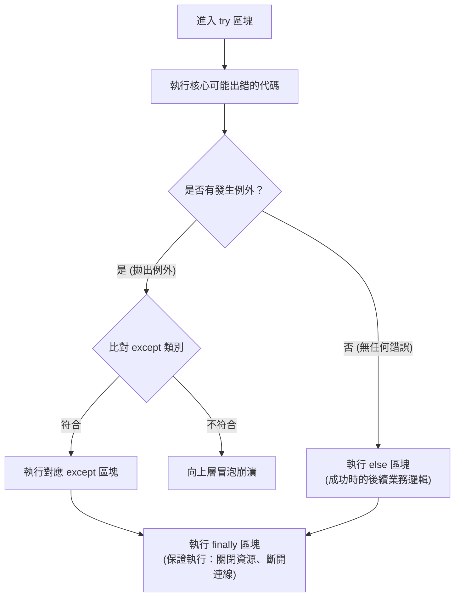

# 🔄 Ch04 流程控制、迭代演算法與例外處理架構

> **授課教師**：溫敏淦 教授  
> **對應教材**：`F1700_ch03.pptx`、`Untitled-1.ipynb`  
> **重點導讀**：系統化解析文字 I/O 技巧（`input` 字串本質與 `print` 的 `sep`/`end` 控制）、條件判斷分支與**浮點數比較禁忌**、三元運算式、`while` 與 `for` 迴圈的 `else` 子句特性、`enumerate` 與 `zip` 高效迭代、多維推導式與**小括號產生器 (Generator) 惰性求值**，以及結構化例外處理 `try...except...else...finally` 的完整防護架構。

---

## 📌 1. 文字輸入與輸出技巧 (I/O Mechanics)

### 1-1. `input()` 函式核心規則
* **核心特性**：無論使用者在終端機中輸入純數字、小數或符號，**`input()` 傳回的資料型別保證永遠是字串 (`str`)**！
* **數值計算前置轉換**：
```python
# ❌ 錯誤示範：字串相加會變成文字串接而非數學加法
# a = input("請輸入數字 a: ") # 輸入 5
# b = input("請輸入數字 b: ") # 輸入 3
# print(a + b)                # 輸出 "53"！

# ✅ 正確做法：顯式型別轉換
val = int(input("請輸入整數: "))
```

### 1-2. `print()` 函式之格式與參數控制
`print(*objects, sep=' ', end='\n', file=sys.stdout, flush=False)` 具備強大的輸出微調能力：
1. **`sep` (Separator，分隔符號)**：自訂多個輸出物件之間的連接字元（預設為單一空格 `' '`）。
2. **`end` (End character，結尾字元)**：自訂輸出完畢後的結尾符號（預設為換行符號 `'\n'`）。若設定為 `end=''` 則可實現**連續不換行輸出**。
3. **寬度溢出規則**：設定格式化寬度時（如 `%5d` 或 `{val:5d}`），**若資料實際長度超過指定寬度，Python 會完整顯示全部資料，絕不截斷**！

```python
# ==============================================================================
# 範例程式 4-1：sep 與 end 格式化輸出控制
# ==============================================================================
# 自訂分隔符號
print("2026", "09", "23", sep="-")           # 輸出: 2026-09-23
print("user", "example.com", sep="@")        # 輸出: user@example.com

# 連續輸出進度條（不換行）
import time
print("載入中: ", end="")
for _ in range(5):
    print("■", end="", flush=True)
print(" 完成！")
```

---

## 📌 2. 條件判斷式 (if-elif-else) 與浮點數陷阱

### 2-1. 單行 if 與條件運算式 (Ternary Operator)
* **單行簡寫**：若條件區塊內只有單一行敘述，可直接併入冒號後方：
  ```python
  if score >= 60: print("合格")
  ```
* **三元運算式 (條件運算式)**：
  * **語法**：`值1 if 條件 else 值2`
  * **特點**：當條件為真時計算並傳回「值1」，否則傳回「值2」。「值1」與「值2」可以是任意運算式，甚至是不同型別的資料。
  ```python
  status = "及格 PASS" if score >= 60 else "不及格 FAIL"
  ```

### 2-2. 浮點數比較禁忌（簡報第 11 頁警示）
> [!CAUTION] 嚴禁使用 `==` 直接比較兩個浮點數
> 由於計算機內部採用二進位儲存浮點數（IEEE 754 標準），許多十進位小數（如 0.1, 0.2）無法精確表示為有限二進位小數，會產生微小的精度偏差：
> ```python
> print(0.1 + 0.2 == 0.3)  # 輸出: False！ (0.1 + 0.2 實際上是 0.30000000000000004)
> ```
* **正確解決對策**：
  1. 使用容許誤差範圍（Epsilon 容差）：`abs(a - b) < 1e-9`
  2. 使用標準函式庫：`math.isclose(a, b)`

---

## 📌 3. 迴圈控制與迴圈專屬 `else` 子句

### 3-1. `while` 迴圈與根號逼近實作
`while` 迴圈依據條件判斷重複執行，適合用於終止條件明確但迭代次數未知的場景（例如二分搜尋、牛頓法）：
```python
# ==============================================================================
# 範例程式 4-2：while 迴圈數值逼近（牛頓法求平方根）
# ==============================================================================
target = 2.0
guess = target / 2.0
epsilon = 1e-7

while abs(guess * guess - target) > epsilon:
    guess = (guess + target / guess) / 2.0

print(f"√2 數值逼近結果: {guess:.8f}")  # 1.41421356
```

### 3-2. 迴圈專屬 `else` 子句的核心機制
> [!IMPORTANT] 簡報第 15 與 23 頁核心語法
> `while` 與 `for` 迴圈均可搭配 `else` 子句：
> 1. **觸發條件**：當迴圈**正常走訪完畢**或**條件自然變為 False 結束**時，會執行 `else` 區塊。
> 2. **跳過條件**：若迴圈是因為執行了 **`break` 強制中斷跳出**，則 **絕對不會執行 `else` 區塊**！

```python
# ==============================================================================
# 範例程式 4-3：for...else... 在質數判別中的經典應用
# ==============================================================================
def check_prime(num: int):
    """檢查是否為質數"""
    if num <= 1:
        print(f"{num} 不是質數")
        return

    for factor in range(2, int(num ** 0.5) + 1):
        if num % factor == 0:
            print(f"{num} 不是質數（因數: {factor}）")
            break  # 找到因數，中斷迴圈，跳過 else
    else:
        # 迴圈正常結束（從未遇到 break）表示沒有任何因數
        print(f"🎉 {num} 是質數 (Prime Number)！")

check_prime(29)  # 觸發 else 區塊：輸出質數
check_prime(35)  # 觸發 break：跳過 else
```

### 3-3. 高效迭代函式：`enumerate()` 與 `zip()`
1. **`enumerate(iterable, start=0)`**：
   將容器元素打包為包含序號的元組 `(index, item)`，避免傳統 `range(len(...))` 的笨拙寫法。
2. **`zip(*iterables)`**：
   將多個長度相同（或不同）的容器平行綁定走訪，長度以最短者為終止基準。

---

## 📌 4. 容器推導式與產生器 (Generators) 深度剖析

### 4-1. 三大推導式語法
```python
# 1. 串列推導式 (List Comprehension)
evens_squared = [x ** 2 for x in range(10) if x % 2 == 0]

# 2. 集合推導式 (Set Comprehension - 自動去重)
unique_lengths = {len(w) for w in ["apple", "banana", "cat", "apple"]}

# 3. 字典推導式 (Dict Comprehension)
score_map = {name: score for name, score in [("小明", 90), ("小華", 85)]}
```

### 4-2. 產生器表達式 (Generator Expression) —— 括號陷阱！
> [!WARNING] 簡報第 30~31 頁關鍵規則
> 如果將推導式放在**小括號 `()`** 中，**絕對不會產生 Tuple**（因 Tuple 是不可變的）！
> 而是會建立一個**產生器物件 (Generator Object)**！

```python
gen = (x ** 2 for x in range(1, 1000000))
print(type(gen))  # <class 'generator'>
```
* **惰性求值 (Lazy Evaluation)**：產生器不會立刻在記憶體中建立百萬個平方數，而是在需要元素時（如被 `for` 迴圈讀取或呼叫 `next(gen)` 時）才動態計算一個並傳回，**記憶體佔用近乎為零**！

### 4-3. 巢狀多層推導式解析順序
推導式支援多重 `for` 與 `if`，其解析順序為**由左至右對應傳統代碼由外至內的巢狀結構**：
```python
# 二維矩陣扁平化
matrix = [[1, 2, 3], [4, 5, 6]]
flat = [val for row in matrix for val in row]
# 等價於:
# for row in matrix:
#     for val in row:
#         flat.append(val)
print(flat)  # [1, 2, 3, 4, 5, 6]
```

---

## 📌 5. 結構化例外處理機制 (Exception Handling)

### 5-1. 語法錯誤 (Syntax Error) vs 執行期錯誤 (Runtime Error)
* **語法錯誤 (SyntaxError)**：程式在解析編譯階段即未通過語法規則（如少加冒號 `:`、括號不對稱），直譯器直接中斷，程式無法啟動。
* **執行期錯誤 (Exceptions)**：語法完全正確，但在執行過程中遇到非法操作（如除以 0、讀取不存在的檔案、鍵不存在），直譯器拋出例外中斷執行。

### 5-2. `try...except...else...finally` 四重防護結構


```python
# ==============================================================================
# 範例程式 4-4：完整 try-except-else-finally 例外架構實作
# ==============================================================================
def safe_divide(a_str: str, b_str: str):
    try:
        a = float(a_str)
        b = float(b_str)
        result = a / b
    except ValueError as e:
        print(f"【輸入錯誤】傳入的字串無法轉換為數值: {e}")
    except ZeroDivisionError:
        print("【數學錯誤】除數不可為 0！")
    except Exception as e:
        print(f"【未預期錯誤】: {type(e).__name__} - {e}")
    else:
        # 只有在完全沒有任何例外時才會執行
        print(f"【計算成功】結果為: {result:.4f}")
        return result
    finally:
        # 無論是否發生例外、甚至函式提前 return，都保證必定執行！
        print("【清理機制】完成本次除法運算呼叫，釋放資源。")

# 測試各類情境
safe_divide("10", "2")   # 觸發 else + finally
safe_divide("10", "0")   # 觸發 ZeroDivisionError + finally
safe_divide("abc", "2")  # 觸發 ValueError + finally
```

### 5-3. 常用內建例外類型階層表
| 例外類別名稱 | 觸發原因說明 | 典型引發範例 |
|:---|:---|:---|
| `ZeroDivisionError` | 任何數值除以 0 或取餘數模 0 | `10 / 0`, `5 % 0` |
| `ValueError` | 函式引數型別正確但內容值不合法 | `int("3.14")`, `list.remove(99)` |
| `TypeError` | 運算子或函式作用於不相容的型別 | `'5' + 5`, `len(100)` |
| `IndexError` | 序列索引超出有效範圍 | `[1, 2][5]` |
| `KeyError` | 字典查找不存在的 Key（且未用 `.get()`） | `{'a': 1}['b']` |
| `FileNotFoundError` | 嘗試開啟不存在的檔案路徑 | `open("not_found.txt")` |
