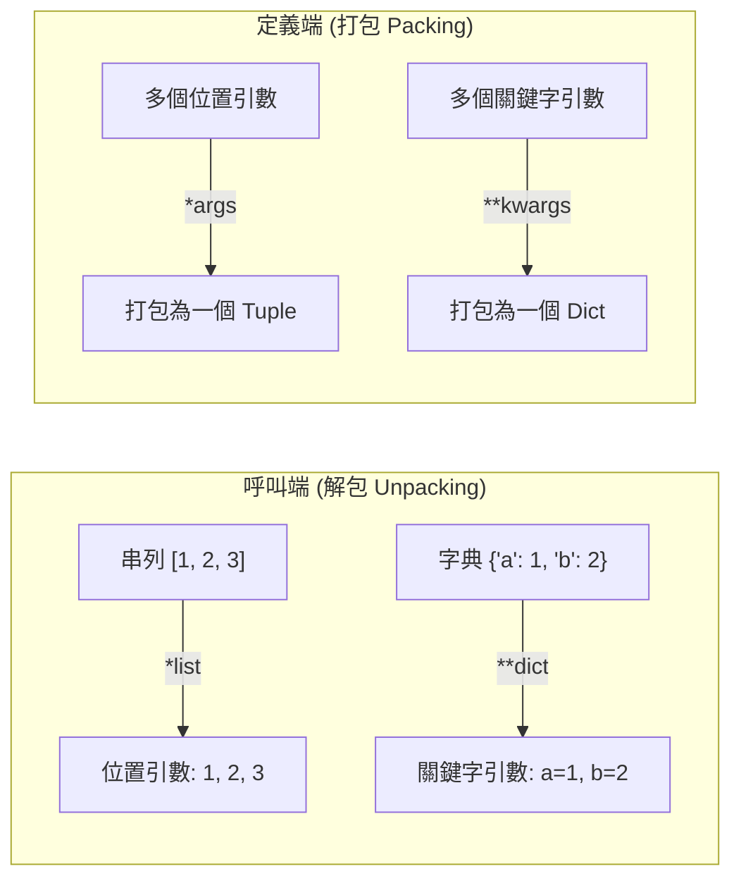
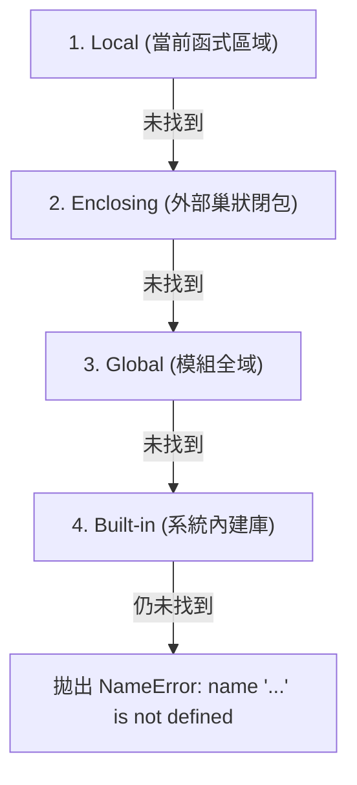

# 🧩 Ch05 函式設計、引數傳遞機制與作用域規則

> **授課教師**：溫敏淦 教授  
> **對應教材**：`F1700_ch04.pptx`  
> **重點導讀**：深入剖析自訂函式 `def` 語法、位置引數 vs 關鍵字引數、預設引數順序規範與可變預設引數陷阱、`*args` 與 `**kwargs` 之「定義端打包 (Packing)」與「呼叫端解包 (Unpacking)」對稱機制、Lambda 匿名函式、變數作用域 LEGB 尋找法則、`global` 與 `nonlocal`、可變容器在函式內的原地修改例外、物件參照傳遞 (Pass-by-Object-Reference)，以及函式文件化 `__doc__` 與巢狀內部函式。

---

## 📌 1. 函式定義、引數傳遞與傳回值

### 1-1. 基礎語法與引數傳遞模式
* **位置引數 (Positional Arguments)**：依據引數在括號中的順序一一對應。
* **關鍵字引數 (Keyword / Named Arguments)**：透過 `參數名 = 數值` 明確指名傳遞，此時引數傳遞順序不受宣告順序限制。

```python
def student_profile(name, age, department="資管系"):
    return f"姓名: {name} | 年齡: {age} | 科系: {department}"

# 1. 純位置引數
print(student_profile("張小明", 20))

# 2. 純關鍵字引數（可打破順序）
print(student_profile(age=21, name="李小華"))

# 3. 混用（位置引數必須在前，關鍵字引數在後）
print(student_profile("王大雄", age=22, department="工管系"))
```

### 1-2. 預設引數的兩大鐵律
1. **順序鐵律**：**有預設值的參數必須嚴格定義在無預設值參數的「後面」**！
   * ❌ `def func(a=10, b):` ➔ 拋出 `SyntaxError: non-default argument follows default argument`。
   * ✅ `def func(b, a=10):` ➔ 合法。
2. **可變物件預設值陷阱 (Mutable Default Argument Trap)**：
   * Python 的函式預設值在**函式定義（編譯）階段即建立一次**，若將 List 或 Dict 作為預設值，後續所有呼叫將**共用同一個記憶體物件**！
   ```python
   # ❌ 錯誤示範：預設串列會持續累計歷史資料
   def bad_append(item, target_list=[]):
       target_list.append(item)
       return target_list

   # ✅ 正確做法：預設值設為 None，內部動態建立
   def safe_append(item, target_list=None):
       if target_list is None:
           target_list = []
       target_list.append(item)
       return target_list
   ```

### 1-3. `return` 傳回值規範
* `return xxx`：結束函式並傳回物件。若無 `return` 或只寫 `return`，則**隱式傳回 `None`**。
* **多值傳回本質**：`return a, b, c` 實際上是將多個值**自動打包為一個元組 (Tuple)** 傳回，呼叫端可直接透過解包語法 `x, y, z = func()` 接收。

---

## 📌 2. 不定數目引數：`*args` 與 `**kwargs`（打包 vs 解包）

> [!IMPORTANT] 簡報第 11~16 頁核心對稱架構
> `*` 與 `**` 在「**函式定義端**」代表**打包 (Packing)**；在「**函式呼叫端**」代表**解包 (Unpacking)**！



### 2-1. 定義端打包 (Packing)
* **`*args`**：接收任意數量的位置引數，於函式內部打包為 `tuple`。
* **`**kwargs`**：接收任意數量的關鍵字引數，於函式內部打包為 `dict`。
* **參數擺放順序規範**：
  $$\text{def func(位置參數, } *\text{args, 僅限關鍵字參數, } **\text{kwargs):}$$
  * **在 `*args` 之後定義的參數，在呼叫時必須使用關鍵字引數傳遞 (Keyword-Only Arguments)**！

### 2-2. 呼叫端解包 (Unpacking)
* `*iterable`：將容器拆解為獨立的位置引數。
* `**dict`：將字典拆解為 `k1=v1, k2=v2` 的關鍵字引數。

```python
# ==============================================================================
# 範例程式 5-1：打包與解包完整範例
# ==============================================================================
def display_info(title, *scores, threshold=60, **details):
    print(f"=== {title} ===")
    print(f"分數元組 (args): {scores} (型別: {type(scores).__name__})")
    print(f"合格門檻 (kw-only): {threshold}")
    print(f"額外資訊 (kwargs): {details} (型別: {type(details).__name__})")

# 1. 一般呼叫：引數自動打包
display_info("期中成績", 85, 90, 78, threshold=70, teacher="溫敏淦", room="E201")

# 2. 呼叫端解包：使用 * 與 ** 將既有容器拆解傳入
score_list = [92, 88, 95]
extra_info = {"teacher": "溫敏淦教授", "semester": "113-1"}
display_info("期末成績", *score_list, **extra_info)
```

---

## 📌 3. 變數有效範圍 (Scope) 與 LEGB 規則

### 3-1. LEGB 尋找順序
當在程式中讀取一個變數名稱時，Python 嚴格按照以下優先順序由內向外尋找：
1. **L (Local)**：當前函式內部定義的區域變數。
2. **E (Enclosing)**：外部巢狀函式的區域環境（外層閉包函式）。
3. **G (Global)**：模組最外層定義的全域變數。
4. **B (Built-in)**：Python 系統內建名稱（如 `print`, `len`, `int`）。



### 3-2. `global` 與 `nonlocal` 關鍵字
* **`global var`**：告訴直譯器「在函式內部所指派的 `var` 是模組最外層的全域變數」，而非建立同名區域變數。
* **`nonlocal var`**：告訴直譯器「所指派的 `var` 屬於外層 Enclosing 函式環境」，用於閉包 (Closure) 狀態保持。

### 3-3. 容器物件的 Scope 修改例外（簡報第 26 頁核心細節）
> [!IMPORTANT] 關鍵區別：原地修改 (In-place) vs 重新指派 (Reassignment)
> * 若全域變數綁定的是**可變容器 (如 List, Dict, Set)**：
>   * 在函式內部呼叫 `lst.append()`、`lst.pop()`、`dct["key"] = val`：**不需要宣告 `global`**！因為這是在現存物件上進行原地修改，並未改變名牌本身的綁定目標！
>   * 但若要進行**重新綁定** `lst = [1, 2, 3]`，則**必須顯式宣告 `global lst`**，否則會被視為建立新的同名區域變數！

```python
# ==============================================================================
# 範例程式 5-2：可變容器原地修改 vs 重新賦值
# ==============================================================================
shared_list = [1, 2, 3]

def modify_in_place():
    # 原地修改容器元素：不需要 global！
    shared_list.append(4)

def reassign_without_global():
    # 重新賦值：會被視為區域變數，不影響外部全域變數
    shared_list = [999]

modify_in_place()
print(f"原地修改後全域變數: {shared_list}") # [1, 2, 3, 4]

reassign_without_global()
print(f"重新賦值後全域變數: {shared_list}") # [1, 2, 3, 4] (依然是原本的串列！)
```

---

## 📌 4. 引數傳遞機制：傳物件參照 (Pass-by-Object-Reference)

Python 既非純粹的「傳值 (Pass-by-Value)」，亦非傳統的「傳址 (Pass-by-Reference)」，而是**傳遞物件參照（名牌綁定）**：
* **不可變物件 (int, float, str, tuple)**：在函式內若對參數進行運算修改，實際上會產生新物件並將參數名牌改綁新物件，**外部呼叫端的變數完全不受影響**（行為類似傳值）。
* **可變物件 (list, dict, set)**：參數名牌與外部引數名牌共享同一個堆疊物件，在函式內對容器的原地修改（如 `append`、切片賦值）**會直接連動反映到外部**（行為類似傳址）。

---

## 📌 5. Lambda 匿名函式與高階函式應用

### 5-1. Lambda 語法與限制
* **語法**：`lambda 參數1, 參數2, ... : 傳回值運算式`
* **規則與限制**：
  * 只能包含**單一運算式 (Expression)**，該運算式的結果即為隱式傳回值。
  * **不得包含敘述 (Statements)**，例如不得出現 `while`、`for` 區塊、`try-except` 或指派 `=`。

### 5-2. 高階函式快速回調 (Callbacks)
```python
# ==============================================================================
# 範例程式 5-3：Lambda 結合 sorted() 自訂多維鍵排序
# ==============================================================================
products = [
    ("筆記型電腦", 32000, 4.8),
    ("無線耳機",   3500,  4.5),
    ("曲面螢幕",   8900,  4.9),
    ("機械鍵盤",   2800,  4.7),
]

# 依評分由高至低排序 (元素索引 2)
sorted_by_rating = sorted(products, key=lambda item: item[2], reverse=True)
print("--- 依評分降冪排序 ---")
for p in sorted_by_rating:
    print(f"產品: {p[0]:8s} | 價格: {p[1]:5d} | 評分: {p[2]}")
```

---

## 📌 6. 函式自我文件化與巢狀內部函式

### 6-1. 函式自我文件化 (Docstring) 與 `__doc__`
* 在 `def` 敘述正下方的第一行使用三引號字串 `"""說明"""` 編寫註解。
* Python 會自動將該字串存入該函式物件的 `__doc__` 屬性中，使用者可透過 `help(函式名)` 或 `函式名.__doc__` 在執行期間直接調閱。

### 6-2. 巢狀內部函式 (Inner Function)
在函式內部定義輔助函式，實現模組封裝：
```python
# ==============================================================================
# 範例程式 5-4：內部函式與 Docstring 檢視
# ==============================================================================
def outer_calculator(base: float):
    """
    外部計算器函式：展示內部函式封裝與 __doc__ 調閱
    :param base: 基準數值
    """
    def inner_square(x: float) -> float:
        """內部函式：計算平方"""
        return x ** 2

    return inner_square(base) + 10.0

print(f"函式說明文件 (__doc__):\n{outer_calculator.__doc__}")
print(f"計算結果: {outer_calculator(5.0)}") # (5^2) + 10 = 35.0
```
