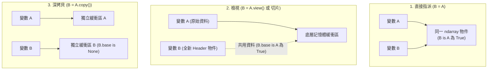

# 🧮 Ch07 NumPy 高效科學計算、矩陣代數與記憶體 View 機制

> **授課教師**：溫敏淦 教授  
> **對應教材**：`科學計算資料分析Numpy.pptx`  
> **重點導讀**：系統化解析 NumPy 核心 `ndarray` 之底層 C 語言連續記憶體模型與五大核心屬性、特殊陣列建構、向量積運算（內積 `dot`/`inner`、外積 `outer`、叉積 `cross`）、形狀變更 (`reshape` vs `resize` vs `ravel`)、陣列堆疊 (`hstack`/`vstack`) 與分割 (`hsplit`/`vsplit`)、廣播機制 (Broadcasting) 軸向相容性數學準則、**記憶體 View vs Copy 底層驗證 (`.base` 屬性)**，以及數值檔案 I/O 操作 (`np.loadtxt` / `np.savetxt`)。

---

## 📌 1. NumPy ndarray 核心架構與五大屬性

NumPy（Numerical Python）是 Python 科學計算與人工智慧生態圈的核心基石。與 Python 原生串列相比，`ndarray` 具有固定長度、元素同質性與連續記憶體配置，能直接調用底層 CPU SIMD 向量化指令集。

### 1-1. 核心陣列屬性表
| 屬性名稱 | 語法格式 | 意義說明 | 範例與數值 |
|:---|:---|:---|:---|
| **維度數** | `a.ndim` | 陣列的維度軸數 (Axes) | 一維為 1，矩陣為 2 |
| **形狀** | `a.shape` | 以 Tuple 格式記錄每個維度的大小 | 如 `(3, 4)` 代表 3 列 4 欄 |
| **元素個數** | `a.size` | 陣列中包含的元素總數量 | 等於 shape 各分量乘積 ($3 \times 4 = 12$) |
| **資料型態** | `a.dtype` | 陣列元素的資料型別 | 如 `int32`, `float64`, `<U10` (字串) |
| **元素位元組數** | `a.itemsize`| 單一元素所佔用的記憶體 Bytes 數 | `float64` 為 8 bytes，`int32` 為 4 bytes |

---

## 📌 2. 陣列生成與特殊矩陣建構

```python
# ==============================================================================
# 範例程式 7-1：ndarray 多樣化生成方式
# ==============================================================================
import numpy as np

# 1. 由原生 List/Tuple 建立
arr1d = np.array([1, 2, 3], dtype=np.float64)

# 2. 特殊矩陣生成
zeros_mat = np.zeros((2, 3))                 # 全 0 矩陣 (2x3)
ones_mat  = np.ones((3, 3), dtype=np.int32)   # 全 1 矩陣 (3x3)
empty_mat = np.empty((2, 2))                 # 未初始化隨機記憶體殘留值矩陣

# 3. 數列產生器
arange_arr   = np.arange(0, 10, 2)           # [0, 2, 4, 6, 8] (半開區間 [0, 10))
linspace_arr = np.linspace(0.0, 1.0, 5)      # [0., 0.25, 0.5, 0.75, 1.] (等分取樣，含端點)
```

---

## 📌 3. 向量積與矩陣代數運算 (Vector & Matrix Algebra)

> [!IMPORTANT] 簡報第 7 與 11 頁向量代數核心
> 向量在幾何、物理與機器學習中具備多種乘積定義，NumPy 提供完整對應函式：

| 運算類型 | 數學表示 | NumPy 語法 | 意義說明與維度變化 |
|:---|:---:|:---|:---|
| **內積 (Dot / Inner)** | $\mathbf{a} \cdot \mathbf{b} = \mathbf{a}^T \mathbf{b}$ | `np.dot(A, B)` 或 `np.inner(A, B)` 或 `A @ B` | 傳回純量（純量積 / 點積），用於計算投影或加權總和 |
| **外積 (Outer Product)**| $\mathbf{a} \otimes \mathbf{b} = \mathbf{a} \mathbf{b}^T$ | `np.outer(A, B)` | $m$ 維與 $n$ 維向量相乘產生 $m \times n$ 階矩陣 |
| **叉積 (Cross Product)**| $\mathbf{a} \times \mathbf{b}$ | `np.cross(A, B)` | 向量積，結果為與 $\mathbf{a}, \mathbf{b}$ 均垂直的向量 |
| **矩陣轉置** | $A^T$ | `np.transpose(A)` 或 `A.T` | 對角線翻轉，列與欄維度互換 |

```python
# ==============================================================================
# 範例程式 7-2：內積、外積、叉積與矩陣相乘
# ==============================================================================
import numpy as np

v1 = np.array([1, 2, 3])
v2 = np.array([4, 5, 6])

# 1. 內積 (1*4 + 2*5 + 3*6 = 32)
dot_val = np.dot(v1, v2)
print(f"內積 (Dot Product): {dot_val}")     # 32

# 2. 外積 (產生 3x3 矩陣)
outer_mat = np.outer(v1, v2)
print(f"外積 (Outer Product):\n{outer_mat}")

# 3. 叉積 (向量積: [2*6-3*5, 3*4-1*6, 1*5-2*4] = [-3, 6, -3])
cross_vec = np.cross(v1, v2)
print(f"叉積 (Cross Product): {cross_vec}") # [-3  6 -3]

# 4. 矩陣乘法運算子 @
M = np.array([[1, 2], [3, 4]])
N = np.array([[5, 6], [7, 8]])
print(f"矩陣相乘 M @ N:\n{M @ N}")
```

---

## 📌 4. 形狀變更、陣列堆疊與分割

### 4-1. 形狀變更三劍客：`reshape` vs `ravel` vs `resize`
* **`A.reshape(m, n)`**：回傳一個改變形狀的**新 View，不改變原陣列 `A` 的形狀**。
* **`A.ravel()`**：扁平化為一維陣列 View，**不改變原陣列 `A`**。
* **`A.resize(m, n)`**：**注意！這是原地操作 (In-place)！會直接修改原陣列 `A` 本身的形狀與大小**！

### 4-2. 陣列堆疊與分割 (Stacking & Splitting)
* **水平與垂直堆疊**：
  * `np.hstack((A, B))` 或 `np.column_stack((A, B))`：水平方向（橫向欄位擴展）串接。
  * `np.vstack((A, B))` 或 `np.row_stack((A, B))`：垂直方向（縱向列數擴展）堆疊。
* **新增維度**：使用 `np.newaxis`，例如將形狀 `(3,)` 升維為 `(3, 1)`：`W[:, np.newaxis]`。
* **陣列分割**：
  * `np.hsplit(A, n)`：水平切分為 $n$ 個子陣列。
  * `np.vsplit(A, n)`：垂直切分為 $n$ 個子陣列。

```python
# ==============================================================================
# 範例程式 7-3：堆疊、分割與升維
# ==============================================================================
import numpy as np

a = np.array([[1, 2], [3, 4]])
b = np.array([[5, 6], [7, 8]])

# 堆疊
v_stacked = np.vstack((a, b))  # 形狀 (4, 2)
h_stacked = np.hstack((a, b))  # 形狀 (2, 4)
print(f"垂直堆疊:\n{v_stacked}")
print(f"水平堆疊:\n{h_stacked}")

# 升維
vec = np.array([10, 20, 30])   # shape: (3,)
col_vec = vec[:, np.newaxis]   # shape: (3, 1)
print(f"升維後形狀: {col_vec.shape}")
```

---

## 📌 5. 廣播機制核心準則 (Broadcasting Rules)

> [!IMPORTANT] 簡報第 11 頁廣播原則
> 廣播是指在對不同形狀的陣列進行算術運算時，NumPy 自動在虛擬維度上將較小的陣列擴展以匹配較大陣列的機制（不產生實體記憶體複製）。

### 維度相容性準則 (Compatibility Rules)
比對兩個陣列的 shape，**從最後一個維度（Trailing Dimension，最右側）開始往前逐一比對**。若各維度滿足以下**任一條件**，即屬相容：
1. 兩個維度的大小**完全相等**。
2. 其中一個陣列在該維度的大小**為 1**。

#### 相容與不相容實例推導：
* **相容範例 1**：$A$ 為 $(15, 3, 5)$，$B$ 為 $(3, 1)$。
  * 最右軸：$5$ vs $1$（相容，可擴展為 5）。
  * 中間軸：$3$ vs $3$（相容）。
  * 左側軸：$15$ vs 空缺（相容，可擴展為 15）。
  * $\Rightarrow$ $B$ 可自動廣播擴展為 $(15, 3, 5)$ 完成運算！
* **不相容範例 2**：$A$ 為 $(3, 5)$，$B$ 為 $(3, 2)$。
  * 最右軸：$5$ vs $2$（既不相等亦不為 1）$\Rightarrow$ **不相容！直接拋出 `ValueError: operands could not be broadcast together`**！

---

## 📌 6. 陣列記憶體機制：View（檢視） vs Copy（拷貝）

> [!CAUTION] 簡報第 13 頁核心考點
> 混淆 View 與 Copy 是資料科學除錯中最隱蔽的陷阱！



```python
# ==============================================================================
# 範例程式 7-4：View vs Copy 記憶體基底驗證
# ==============================================================================
import numpy as np

A = np.array([10, 20, 30])

# 1. 檢視 (View)
B = A.view()
print(f"B is A:       {B is A}")       # False (B 是一個新的 ndarray 物件)
print(f"B.base is A:  {B.base is A}")  # True (B 的底層記憶體資料完全指向 A！)
B[0] = 999
print(f"修改 B 後的 A: {A}")           # [999, 20, 30] (A 連動被竄改！)

# 2. 獨立拷貝 (Copy)
C = A.copy()
print(f"C.base is A:  {C.base is A}")  # False (C.base 為 None，擁有全新記憶體)
C[0] = 111
print(f"修改 C 後的 A: {A}")           # [999, 20, 30] (A 完全不受影響)
```

---

## 📌 7. 純數值檔案 I/O 操作 (`loadtxt` 與 `savetxt`)

針對純數值或結構化 CSV 資料，NumPy 提供了極為高效的批次寫入與讀取方法：

```python
# ==============================================================================
# 範例程式 7-5：loadtxt 與 savetxt 實務
# ==============================================================================
import numpy as np
import os

file_path = "temp_matrix.csv"

# 1. 建立測試矩陣並儲存
data = np.array([
    [1.0, 2.5, 3.8],
    [4.2, 5.1, 6.9],
    [7.0, 8.4, 9.6]
])

# 儲存 (delimiter 指定分隔符號，fmt 指定浮點數輸出格式，header 加入欄位標頭)
np.savetxt(file_path, data, delimiter=",", fmt="%.2f", header="col1,col2,col3", comments="")

# 2. 讀取特定欄位 (skiprows=1 跳過標頭，usecols=(0, 2) 僅讀取第 0 與第 2 欄)
loaded = np.loadtxt(file_path, delimiter=",", skiprows=1, usecols=(0, 2))
print(f"讀取第 0 與第 2 欄結果:\n{loaded}")

if os.path.exists(file_path):
    os.remove(file_path)
```
