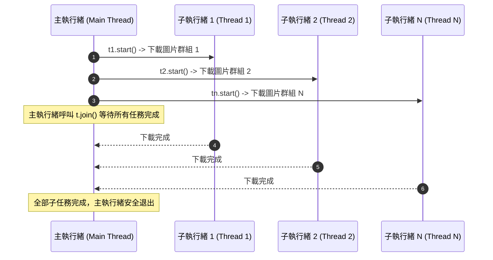

# 🌐 Ch10 網路爬蟲實戰、多執行緒巨量下載與 Selenium 自動化

> **授課教師**：溫敏淦 教授  
> **對應教材**：`F1700_ch06.pptx`、`F1700_ch07.pptx`、`ch07.7z`、`chromedriver-win64.zip`  
> **重點導讀**：系統化解析 HTTP 通訊協定（GET/POST、Headers 標頭偽裝、Cookie、Session）、BeautifulSoup4 網頁解析與**延遲載入 (Lazy Loading `data-lazy`) 陷阱**、串流下載與 `os` 分類歸檔、**`threading` 多執行緒平行加速巨量爬取**，以及 Selenium 4 + ChromeOptions 核心啟動參數全攻略（無頭模式、反反爬特徵消除、禁用圖片加速、無痕模式）。

---

## 📌 1. HTTP 通訊機制與反爬蟲防護

### 1-1. 爬蟲基本通訊流程
1. **Client 送出 HTTP Request (請求)**：
   * `headers` 偽裝：`User-Agent`（模擬真實 Chrome 瀏覽器，防止伺服器判定為 Python 機器人而回傳 403 Forbidden）。
   * `cookies`：攜帶身分認證標籤（如 PTT 滿 18 歲認證 `{'over18': '1'}`）。
   * `params`：URL 網址查詢字串（如 `?date=20260923&stockNo=2330`）。
2. **Server 回應 HTTP Response (回應)**：
   * `res.status_code`：`200`（成功）、`403`（拒絕存取/被反爬擋下）、`404`（網址不存在）、`500`（伺服器錯誤）。
   * **編碼自動偵測與手動覆蓋**：`res.encoding = 'utf-8'`，防止中文繁體內容出現亂碼。

---

## 📌 2. 靜態網頁解析與延遲載入 (Lazy Loading) 陷阱

> [!CAUTION] 簡報第 7 章第 14 頁核心陷阱
> 現代圖片與商品網站為了節省頻寬，普遍採用 **延遲載入 (Lazy Loading)** 技術：
> * 原始 HTML 中的 `` 標籤，其 `src` 屬性往往只是一張極小的空白佔位圖（例如 `/static/img/blank.gif`）。
> * **真實圖片的高畫質網址實際上存放在 `data-lazy` 或 `data-src` 自訂屬性中**！
> * **防禦性取值語法**：
>   ```python
>   real_url = img.get("data-lazy") or img.get("data-src") or img.get("src")
>   ```

```python
# ==============================================================================
# 範例程式 10-1：BeautifulSoup CSS 選擇器與延遲載入圖片解析
# ==============================================================================
import requests
from bs4 import BeautifulSoup

def extract_image_urls(target_url: str) -> list[str]:
    headers = {
        "User-Agent": "Mozilla/5.0 (Windows NT 10.0; Win64; x64) AppleWebKit/537.36"
    }
    res = requests.get(target_url, headers=headers)
    res.encoding = "utf-8"
    
    soup = BeautifulSoup(res.text, "html.parser")
    image_urls = []
    
    # 選取所有 img 標籤
    for img in soup.find_all("img"):
        # 依序檢查 data-lazy, data-src, src
        src = img.get("data-lazy") or img.get("data-src") or img.get("src")
        if src and not src.endswith("blank.gif"):
            if src.startswith("//"):
                src = "https:" + src
            elif src.startswith("/"):
                src = "https://example.com" + src
            image_urls.append(src)
            
    return image_urls
```

---

## 📌 3. 多執行緒 (Threading) 平行加速巨量下載

> [!IMPORTANT] 簡報第 7 章第 28~33 頁多執行緒原理
> 網路爬蟲是典型的 **I/O 密集型任務 (I/O Bound)**。若循序單執行緒下載 100 張圖片需耗時 100 秒；透過 `threading` 啟動 10 個平行執行緒，總耗時可驟降至 10 秒！



```python
# ==============================================================================
# 範例程式 10-2：threading 多執行緒平行下載器
# ==============================================================================
import requests
import os
import threading

def download_single_pic(url: str, save_dir: str, file_name: str):
    """單張圖片串流下載函式"""
    try:
        res = requests.get(url, headers={"User-Agent": "Mozilla/5.0"}, stream=True, timeout=10)
        if res.status_code == 200:
            file_path = os.path.join(save_dir, file_name)
            with open(file_path, "wb") as f:
                for chunk in res.iter_content(chunk_size=1024 * 32):
                    f.write(chunk)
            print(f"[Thread 完成] {file_name}")
    except Exception as e:
        print(f"[Thread 失敗] {file_name}: {e}")

def batch_download_multithread(url_list: list[str], folder_name: str = "downloads"):
    os.makedirs(folder_name, exist_ok=True)
    threads = []

    for idx, url in enumerate(url_list, start=1):
        ext = url.split(".")[-1].split("?")[0]
        if ext.lower() not in ["jpg", "png", "jpeg", "webp"]:
            ext = "jpg"
        file_name = f"img_{idx:03d}.{ext}"

        # 建立執行緒物件 (target: 函式名, args: 元組參數)
        t = threading.Thread(target=download_single_pic, args=(url, folder_name, file_name))
        threads.append(t)
        t.start()  # 啟動子執行緒

    # 主執行緒等待所有子執行緒結束 (join)
    for t in threads:
        t.join()

    print("🎉 所有圖片多執行緒下載完畢！")
```

---

## 📌 4. Selenium 4 + ChromeOptions 進階參數全攻略

> [!IMPORTANT] 簡報第 7 章第 35~49 頁 Selenium 核心參數
> 當遇到 Vue/React/Angular 或滾動載入之動態網頁時，必須使用 Selenium 操控真實瀏覽器核心。透過 `webdriver.ChromeOptions()` 可以進行高度專業化參數調優：

| 參數代碼 / 方法 | 功用與目的 | 適用實戰情境 |
|:---|:---|:---|
| `options.add_argument('--headless')` | **無介面後台執行 (Headless)** | 伺服器部署、省去 GUI 視窗繪製運算，大幅加速 |
| `options.add_argument('--disable-gpu')` | 停用 GPU 硬體加速 | 規避早期 Chrome 在虛擬機或 Linux 下渲染崩潰的 Bug |
| `options.add_argument('--no-sandbox')` | 取消作業系統沙盒隔離 | Docker 容器或 Linux 權限受限環境下必加 |
| `options.add_argument('window-size=1920x1080')` | 指定虛擬視窗解析度 | 防止因視窗過小觸發 RWD 響應式佈局導致按鈕隱藏 |
| `options.add_argument('blink-settings=imagesEnabled=false')` | **禁止載入圖片** | 爬取純文字資料時**大幅減少 70% 以上頻寬消耗與等待時間** |
| `options.add_argument('--incognito')` | **無痕模式啟動** | 不留下任何歷史紀錄與暫存 Cookie |
| `options.add_argument('user-agent=...')` | 自訂 HTTP 請求身分 | 偽裝成各型手機或最新桌面瀏覽器 |
| `options.add_argument('--lang=zh-TW')` | 指定語系為繁體中文 | 強制伺服器回傳繁體中文在地化網頁 |
| `options.add_experimental_option('excludeSwitches', ['enable-automation'])` | **隱藏自動化標記** | **消除 `navigator.webdriver = true` 特徵，繞過反爬偵測** |
| `options.add_experimental_option('prefs', {'profile.default_content_setting_values': {'notifications': 2}})` | **全面阻斷通知彈窗** | 防止網頁詢問「允許顯示通知」卡死程式流程 |

```python
# ==============================================================================
# 範例程式 10-3：工業級 Selenium 4 反爬防護與動態滾動爬取樣板
# ==============================================================================
from selenium import webdriver
from selenium.webdriver.chrome.options import Options
from selenium.webdriver.common.by import By
from selenium.webdriver.support.ui import WebDriverWait
from selenium.webdriver.support import expected_conditions as EC
import time

def create_stealth_driver() -> webdriver.Chrome:
    """建立具備反反爬特徵的 Headless Chrome 驅動器"""
    options = Options()
    
    # 核心效能與無頭參數
    options.add_argument("--headless")
    options.add_argument("--disable-gpu")
    options.add_argument("--no-sandbox")
    options.add_argument("window-size=1920x1080")
    
    # 提速：禁止載入圖片
    options.add_argument("blink-settings=imagesEnabled=false")
    
    # 隱藏自動化機器人特徵
    options.add_experimental_option("excludeSwitches", ["enable-automation"])
    options.add_experimental_option("useAutomationExtension", False)
    
    # 禁用彈窗通知
    prefs = {"profile.default_content_setting_values": {"notifications": 2}}
    options.add_experimental_option("prefs", prefs)
    
    driver = webdriver.Chrome(options=options)
    
    # 執行 CDP 注入：徹底消除 webdriver 指標
    driver.execute_cdp_cmd("Page.addScriptToEvaluateOnNewDocument", {
        "source": "Object.defineProperty(navigator, 'webdriver', {get: () => undefined})"
    })
    return driver

# 實務操作範例
if __name__ == "__main__":
    driver = create_stealth_driver()
    try:
        driver.get("https://tw.stock.yahoo.com/")
        
        # 顯式等待指定元素渲染
        wait = WebDriverWait(driver, 10)
        search_box = wait.until(EC.presence_of_element_located((By.NAME, "q")))
        
        print(f"成功連線網頁: {driver.title}")
    finally:
        driver.quit()
```
