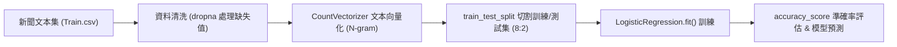

# 📰 Ch11 自然語言處理、Jieba 中文斷詞與假新聞分類器實戰

> **授課教師**：溫敏淦 教授  
> **對應教材**：`F1700_ch08n.pptx`  
> **重點導讀**：系統化貫穿自然語言處理 (NLP) 與機器學習文本分類管線：Jieba 三大斷詞模式（精確、全模式、搜尋引擎模式）、詞性標註 (`posseg`)、詞頻動態調節 (`suggest_freq`)、詞元位置追蹤 (`tokenize`)、TF-IDF 權重關鍵字萃取、詞袋模型 (Bag of Words) 與 `CountVectorizer` 參數解析（N-gram、max_features、停用詞過濾），以及運用邏輯斯迴歸 (Logistic Regression) 訓練與評估假新聞分類器。

---

## 📌 1. Jieba 中文斷詞核心演算法與三大模式

中文句子無空白分隔，Jieba 底層採用 **DAG (有向無環圖)** 配合前綴詞典快速計算最大機率路徑，並以 **HMM (隱藏馬可夫模型) + Viterbi 演算法** 識別未登錄的新詞。

### 1-1. 三大斷詞模式全解析
1. **精確模式 (Accurate Mode - 推薦)**：
   * 語法：`jieba.cut(text, cut_all=False)` 或 `jieba.lcut(text)`（直接回傳 List）。
   * 特性：將句子最精確地切開，適合文本分析與特徵萃取。
2. **全模式 (Full Mode)**：
   * 語法：`jieba.cut(text, cut_all=True)`。
   * 特性：掃描句子中所有可能成詞的詞語，速度快但冗餘、存在重疊歧義。
3. **搜尋引擎模式 (Search Engine Mode)**：
   * 語法：`jieba.cut_for_search(text)`。
   * 特性：在精確模式的基礎上，對長詞再進一步切分，提高搜尋召回率 (Recall)。

```python
# ==============================================================================
# 範例程式 11-1：Jieba 三大模式與詞典動態調節
# ==============================================================================
import jieba

text = "國立聯合大學開設人工智慧與大數據分析課程"

# 1. 模式對比
print("精確模式:", "/ ".join(jieba.lcut(text)))
print("全模式:  ", "/ ".join(jieba.lcut(text, cut_all=True)))
print("搜尋模式:", "/ ".join(jieba.lcut_for_search(text)))

# 2. 自訂詞典與詞頻微調
# 若專有名詞被誤切，可動態新增詞彙或調節詞頻 (tune=True)
jieba.add_word("國立聯合大學", freq=2000)
jieba.suggest_freq(("人工智慧"), tune=True)
print("微調後精確模式:", "/ ".join(jieba.lcut(text)))
```

---

## 📌 2. 詞性標註 (POS)、詞元定位 (Tokenize) 與 TF-IDF 萃取

> [!IMPORTANT] 簡報第 54, 57, 60~62 頁高階分析工具
> Jieba 不僅能斷詞，還內建強大的語法分析與特徵抽取模組：

### 2-1. 詞性標註 (`jieba.posseg`)
標記詞彙的詞性（如 `n` 名詞、`v` 動詞、`ns` 地名、`nr` 人名）：
```python
import jieba.posseg as pseg

words = pseg.cut("溫敏淦教授在苗栗講授機器學習技術")
for word, flag in words:
    print(f"{word} -> 詞性標籤: {flag}")
# 溫敏淦 nr (人名) | 教授 n (名詞) | 苗栗 ns (地名)
```

### 2-2. 詞元索引定位 (`jieba.tokenize`)
取得詞彙在原始文字中的**起訖字元下標 (Start, End)**，精準用於文字高亮或實體標記：
```python
tokens = jieba.tokenize("人工智慧程式設計")
for word, start, end in tokens:
    print(f"詞彙: {word:6s} | 範圍: [{start}:{end}]")
```

### 2-3. TF-IDF 關鍵字權重萃取 (`jieba.analyse`)
依據 TF-IDF 演算法自動評估詞彙重要度並依權重降冪排列：
```python
import jieba.analyse as analyse

news_text = "國立聯合大學人工智慧研究團隊發表深度學習新演算法，大幅提升自駕車與車牌辨識準確率。"
# 提取前 5 個關鍵詞，限定只取名詞 ('n', 'ns')，並傳回權重值
tags = analyse.extract_tags(news_text, topK=5, withWeight=True, allowPOS=('n', 'ns'))
for tag, weight in tags:
    print(f"關鍵詞: {tag:10s} | TF-IDF 權重: {weight:.4f}")
```

---

## 📌 3. 文本特徵向量化：詞袋模型 (CountVectorizer)

機器學習演算法無法直接讀取字串文字，必須透過 `CountVectorizer` 將非結構化文字矩陣化為數值向量：

### 3-1. `CountVectorizer` 核心參數表 (簡報第 26 頁)
| 參數名稱 | 格式與型別 | 意義與設定規則 |
|:---|:---:|:---|
| `stop_words` | `'english'` 或 list | 自動過濾停用詞（如 "the", "is", "在", "的"） |
| `ngram_range` | `(min_n, max_n)` | 詞組長度範圍；如 `(1, 2)` 同時包含單詞 (Unigram) 與相鄰雙詞 (Bigram) |
| `max_features` | `int` (如 1000) | 僅保留全文本中最高詞頻的前 $N$ 個詞彙作為特徵欄位 |
| `min_df` / `max_df` | `float` 或 `int` | 過濾過於罕見或過於普遍的詞彙（可設定詞頻次數或比例） |

---

## 📌 4. 假新聞分類器 (Fake News Classifier) 實戰全流程

> [!IMPORTANT] 簡報第 36~47 頁 Kaggle 假新聞專題
> 結合 `CountVectorizer` 與 **邏輯斯迴歸 (Logistic Regression)** 構建真假新聞二元分類器：



```python
# ==============================================================================
# 範例程式 11-2：假新聞分類器模型訓練與推論評估
# ==============================================================================
from sklearn.feature_extraction.text import CountVectorizer
from sklearn.model_selection import train_test_split
from sklearn.linear_model import LogisticRegression
from sklearn.metrics import accuracy_score, classification_report
import pandas as pd

# 1. 模擬新聞語料資料集 (標籤: 1 代表假新聞 Fake, 0 代表真實新聞 Real)
corpus = [
    "Shocking! Alien spaceship landed in capital city yesterday night!", # 1 (Fake)
    "Central Bank announces interest rate increase by 25 basis points.", # 0 (Real)
    "Drinking boiled lemon water completely cures all cancers in 24 hours!", # 1 (Fake)
    "Ministry of Finance reports economic growth of 3.2 percent this year.", # 0 (Real)
    "Secret government experiment creates invisible flying human soldiers!", # 1 (Fake)
    "Global climate summit reaches landmark agreement on carbon reduction."  # 0 (Real)
]
labels = [1, 0, 1, 0, 1, 0]

df_news = pd.DataFrame({"text": corpus, "label": labels})

# 2. 文本特徵提取：構建二元詞袋模型 (Unigram + Bigram)
vectorizer = CountVectorizer(stop_words='english', ngram_range=(1, 2), max_features=100)
X_features = vectorizer.fit_transform(df_news["text"])
y_labels = df_news["label"]

print(f"特徵矩陣維度: {X_features.shape}") # (6, 特徵數量)

# 3. 劃分訓練集與測試集
X_train, X_test, y_train, y_test = train_test_split(X_features, y_labels, test_size=0.33, random_state=42)

# 4. 訓練邏輯斯迴歸分類器 (Logistic Regression)
model = LogisticRegression()
model.fit(X_train, y_train)

# 5. 評估與預測新新聞
sample_news = ["Secret alien base discovered on the dark side of the moon"]
sample_vec = vectorizer.transform(sample_news)
pred = model.predict(sample_vec)
prob = model.predict_proba(sample_vec)

status = "❌ 假新聞 (Fake News)" if pred[0] == 1 else "✅ 真實新聞 (Real News)"
print(f"\n測試新聞: \"{sample_news[0]}\"")
print(f"預測判定: {status} (假新聞機率: {prob[0][1]*100:.1f}%)")
```
