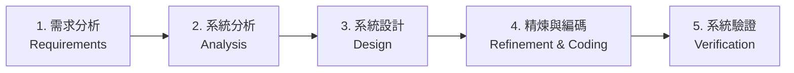

# 📘 資料結構 Ch01: 基礎概念與效能分析 (Basic Concepts & Performance Analysis)

> **授課教師**：溫敏淦 教授  
> **教材對齊**：`02_Basic.pptx` (全 63 頁 Slides)、教科書第 1 章  
> **核心主題**：系統生命週期、ADT 規範、演算法特徵、遞迴狀態展開、空間複雜度 (固定/變動部)、步驟計算 (Step Count)、漸近符號嚴格數學證明、C++ 效能測量

---

## 1. 系統生命週期 (System Life Cycle)

大型軟體系統並非一蹴可幾，而是經歷明確的軟體生命週期階段：



1. **需求分析 (Requirements)**：
   - 收集使用者需求，釐清問題輸入 (Inputs) 與預期輸出 (Outputs)。
   - 明確定義系統功能與非功能性限制。
2. **系統分析 (Analysis)**：
   - **由下而上法 (Bottom-up approach)** 與 **由上而下法 (Top-down approach)**。
   - 將大型複雜問題分解為可管理、模組化的子問題 (Manageable pieces)。
3. **系統設計 (Design)**：
   - 定義資料物件及其操作規格：**抽象資料型態 (Abstract Data Types, ADT)**。
   - **資訊隱藏 (Information Hiding)**：將規格 (Specification) 與具體實作 (Implementation) 徹底解耦。
4. **精煉與編碼 (Refinement and Coding)**：
   - 選擇具體的資料結構（如陣列、指標鏈結）與程式語言 (C++) 實現演算法。
5. **系統驗證 (Verification)**：
   - **正確性證明 (Proofs of Correctness)**：數學推導確認符合規格。
   - **程式測試 (Testing)**：各類邊界資料與極端測試。
   - **錯誤保險/精算 (Error Actuarial)**：驗證例外處理機制。

---

## 2. 抽象資料型態 (Abstract Data Type, ADT)

### 2.1 抽象與封裝 (Abstraction & Encapsulation)
- **資料型態 (Data Type)**：一組物件 (Objects) 與作用於其上的一組操作 (Operations) 的集合。
- **ADT**：只定義「能做什麼 (What)」，完全獨立於程式語言與內部記憶體配置（「如何做 (How)」）。

### 2.2 ADT 自然數 (NaturalNumber) 規格定義

```text
ADT NaturalNumber is
objects:
    從 0 開始到最大整數 INT_MAX 的有序整數子範圍。
functions:
    for all x, y ∈ NaturalNumber; TRUE, FALSE ∈ Boolean
    NaturalNumber Zero()                  ::= 0
    Boolean       IsZero(x)               ::= if (x == 0) return TRUE else return FALSE
    NaturalNumber Add(x, y)               ::= if ((x + y) <= INT_MAX) return x + y else return INT_MAX
    Boolean       Equal(x, y)             ::= if (x == y) return TRUE else return FALSE
    NaturalNumber Successor(x)            ::= if (x == INT_MAX) return x else return x + 1
    NaturalNumber Subtract(x, y)          ::= if (x < y) return 0 else return x - y
end NaturalNumber
```

---

## 3. 演算法規範 (Algorithm Specification)

### 3.1 演算法的 5 大核心要件
演算法是一組執行特定任務的有限指令集，必須滿足：
1. **輸入 (Input)**：有 0 個或多個由外部提供的輸入量。
2. **輸出 (Output)**：至少產生 1 個輸出結果。
3. **明確性 (Definiteness)**：每道指令必須清晰無歧義。
4. **有限性 (Finiteness)**：演算法必須在執行有限步驟後終止。
5. **有效性 (Effectiveness)**：每道指令必須足夠基本，在紙筆上原則上均可操作完成。

> [!TIP]
> **Algorithm vs. Program 關鍵考點**：
> - **程式 (Program)**：不一定需要滿足「有限性 (Finiteness)」。例如作業系統 (Operating System)，只要電腦未關機，就處於無窮事件迴圈中等待中斷，不滿足演算法的有限性，但它是一支程式。

### 3.2 經典演算法 C++ 實作範例

#### 選擇排序法 (Selection Sort)
在未排序序列中尋找最小值，置換至最前端：
```cpp
void SelectionSort(int list[], int n) {
    for (int i = 0; i < n - 1; i++) {
        int min_idx = i;
        for (int j = i + 1; j < n; j++) {
            if (list[j] < list[min_idx])
                min_idx = j;
        }
        // 將最小值交換至第 i 個位置
        int temp = list[i];
        list[i] = list[min_idx];
        list[min_idx] = temp;
    }
}
```

#### 二元搜尋法 (Binary Search)
適用於**已排序序列**，每次比較排除一半搜尋範圍：
```cpp
// 輔助巨集/函式：三向比較
int COMPARE(int x, int y) {
    if (x < y) return -1;
    else if (x == y) return 0;
    else return 1;
}

// 迭代版本 (Iterative)
int binsearch(int list[], int searchnum, int left, int right) {
    while (left <= right) {
        int middle = (left + right) / 2;
        switch (COMPARE(list[middle], searchnum)) {
            case -1: left = middle + 1; break;  // list[middle] < searchnum
            case  0: return middle;             // 找到目標索引
            case  1: right = middle - 1; break; // list[middle] > searchnum
        }
    }
    return -1; // 找不到
}

// 遞迴版本 (Recursive)
int rbinsearch(int list[], int searchnum, int left, int right) {
    if (left <= right) {
        int middle = (left + right) / 2;
        switch (COMPARE(list[middle], searchnum)) {
            case -1: return rbinsearch(list, searchnum, middle + 1, right);
            case  0: return middle;
            case  1: return rbinsearch(list, searchnum, left, middle - 1);
        }
    }
    return -1;
}
```

---

## 4. 遞迴演算法與狀態展開 (Recursion)

### 4.1 遞迴排列組合生成器 (Permutation Generator)
給定集合 $\{a, b, c, d\}$，印出所有可能的相異全排列：

```cpp
void SWAP(char &a, char &b) {
    char temp = a;
    a = b;
    b = temp;
}

void Permutations(char *list, const int k, const int m) {
    // 若 k == m，表示已排至最後一個字元，直接輸出
    if (k == m) {
        for (int i = 0; i <= m; i++) cout << list[i] << " ";
        cout << endl;
    } else {
        for (int i = k; i <= m; i++) {
            SWAP(list[k], list[i]);          // 交換，固定第 k 位
            Permutations(list, k + 1, m);   // 遞迴排列後續字元
            SWAP(list[k], list[i]);          // 回溯 (Backtrack)，復原狀態
        }
    }
}
```

### 4.2 河內塔問題 (Towers of Hanoi)
- **問題規範**：有三根柱子 A、B、C。A 柱上有 $n$ 個由小到大堆疊的金盤。目標是將所有盤子搬移至 C 柱。
- **限制條件**：每次僅能搬動一個盤子；大盤絕不能壓在小盤之上。

```cpp
void TowersOfHanoi(int n, char from, char to, char aux) {
    if (n == 1) {
        cout << "Move disk 1 from " << from << " to " << to << endl;
        return;
    }
    TowersOfHanoi(n - 1, from, aux, to);  // 將上方 n-1 個盤子藉由 C 搬至 B
    cout << "Move disk " << n << " from " << from << " to " << to << endl;
    TowersOfHanoi(n - 1, aux, to, from);  // 將 B 上的 n-1 個盤子藉由 A 搬至 C
}
```

#### 搬移次數遞迴關係式推導：
$$moves(n) = \begin{cases} 0 & n = 0 \\ 2 \cdot moves(n-1) + 1 & n > 0 \end{cases}$$

- $n = 1 \implies moves(1) = 2(0) + 1 = 1 = 2^1 - 1$
- $n = 2 \implies moves(2) = 2(1) + 1 = 3 = 2^2 - 1$
- $n = 3 \implies moves(3) = 2(3) + 1 = 7 = 2^3 - 1$
- **數學歸納法通項公式**：$$moves(n) = 2^n - 1 \implies O(2^n)$$

---

## 5. 空間複雜度分析 (Space Complexity)

程式 $P$ 執行完畢所需的總記憶體空間 $S(P)$ 由兩部分構成：
$$S(P) = c + S_P(I)$$

1. **固定空間需求 (Fixed Part, $c$)**：
   - 包含程式碼空間 (Instruction space)。
   - 簡單變數、常數空間、結構變數。
   - 與輸入資料的特徵或大小無關。
2. **變動空間需求 (Variable Part, $S_P(I)$)**：
   - 動態配置空間 (Dynamic allocation)。
   - **函式呼叫的遞迴堆疊空間 (Recursion Stack Space / Activation Record)**。

### 空間複雜度案例對照：
- **迭代求和 `sum(float list[], int n)`**：
  ```cpp
  float sum(float list[], int n) {
      float s = 0;
      for (int i = 0; i < n; i++) s += list[i];
      return s;
  }
  ```
  - 空間分析：引數均為傳值或陣列位址，局部變數僅有 `s` 與 `i`。$S_{sum}(I) = 0$。總空間為常數 $O(1)$。
- **遞迴求和 `rsum(float *a, const int n)`**：
  ```cpp
  float rsum(float *a, const int n) {
      if (n <= 0) return 0;
      return rsum(a, n - 1) + a[n - 1];
  }
  ```
  - 空間分析：每次呼叫需建立 Activation Record，保存引數指標、常數 $n$、回傳位址及局部環境。
  - 若每個 Activation Record 佔 4 個 words（約 16 bytes），遞迴深度為 $n+1$。
  - 總變動空間為 $4(n+1)$ words $\implies S_{rsum}(n) = O(n)$。

---

## 6. 時間複雜度與步驟計算 (Time Complexity & Step Count)

### 6.1 步驟 (Step) 判定原則
- **0 步 (0 step)**：註解 (`// ...`)、型態宣告 (`int a, b;`)、結構/類別定義、函式標頭陳述。
- **1 步 (1 step)**：代入運算 (`a = 4;`)、簡單條件式判斷 (`if (n <= 0)`)、單次回傳 (`return 0;`)。

### 6.2 計步法分析表格 (Step Count Table)

#### 範例 1：`float sum(float *a, int n)`
| 陳述式 (Statement) | s/e (每步代價) | 執行頻率 (Frequency) | 總步數 (Total Steps) |
| :--- | :---: | :---: | :---: |
| `float sum(float *a, int n) {` | 0 | 1 | 0 |
| `    float s = 0;` | 1 | 1 | 1 |
| `    for (int i = 0; i < n; i++)` | 1 | $n + 1$ | $n + 1$ |
| `        s += a[i];` | 1 | $n$ | $n$ |
| `    return s;` | 1 | 1 | 1 |
| `}` | 0 | 1 | 0 |
| **總計 (Total Steps)** | | | **$2n + 3$** |

#### 範例 2：`float rsum(float *a, int n)`
- 遞迴關係式：
  $$t_{rsum}(n) = \begin{cases} 2 & n \le 0 \\ 2 + t_{rsum}(n-1) & n > 0 \end{cases}$$
- 展開：$t_{rsum}(n) = 2 + 2 + t_{rsum}(n-2) = \dots = 2n + t_{rsum}(0) = \mathbf{2n + 2}$。

#### 範例 3：矩陣加法 `Matrix Addition`
```cpp
void add(int **a, int **b, int **c, int rows, int cols) {
    for (int i = 0; i < rows; i++)               // rows + 1 步
        for (int j = 0; j < cols; j++)           // rows * (cols + 1) 步
            c[i][j] = a[i][j] + b[i][j];         // rows * cols 步
}
```
- 總步驟數：
  $$\text{Steps} = (rows + 1) + rows \cdot (cols + 1) + rows \cdot cols = \mathbf{2 \cdot rows \cdot cols + 2 \cdot rows + 1} \implies \Theta(rows \cdot cols)$$

---

## 7. 漸近符號與數學證明 (Asymptotic Notation)

### 7.1 Big $O$ (漸近上限，Asymptotic Upper Bound)
> **定義**：$f(n) = O(g(n))$ 當且僅當存在正整數常數 $c$ 與 $n_0$，使得：
> $$\forall n \ge n_0, \quad 0 \le f(n) \le c \cdot g(n)$$

- **範例證明 1**：證明 $3n + 2 = O(n)$
  - 欲證 $3n + 2 \le c \cdot n$。
  - 當 $c = 4$ 時，不等式 $3n + 2 \le 4n \iff n \ge 2$。
  - 取 $c = 4, n_0 = 2$，條件成立，故 $3n + 2 = O(n)$。
- **範例證明 2**：證明 $10n^2 + 4n + 2 = O(n^2)$
  - 當 $n \ge 1$ 時，$10n^2 + 4n + 2 \le 10n^2 + 4n^2 + 2n^2 = 16n^2$。
  - 取 $c = 16, n_0 = 1$，條件成立，故為 $O(n^2)$。

### 7.2 Omega $\Omega$ (漸近下限，Asymptotic Lower Bound)
> **定義**：$f(n) = \Omega(g(n))$ 當且僅當存在正整數常數 $c$ 與 $n_0$，使得：
> $$\forall n \ge n_0, \quad f(n) \ge c \cdot g(n) \ge 0$$

- **範例證明**：證明 $3n + 2 = \Omega(n)$
  - $3n + 2 \ge 3n, \forall n \ge 1$。
  - 取 $c = 3, n_0 = 1$，不等式成立，故 $3n + 2 = \Omega(n)$。

### 7.3 Theta $\Theta$ (嚴格漸近漸進夾擠，Asymptotically Tight Bound)
> **定義**：$f(n) = \Theta(g(n))$ 當且僅當存在正整數常數 $c_1, c_2$ 與 $n_0$，使得：
> $$\forall n \ge n_0, \quad c_1 \cdot g(n) \le f(n) \le c_2 \cdot g(n)$$

- **範例證明**：證明 $3n + 2 = \Theta(n)$
  - 取 $c_1 = 3, c_2 = 4, n_0 = 2$。
  - 則 $3n \le 3n + 2 \le 4n$ 對所有 $n \ge 2$ 均成立，故 $3n + 2 = \Theta(n)$。

### 7.4 常用時間複雜度成長階層
$$O(1) < O(\log n) < O(n) < O(n \log n) < O(n^2) < O(n^3) < O(2^n) < O(n!)$$

```text
n = 16 時各函數值對比：
log2(n)   = 4
n         = 16
n log2(n) = 64
n^2       = 256
2^n       = 65,536
n!        = 20,922,789,888,000
```

---

## 8. C/C++ 實際執行時間測量 (Performance Measurement)

在實務中，除了理論分析計步數之外，常利用 `<time.h>` 測量 CPU 耗時：

```cpp
#include <iostream>
#include <time.h>
using namespace std;

int main() {
    clock_t start, finish;
    double duration;

    start = clock(); // 記錄起始 CPU ticks

    // 待測演算法區塊
    long sum = 0;
    for (long i = 0; i < 100000000; i++) {
        sum += i;
    }

    finish = clock(); // 記錄結束 CPU ticks
    duration = (double)(finish - start) / CLOCKS_PER_SEC; // 換算為秒

    cout << "Elapsed Time: " << duration << " seconds" << endl;
    return 0;
}
```

---

## 🎯 課堂速記與期末考檢核重點

> [!TIP]
> 1. **必考證明題**：Big-$O$、$\Omega$、$\Theta$ 的嚴格極限定義與 $c, n_0$ 取值證明。
> 2. **必考計步題**：給定雙層或三層 for 迴圈（如矩陣相乘或搜尋），精確推導 frequency 與總步驟數公式。
> 3. **遞迴展開樹**：河內塔問題 $moves(n) = 2^n - 1$ 的數學歸納法推導。
> 4. **空間複雜度陷阱**：遞迴函式即使沒有宣告額外陣列，其 Activation Record 產生的堆疊空間仍需計入 $S_P(I)$。

```markdown
<!-- 上課重點即時填寫區 -->
> [!note] 課堂速記 (隨堂記錄溫老師補充)
> - 
```
