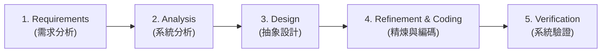

# Ch01 基礎概念與效能分析 (Basic Concepts & Performance Analysis)

> [!NOTE] 課程資訊與學習目標
> - **授課教師**：温敏淦
> - **核心目標**：建立系統開發思維（System Life Cycle）、理解抽象資料型別（ADT）規格與實作分離的核心理念、熟練遞迴演算法與數學推導、掌握空間與時間複雜度的量化分析工具（Big-O, $\Omega$, $\Theta$）。

---

## 1. 系統生命週期 (System Life Cycle)

軟體系統從無到有的完整研發流程主要分為五大階段：



1. **Requirements (需求)**：
   - 制定系統規格（Specifications）。
   - 明確定義問題的**輸入資料（Input）**以及預期產生的**輸出結果（Output）**。
2. **Analysis (分析)**：
   - 將大型複雜問題拆解為可管理的子問題。
   - **Bottom-up（由下而上）**：由細節或現有元件拼湊，缺乏全局藍圖，適用於原型探索。
   - **Top-down（由上而下）**：具備高階全景規劃，層層拆解，大型複雜系統最推薦的策略。
3. **Design (設計)**：
   - 定義資料物件及其上的操作，建立**抽象資料型別（ADT）**。
   - 此階段**完全與特定程式語言無關（Language-independent）**。
4. **Refinement and Coding (精煉與編碼)**：
   - 選擇合適的資料結構來表示資料物件（資料的儲存方式將直接決定後續演算法的效能！）。
   - 以特定程式語言（如 C++）實作各項操作。
5. **Verification (驗證)**：
   - **正確性證明（Correctness Proofs）**：數學層面的嚴謹推導。
   - **測試（Testing）**：以多元測試案例檢驗程式行為。
   - **除錯（Error Removal）**：修正語法與邏輯漏洞。

---

## 2. 抽象資料型別 (Abstract Data Type, ADT)

> [!IMPORTANT] 核心精神：規格與實作分離（Specification vs. Implementation）
> - **資料型別 (Data Type)** = 物件集合 (A set of objects) + 操作集合 (A set of operations)。
> - **ADT** 只宣告「**做什麼（What to do）**」，而不涉及「**怎麼做（How to do it）**」。
> - 使用者僅需透過操作介面呼叫功能，內部資料結構與演算法細節對外隱藏（Information Hiding）。

### 經典範例：自然數 ADT (`NaturalNumber`)

```cpp
class NaturalNumber {
    // 物件定義：從 0 開始到 INT_MAX 的整數有序子集
public:
    NaturalNumber Zero();                          // 回傳 0
    bool IsZero(NaturalNumber x);                  // 判斷 x 是否為 0
    bool Equal(NaturalNumber x, NaturalNumber y);  // 判斷 x 與 y 是否相等
    NaturalNumber Successor(NaturalNumber x);      // 回傳 x 的後繼值 (x + 1)
    NaturalNumber Add(NaturalNumber x, NaturalNumber y); // x + y
    NaturalNumber Subtract(NaturalNumber x, NaturalNumber y); // x - y (若 x < y 則回傳 0)
};
```

---

## 3. 演算法五大特性 (Algorithm Specification)

> [!TIP] 考試必背重點 (#送分題)
> 一個合格的演算法（Algorithm）必須同時滿足以下五大特性：
> 1. **Input（輸入）**：有 0 個或多個由外部提供的輸入量。
> 2. **Output（輸出）**：至少產生 1 個輸出結果。
> 3. **Definiteness（明確性）**：每一道指令必須清晰、明確、無歧義。
> 4. **Finiteness（有限性）**：演算法在執行有限步驟後，必須能夠終止（Program 在計算理論上不一定要終止，如 OS，但 Algorithm 一定要）。
> 5. **Effectiveness（有效性）**：每一步驟都必須足夠基本，原則上能用紙筆在有限時間內完成。

---

## 4. 遞迴演算法 (Recursive Algorithms)

- **直接遞迴 (Direct Recursion)**：函式在其內部直接呼叫自己，如 $f() \rightarrow f()$。
- **間接遞迴 (Indirect Recursion)**：函式透過其他函式間接呼叫自己，如 $f() \rightarrow g() \rightarrow f()$。
- **終止條件 (Base Case / Stopping Condition)**：遞迴結構中最重要的防線，缺乏終止條件將導致無窮遞迴與堆疊溢位（Stack Overflow）。

### 經典案例 1：二分搜尋 (Binary Search)

```cpp
int BinarySearch(int *a, int x, int left, int right) {
    if (left <= right) {
        int mid = left + (right - left) / 2; // 避免溢位寫法
        if (x == a[mid]) return mid;
        if (x < a[mid]) return BinarySearch(a, x, left, mid - 1);
        return BinarySearch(a, x, mid + 1, right);
    }
    return -1; // 找不到
}
```

### 經典案例 2：河內塔 (Towers of Hanoi)

將 $n$ 個盤子從木樁 A 透過木樁 B 搬移至木樁 C：
- **移動次數遞迴關係式**：
  $$T(n) = 2T(n-1) + 1, \quad T(1) = 1$$
- **通項閉合解推導**：
  $$T(n) = 2^n - 1$$
- 時間複雜度為指數級 $O(2^n)$。

---

## 5. 效能分析 (Performance Analysis)

### (1) 空間複雜度 (Space Complexity)

程式執行所需的記憶體總量計算公式：
$$S(P) = c + S_p(I)$$

- **$c$（固定空間，Fixed Part）**：與輸入實例特徵無關的空間（指令空間、簡單變數、常數空間）。
- **$S_p(I)$（變動空間，Variable / Instance Characteristics Part）**：取決於輸入實例特徵 $I$ 的空間（動態配置陣列大小、遞迴呼叫堆疊深度）。

> [!WARNING] 參數傳遞對空間複雜度的致命影響！
> - **傳值（Call by Value）**：呼叫函式時若將大小為 $n$ 的陣列複製傳入，每次呼叫皆耗費 $O(n)$ 空間。若遞迴深度為 $n$，空間複雜度暴增為 $O(n^2)$！
> - **傳址 / 指標（Call by Reference / Pointer）**：每次呼叫僅傳遞固定大小的指標位址（4 或 8 bytes），空間複雜度維持 $O(n)$。

### (2) 時間複雜度與步數計算 (Time Complexity & Step Count)

估算程式執行時間的最有效方式為計算**程式步數（Step Count）**：

| 語句 (Statement) | 每次執行步數 (s/e) | 總執行次數 (Frequency) | 總步數 (Total Steps) |
|:---|:---:|:---:|:---:|
| `float sum(float *a, int n) {` | 0 | 0 | 0 |
| `    float s = 0;` | 1 | 1 | 1 |
| `    for (int i = 0; i < n; i++)` | 1 | $n + 1$ | $n + 1$ |
| `        s += a[i];` | 1 | $n$ | $n$ |
| `    return s;` | 1 | 1 | 1 |
| `}` | 0 | 0 | 0 |
| **總計 (Total)** | - | - | **$2n + 3$ 步** $\rightarrow O(n)$ |

### (3) 漸進記號 (Asymptotic Notations)

1. **Big-$O$（漸進上界，Upper Bound）**：
   - $f(n) = O(g(n))$ 代表存在正常數 $c$ 與 $n_0$，使得當 $n \ge n_0$ 時，$f(n) \le c \cdot g(n)$。
   - 用於評估**最差情況（Worst-Case）**效能。
2. **Omega $\Omega$（漸進下界，Lower Bound）**：
   - $f(n) = \Omega(g(n))$ 代表存在正常數 $c$ 與 $n_0$，使得當 $n \ge n_0$ 時，$f(n) \ge c \cdot g(n)$。
   - 用於評估**最佳情況（Best-Case）**效能。
3. **Theta $\Theta$（漸進緊確界，Tight Bound）**：
   - $f(n) = \Theta(g(n))$ 當且僅當 $f(n) = O(g(n))$ 且 $f(n) = \Omega(g(n))$。

#### 常見成長速率階層（由快至慢）：
$$O(1) < O(\log n) < O(n) < O(n \log n) < O(n^2) < O(n^3) < O(2^n) < O(n!)$$

---

## 📌 隨堂註記 / 老師口述補充

> [!NOTE] 隨堂筆記區
> - 老師課堂補充重點留白區，可在上課時直接在此鍵入文字或補充練習題。
