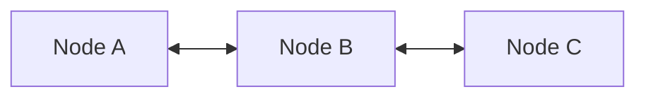

# Ch04 鏈結串列 (Linked Lists) - 初步筆記

> [!NOTE] 課程資訊與學習目標
> - **授課進度**：第 7~8 週課程
> - **教材來源**：`D:\class-memo\migan-DT\05_LinkingList.ppt`
> - **核心重點**：突破陣列大小固定與連續記憶體限制、熟練單向/雙向/環狀串列指標接續操作、實作 C++ Chain 與 Iterator。

---

## 1. 陣列 vs 鏈結串列 (Array vs. Linked List)

| 評估維度 | 陣列 (Array) | 鏈結串列 (Linked List) |
|:---|:---|:---|
| **記憶體空間** | 連續記憶體空間，需事先宣告大小 | 動態非連續節點，按需配置記憶體 |
| **隨機存取** | 支援 $O(1)$ 隨機存取 (`a[i]`) | 不支援，需從頭指標循序走訪 $O(n)$ |
| **插入與刪除** | 需搬移大量元素，平均 $O(n)$ | 僅需修改指標指向，$O(1)$（已知位置） |
| **額外記憶體開銷**| 無 | 每個節點需額外儲存指標位址 |

---

## 2. 單向鏈結串列 (Singly Linked List)

每個節點包含兩個部分：`data`（資料欄位）與 `link`（指向下一個節點的指標）。

```cpp
template <class T> class Chain; // 前向宣告

template <class T>
class ChainNode {
    friend class Chain<T>;
private:
    T data;
    ChainNode<T> *link;
public:
    ChainNode(const T& element, ChainNode<T>* next = nullptr)
        : data(element), link(next) {}
};
```

### 核心指標操作：
1. **在頭部插入節點**：
   ```cpp
   ChainNode<T> *newNode = new ChainNode<T>(val, first);
   first = newNode;
   ```
2. **在節點 `p` 後方插入節點 `y`**：
   ```cpp
   y->link = p->link;
   p->link = y;
   ```
3. **刪除節點 `p` 後方的節點**：
   ```cpp
   ChainNode<T> *del = p->link;
   p->link = del->link;
   delete del;
   ```

---

## 3. 環狀鏈結串列 (Circular Linked List)

- 將最後一個節點的 `link` 指針指向第一個節點，形成封閉環狀結構。
- **維護尾端指標 `last`**：
  - 存取最後一個節點：`last`，耗時 $O(1)$。
  - 存取第一個節點：`last->link`，同樣只需 $O(1)$！大幅提升頭尾兩端的操作效率。

---

## 4. 雙向鏈結串列 (Doubly Linked List)

為克服單向串列無法反向搜尋的限制，每個節點維護兩個指標：`llink`（指向左節點/前驅）與 `rlink`（指向右節點/後繼）。



> [!TIP] 雙向串列指標操作四部曲（必考題）
> 在節點 `p` 的右側插入新節點 `node`：
> 1. `node->llink = p;`
> 2. `node->rlink = p->rlink;`
> 3. `p->rlink->llink = node;`
> 4. `p->rlink = node;`

---

## 📌 隨堂註記 / 老師口述補充

> [!NOTE] 隨堂筆記區
> - 上課即時補充重點與程式碼範例。
