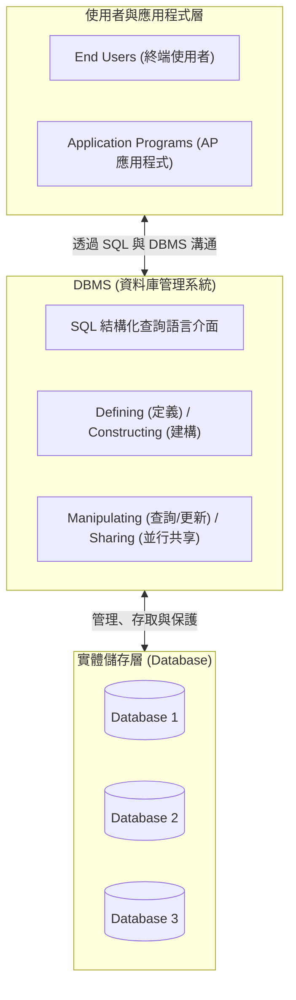
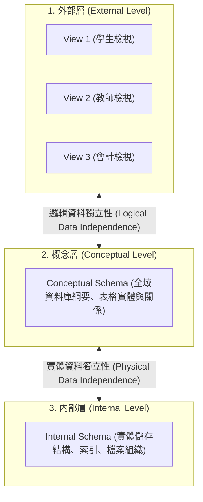

# Ch01 資料庫系統概念與架構 (Database System Concepts & Architecture)

> [!NOTE] 課程資訊與學習目標
> - **授課教師**：陳士杰
> - **核心目標**：理解資料庫（DB）、資料庫管理系統（DBMS）與資料庫系統（DS）之定義與層級架構、掌握手寫筆記重點「何時不需 DBMS」、深入 ANSI/SPARC 三層架構與資料獨立性、理解 View 虛擬表格與 Meta-data 之本質。

---

## 1. 資料庫系統三位一體：DB, DBMS 與 DS



### (1) 資料庫 (Database, DB)
- **定義**：一群**具關聯性（Related）**且經過**系統化儲存**的資料集合。
- **特性**：
  - 減少資料重複性（Redundancy）。
  - 為了特定需求或目的而建構。
  - 必須由 DBMS 統一管理。

### (2) 資料庫管理系統 (DBMS, Database Management System)
- **定義**：一套軟體程式系統（A set of programs），協助使用者進行資料庫的建立、維護與管理。
- **核心四大功能**：
  1. **Defining（定義）**：定義資料結構、資料型態、儲存位置與限制條件。
  2. **Constructing（建構）**：實際在儲存媒體上建立表格、配置儲存空間與環境設定（透過 DDL/SQL）。
  3. **Manipulating（操作）**：提供查詢（Querying）、新增、修改、刪除（Updating）等指令操作（透過 DML/SQL）。
  4. **Sharing（共享）**：允許多位使用者與多個應用程式在同時間安全地並行存取（Concurrency Control）。

### (3) 資料庫系統 (Database System, DS)
$$\text{DS} = \text{DB (資料庫)} + \text{DBMS (管理系統)}$$
- **市售主流商用/開源系統**：Oracle、Microsoft SQL Server、IBM DB2、MySQL、PostgreSQL。
- **價值所在**：DBMS 的核心價值在於其強大的**「安全性（Security）」**、**「完整性（Integrity）」**與**「並行交易處理（Concurrency）」**。

---

## 2. 考點聚焦：何時「不需要」使用 DBMS？

> [!TIP] 期中考高頻問答題（手寫筆記重點標記 ★）
> 雖然 DBMS 功能強大，但建立與維護成本高昂。在下列情境中，**不建議或不需要**引入 DBMS：
> 1. **嚴苛的即時性要求（Stringent Real-time Requirements）**：DBMS 的安全檢查、交易日誌與查詢解析會帶來額外開銷（Overhead），對微秒級硬即時系統（如航太雷達、高頻交易底層硬體）可能造成瓶頸。
> 2. **單人作業且不需擴充（No Multiple-user Access）**：僅供單機單人使用，無多人並行存取或未來擴展需求。
> 3. **資料結構與內容極度簡單**：單純存取固定設定檔或靜態日誌，直接採用文字檔或輕量格式（如 JSON/SQLite）更具成本效益。

### DBMS 的優缺點對決：
- **核心優點**：
  - 避免資料冗餘（Avoid Data Redundancy） $\rightarrow$ 達成資料集中化與存取介面標準化。
  - 避免資料不一致（Avoid Data Inconsistency） $\rightarrow$ 傳播更新（Propagating Update）。
  - 多人即時共享（Multi-User Sharing） $\rightarrow$ 達到資料獨立性（Data Independence）。
  - 嚴密的安全性約束與完整性控制（Security Constraints & Integrity Controls）。
- **主要缺點**：
  - 軟硬體授權與維護成本高。
  - 系統架構複雜，專業人才培訓不易。
  - 一旦 DBMS 發生故障，受影響的應用層面極大（集中式風險）。

---

## 3. 資料庫角色與關鍵概念

### (1) 利害關係人角色
- **DBA (Database Administrator, 資料庫管理師)**：負責授權、效能監控、備份回復、系統資源調配。
- **DBD (Database Designer, 資料庫設計師)**：負責需求分析、ER 模型設計、關聯表格正規化。
- **End Users (終端使用者)**：透過前端介面或預存程序存取資料（分為單純查詢型與進階分析型）。
- **Software Engineers (軟體工程師 / SE)**：撰寫應用程式存取邏輯。

### (2) View (視圖 / 虛擬表格)
- **本質**：只具備定義、**不儲存實體資料的虛擬表格（Virtual Table）**，就像是資料庫的一件「外衣」。
- **特性**：
  - 只有符合存取權限的使用者才能檢視特定 View。
  - 實體表格（Base Table）經由 DBMS 篩選/投影動態產生 View。
  - **安全性價值**：隱藏機密欄位（如薪資、身分證號），達成列層級與欄層級的安全控管。

### (3) Meta-data (中繼資料) vs. Instance (資料實例)
- **Meta-data（中繼資料 / Schema）**：
  - 「描述資料的資料（Data about Data）」或「資料字典（Data Dictionary）」。
  - 存放於系統目錄（System Catalog），具備**自我描述性（Self-Describing）**。
  - **異動頻率：極低（稀少變動）**。
- **Instance（資料實例 / Database State）**：
  - 在特定時間點，資料庫中所儲存的實際資料列（Tuples/Records）。
  - **異動頻率：極高（經常變動）**。

```
+------------------------------------+  <-- Schema / Meta-data
| Student_ID | Student_Name | Year   |      (欄位定義，稀少變動)
+------------------------------------+
| 001        | Alice        | Soph   |  <-- Instance / Data
| 002        | Bob          | Senior |      (實際資料列，頻繁新增修改)
+------------------------------------+
```

---

## 4. ANSI/SPARC 三層架構與資料獨立性



1. **邏輯資料獨立性 (Logical Data Independence)**：
   - 當概念層綱要修改時（例如新增資料表或新增欄位），不影響現有的外部層視圖與應用程式。
2. **實體資料獨立性 (Physical Data Independence)**：
   - 當內部層實體儲存結構改變時（例如新增 B+ Tree 索引、更換硬碟儲存路徑），不影響概念層綱要與應用程式邏輯。

---

## 📎 課堂手寫原稿對照

> [!NOTE] 手寫講義原稿存檔
> 課堂第一週手寫筆記重點原圖已收錄於 `assets/`：
> ![[資料庫L1_260920_142254.png]]

---

## 📌 隨堂註記 / 老師口述補充

> [!NOTE] 隨堂筆記區
> - 上課即時補充重點區。
