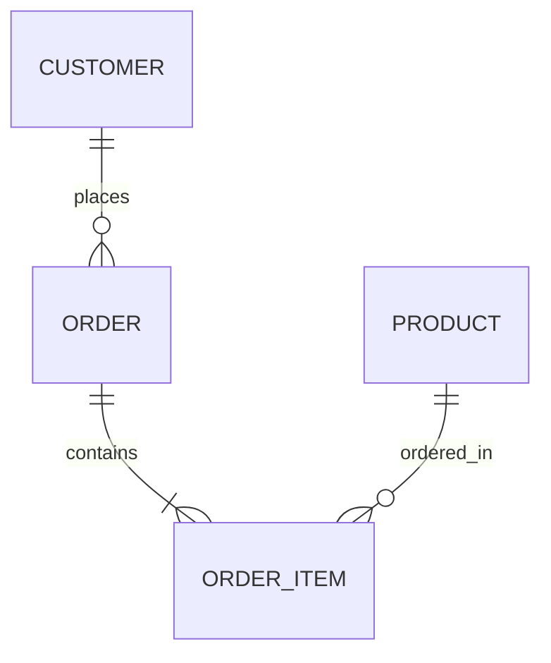

# Ch03 ER 實體關係模型設計 (Entity-Relationship Model) - 初步筆記

> [!NOTE] 課程資訊與學習目標
> - **授課進度**：第 4~5 週課程
> - **教材來源**：`D:\class-memo\資料庫\Ch04.pdf` 與 `Course 5. ER及EER Model轉換為關聯表格.pdf`
> - **核心重點**：掌握實體（Entity）、屬性（Attribute）、關係（Relationship）概念、基數限制（1:1, 1:N, M:N）、精通 ER 轉關聯表之 7 大標準法則。

---

## 1. ER 模型基本構件

1. **Entity（實體）與 Entity Set（實體集）**：
   - 現實世界中可區別的物件（如：學生、課程、員工）。
   - **弱實體（Weak Entity）**：無法單獨靠自身屬性唯一識別，必須依附於強實體（識別實體 Identifying Entity）存在的實體（如：員工的眷屬）。
2. **Attribute（屬性）分類**：
   - **單值 vs 多值屬性 (Single-valued vs. Multi-valued)**：電話號碼可能是多值屬性（雙線橢圓）。
   - **簡單 vs 複合屬性 (Simple vs. Composite)**：地址可拆解為縣市、行政區、路名。
   - **儲存 vs 衍生屬性 (Stored vs. Derived)**：出生年月日為儲存屬性，年齡為衍生屬性（虛線橢圓）。
   - **鍵值屬性 (Key Attribute)**：底線標示。
3. **Relationship（關係）與結構限制**：
   - **基數比 (Cardinality Ratio)**：1:1（一對一）、1:N（一對多）、M:N（多對多）。
   - **參與限制 (Participation)**：
     - 完全參與（Total Participation，雙線）：每個實體皆必須參與關係。
     - 部分參與（Partial Participation，單線）：實體可選擇性參與關係。

---

## 2. ER 轉關聯表格 7 大法則 (Mapping ER to Relational Tables)

> [!IMPORTANT] 資料庫設計最核心精華（期中/期末考必出轉換大題）
> 1. **正規實體轉換**：每個正規實體獨立轉成一張 Table，主鍵即為實體鍵值。
> 2. **弱實體轉換**：弱實體轉成獨立 Table，主鍵由「強實體主鍵 + 弱實體之部分鍵（Partial Key）」聯合組成。
> 3. **1:1 關係轉換**：將其中一方的主鍵作為外鍵放入另一方表格（通常選擇完全參與的一方放入外鍵）。
> 4. **1:N 關係轉換（最常見！）**：**將 1 端的主鍵放入 N 端的表格中作為外鍵（FK）**！
> 5. **M:N 關係轉換**：**必須建立一張全新的關聯表格（Junction Table）**，將兩端的主鍵同時納入，並以該聯合主鍵作為新表的主鍵！
> 6. **多值屬性轉換**：多值屬性必須獨立拉出一張新 Table，主鍵由「原實體主鍵 + 該屬性值」聯合組成。
> 7. **$N$ 元關係轉換（$N > 2$）**：建立獨立關聯表格，包含所有參與實體之主鍵作為外鍵。

---

## 📌 隨堂註記 / 老師口述補充

> [!NOTE] 隨堂筆記區
> - 上課即時補充重點區。
