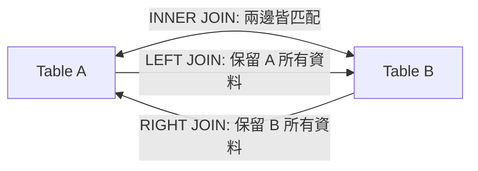

# Ch04 SQL 結構化查詢語言實務 (Structured Query Language) - 初步筆記

> [!NOTE] 課程資訊與學習目標
> - **授課進度**：第 6~7 週課程
> - **教材來源**：`D:\class-memo\資料庫\Course 6. SQL.pdf` 與 `MySQL_Ch1~Ch4.pdf`
> - **核心重點**：熟練 DDL（建表與約束）、精通 DML（增刪改查）、靈活運用多表連接（JOIN）、分組聚合（GROUP BY / HAVING）與子查詢。

---

## 1. SQL 語法三大分支

- **DDL (Data Definition Language)**：`CREATE`, `ALTER`, `DROP`, `TRUNCATE`（定義綱要結構）。
- **DML (Data Manipulation Language)**：`SELECT`, `INSERT`, `UPDATE`, `DELETE`（操作資料內容）。
- **DCL (Data Control Language)**：`GRANT`, `REVOKE`（權限安全控制）。

---

## 2. 核心查詢語法框架

```sql
SELECT   [DISTINCT] 欄位清單, 聚合函數
FROM     資料表名稱
[JOIN    其他表格 ON 關聯條件]
[WHERE   過濾條件 (針對單筆記錄)]
[GROUP BY 分組欄位]
[HAVING  分組過濾條件 (針對聚合結果)]
[ORDER BY 排序欄位 [ASC | DESC]]
[LIMIT   筆數限制];
```

> [!WARNING] `WHERE` 與 `HAVING` 的關鍵差異！
> - `WHERE`：在**資料分組（GROUP BY）之前**先過濾單筆資料，不能使用聚合函數（如 `WHERE AVG(salary) > 50000` 為非法語法！）。
> - `HAVING`：在**資料分組之後**對聚合計算結果進行過濾（如 `HAVING AVG(salary) > 50000`）。

---

## 3. 多表連接 (Table JOINs)



```sql
-- 經典 INNER JOIN 範例：查詢學生姓名及其所選課程
SELECT S.student_name, C.course_name
FROM Students S
INNER JOIN Enrollments E ON S.student_id = E.student_id
INNER JOIN Courses C ON E.course_id = C.course_id;

-- LEFT OUTER JOIN：查詢所有學生（包含尚未選課的學生）
SELECT S.student_name, E.course_id
FROM Students S
LEFT JOIN Enrollments E ON S.student_id = E.student_id;
```

---

## 4. 常用聚合函數 (Aggregate Functions)

- `COUNT(*)`：統計總資料列數（包含 NULL）。
- `COUNT(欄位)`：統計該欄位非 NULL 的資料筆數。
- `SUM(欄位)`、`AVG(欄位)`、`MAX(欄位)`、`MIN(欄位)`。

---

## 📌 隨堂註記 / 老師口述補充

> [!NOTE] 隨堂筆記區
> - 上課即時補充重點區。
