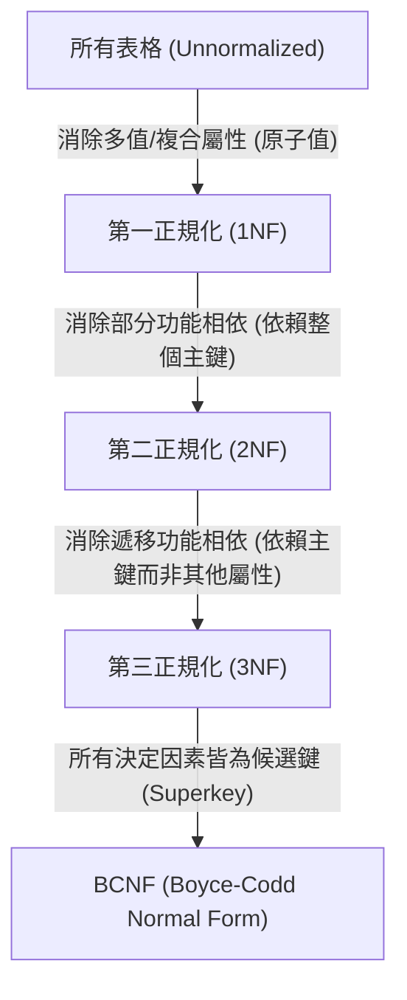

# 🗄️ 資料庫 Ch05: 功能相依性與正規化理論 (Functional Dependencies & Normalization)

> **授課教師**：陳士杰 教授  
> **教材對齊**：`Course 4`, `Ch04.pdf`, 關聯式資料庫設計正規化  
> **核心主題**：不良資料庫設計異常 (Insert/Delete/Update Anomalies)、功能相依性 (Functional Dependency, FD)、阿姆斯壯公理 (Armstrong's Axioms)、1NF 到 BCNF 逐步拆解演算法、無失真結合 (Lossless Join) 與相依性保持 (Dependency Preservation)

---

## 1. 資料庫異常問題 (Database Anomalies)

當關聯綱要 (Relation Schema) 設計不良、將過多實體屬性混雜在同一個表格時，會引發三大異常：
1. **新增異常 (Insertion Anomaly)**：若要新增一門新課程，但尚未有學生選課，若主鍵包含 `StudentID`，受限於實體完整性限制 (Entity Integrity, 主鍵不可為 NULL)，導致無法將該課程輸入資料庫。
2. **刪除異常 (Deletion Anomaly)**：若某學生退選某課程，刪除該筆學生修課紀錄時，意外將該課程的所有資訊（如授課教師、學分數）從系統中徹底抹除。
3. **修改異常 (Update Anomaly)**：同一教師的辦公室電話在資料庫中重複儲存了 500 次。當教師更換電話時，若漏改其中一筆，將導致資料不一致性 (Inconsistency)。

---

## 2. 功能相依性 (Functional Dependency, FD)

> **定義**：設 $R$ 為一關聯綱要，$X$ 與 $Y$ 為 $R$ 的屬性子集合。若對 $R$ 的任何合法狀態 (Instance) $r(R)$，只要兩個元組 (Tuples) $t_1, t_2$ 在 $X$ 上的值相同，其在 $Y$ 上的值也必定相同，則稱 **$X$ 功能決定 $Y$**，記作：
> $$\mathbf{X \to Y}$$
> 其中 $X$ 稱為**決定因素 (Determinant)**，$Y$ 稱為**相依屬性 (Dependent)**。

### 阿姆斯壯公理 (Armstrong's Axioms - 完備且合理)
1. **反身律 (Reflexivity)**：若 $Y \subseteq X$，則 $X \to Y$（平凡相依，Trivial FD）。
2. **擴充律 (Augmentation)**：若 $X \to Y$，則 $XZ \to YZ$。
3. **遞移律 (Transitivity)**：若 $X \to Y$ 且 $Y \to Z$，則 $X \to Z$。

**次要推導規則**：
- **結合律 (Union)**：若 $X \to Y$ 且 $X \to Z$，則 $X \to YZ$。
- **分解律 (Decomposition)**：若 $X \to YZ$，則 $X \to Y$ 且 $X \to Z$。
- **偽遞移律 (Pseudo-transitivity)**：若 $X \to Y$ 且 $WY \to Z$，則 $WX \to Z$。

---

## 3. 正規化階層 (Normal Forms: 1NF $\to$ BCNF)

正規化旨在透過屬性分解消除資料重複與異常：



### 3.1 第一正規化 (1NF, First Normal Form)
- **要求**：表格中每個欄位的值都必須是**不可分割的原子值 (Atomic Value)**，不可包含重複群 (Repeating Groups) 或多值屬性 (Multivalued Attributes)。

### 3.2 第二正規化 (2NF, Second Normal Form)
- **要求**：符合 1NF，且**每個非主鍵屬性必須「完全功能相依 (Fully Functionally Dependent)」於候選鍵**（消除部分相依 Partial Dependency）。
- **觸發情境**：只會在**複合主鍵 (Composite Primary Key)** 出現時發生。若主鍵為單一屬性，則自動符合 2NF。

### 3.3 第三正規化 (3NF, Third Normal Form)
- **要求**：符合 2NF，且**消除遞移功能相依 (Transitive Dependency)**。
- 即：非主鍵屬性不可依賴於另一個非主鍵屬性（若 $A \to B \to C$，其中 $A$ 為主鍵，$B$ 為非主鍵，則 $A \to C$ 構成遞移相依，需拆成 $(A, B)$ 與 $(B, C)$ 兩表格）。

### 3.4 BCNF (Boyce-Codd Normal Form)
- **要求**：比 3NF 更嚴格。對於關聯中每一個非平凡的功能相依 $X \to Y$，$X$ 都必須是**超鍵 (Superkey)**。
- 徹底消除由多個重疊候選鍵所產生的相依性異常。

---

## 4. 分解性質檢定 (Properties of Decompositions)

將關聯 $R$ 分解為 $R_1, R_2$ 時，必須滿足兩大關鍵性質：
1. **無失真結合 (Lossless-Join Decomposition)**：
   - 保證透過自然結合 ($R_1 \bowtie R_2$) 能完全還原出原始表格 $R$，不會產生虛假元組 (Spurious Tuples)。
   - **判定準則**：$R_1 \cap R_2 \to R_1$ 或 $R_1 \cap R_2 \to R_2$ 必須成立（兩表的交集屬性至少是其中一個表的超鍵）。
2. **相依性保持 (Dependency Preservation)**：
   - 原始關聯的所有 FD 在拆解後的子關聯中都能各自被檢核，不需跨表 Join。

---

## 🎯 課堂速記與期末考檢核重點

> [!TIP]
> 1. **正規化手算拆解大題**：給定關聯 $R(A, B, C, D, E)$ 與一組 FD，求其候選鍵，並依序指出它違反了哪一級正規化，逐步拆解至 3NF 或 BCNF。
> 2. **無失真判定**：利用交集屬性推導是否包含決定因素，判斷分解是否為 Lossless-Join。

```markdown
<!-- 上課重點即時填寫區 -->
> [!note] 課堂速記 (隨堂記錄陳老師補充)
> - 
```
