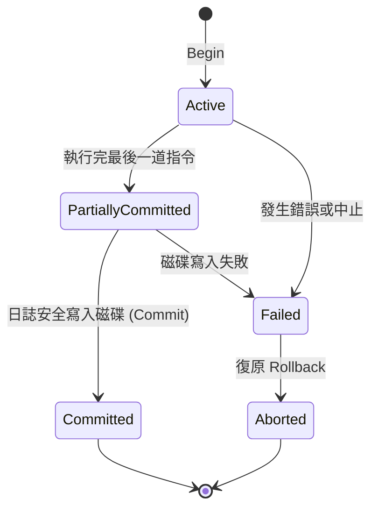

# 🗄️ 資料庫 Ch08: 交易處理與 ACID 特性 (Transaction Processing & ACID)

> **授課教師**：陳士杰 教授  
> **教材對齊**：`Course 8. 交易處理.pdf`  
> **核心主題**：交易概念 (Transaction Concept)、交易狀態轉換圖 (State Transition Diagram)、ACID 四大特性嚴格定義、並行控制引發之三大問題 (Lost Update, Dirty Read, Unrepeatable Read)、排程可循序化 (Serializability) 與優先圖 (Precedence Graph)

---

## 1. 交易概念與狀態轉換 (Transaction Concepts)

**交易 (Transaction)**：構成單一邏輯工作單元 (Logical Unit of Work) 的一系列資料庫讀取與寫入操作。



1. **Active (活動中)**：交易開始執行，讀寫操作進行中。
2. **Partially Committed (部分認可)**：交易最後一道敘述已執行完畢，但記憶體緩衝區資料尚未完全安全寫入磁碟。
3. **Committed (已認可)**：交易成功完成，所有更動永久存盤，不可復原。
4. **Failed (失敗)**：因語法錯誤、除以零、死結或硬體故障無法繼續執行。
5. **Aborted (已中止)**：系統執行 **Rollback (回滾)**，將資料庫還原至交易開始前的狀態。

---

## 2. 交易 ACID 四大特性 (必考核心)

| 特性 | 英文名稱 | 定義與意涵 | 負責之 DBMS 子系統 |
| :--- | :--- | :--- | :--- |
| **不可分割性** | **Atomicity** | **「全有或全無 (All or Nothing)」**。交易中的所有操作要麼全部永久生效，要麼完全不做。 | 回復管理系統 (Recovery Manager) |
| **一致性** | **Consistency** | 交易執行前後，資料庫必須始終維持所有的**完整性限制 (Integrity Constraints)** 與業務規則。 | 完整性子系統 + 應用程式邏輯 |
| **隔離性** | **Isolation** | 多個交易並行執行時，任一交易的中間未認可狀態**不得為其他交易看見**，如同獨占執行。 | 並行控制子系統 (Concurrency Control) |
| **持久性** | **Durability** | 一旦交易 Commit，其對資料庫的修改將**永久保存**於儲存體，即使隨後系統當機亦不遺失。 | 回復管理系統 (Log / WAL) |

---

## 3. 並行執行問題 (Concurrency Anomalies)

若無並行控制，交錯執行交易會引發三大災難：
1. **遺失修改 (Lost Update)**：
   - $T_1$ 讀取 $A$，$T_2$ 亦讀取 $A$；$T_1$ 修改 $A$ 寫回，$T_2$ 隨後修改 $A$ 寫回，導致 $T_1$ 的修改被完全覆蓋抹殺。
2. **暫時性更新讀取 / 髒讀 (Dirty Read / Reading Uncommitted Data)**：
   - $T_1$ 修改了 $A$ 但尚未 Commit，$T_2$ 讀取了 $T_1$ 修改後的 $A$；隨後 $T_1$ 發生錯誤執行 Rollback，導致 $T_2$ 讀到的是根本不存在的「髒資料」。
3. **不可重複讀取 (Unrepeatable Read)**：
   - $T_1$ 讀取了 $A=10$；隨後 $T_2$ 修改 $A=20$ 並 Commit；$T_1$ 再次讀取 $A$ 時發現值變成 20，同一交易內兩次讀取結果不一致。

---

## 4. 排程與可循序性 (Serializability)

- **循序排程 (Serial Schedule)**：多個交易完全依序執行（$T_1$ 做完才換 $T_2$），保證正確，但 CPU 與 I/O 吞吐量極低。
- **衝突可循序化 (Conflict Serializability)**：若一個交錯排程在不改變任何衝突操作次序的前提下，可等價轉換為某個循序排程，則該排程保證正確無誤！

### 衝突操作定義 (Conflict Operations)：
兩道相鄰指令若滿足：**屬於不同交易**、**存取同一個資料項目**、且**至少有一個操作為寫入 (`write`)**，則兩者構成衝突。

### 優先圖演算法 (Precedence Graph / Serialization Graph 判定法)：
1. 每個交易為一個頂點 $T_i$。
2. 若 $T_i$ 執行了某操作，且 $T_j$ 隨後執行了與之衝突的操作，則畫一條有向邊：$T_i \to T_j$。
3. **判定定理**：
   $$\mathbf{優先圖無環 (Acyclic) \iff 排程為衝突可循序化 (Conflict Serializable)}$$
   - 對該圖進行拓撲排序，所得序列即為其等價的循序執行順序！

---

## 🎯 課堂速記與期末考檢核重點

> [!TIP]
> 1. **ACID 填空與論述**：清楚背誦四大特性的中英文名稱、定義與各自對應的 DBMS 子系統。
> 2. **衝突可循序判定大題**：給定包含多個讀寫操作的 Schedule $S$，畫出 Precedence Graph，判斷是否有環並說明其可循序性。

```markdown
<!-- 上課重點即時填寫區 -->
> [!note] 課堂速記 (隨堂記錄陳老師補充)
> - 
```
