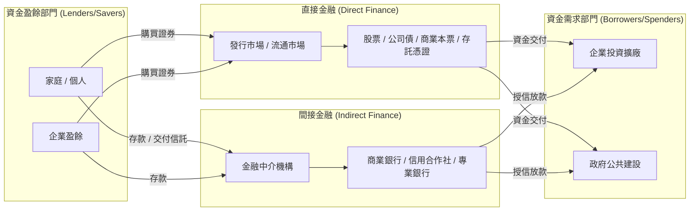

# 🏛️ Ch01 金融市場概論與金融體系架構

> **授課教師**：楊屯山 教授  
> **對應簡報**：ch01_金融市場概論.pdf  
> **重點導讀**：剖析現代金融體系的資金流動管道（直接金融 vs 間接金融）、金融市場分類功能、金融機構類型與法規限制，並對焦期中/期末模擬試題之核心考點。

---

## 📌 1. 金融市場的核心功能與資金流動

金融市場是資金盈餘者（家庭、企業、政府）將剩餘資金移轉給資金短缺者（需要資金進行實體投資或擴廠的企業、政府）的運作場所與機制。

### 資金移轉的兩大管道

| 比較維度 | 直接金融 (Direct Finance) | 間接金融 (Indirect Finance) |
| :--- | :--- | :--- |
| **定義** | 資金需求者直接對投資人發行金融證券以籌措資金 | 資金供給者先將資金存入中介機構，再由機構貸放給借款人 |
| **典型金融工具** | 普通股、特別股、公司債、海外可轉債 (ECB)、商業本票 (CP)、存託憑證 (ADR/GDR/TDR) | 銀行活定存、企業融資貸款、房屋貸款、透支 |
| **中介機構角色** | 證券承銷商、經紀商、票券商（僅協助發行或撮合，**不承擔借款違約風險**） | 商業銀行、專業銀行、信用合作社（**自擔放款違約風險**） |
| **台灣發展趨勢** | 隨著企業籌資管道多元化，**直接金融比重逐年提高** | 傳統放款比重相對降低，銀行面臨去中介化壓力 |

> [!IMPORTANT]
> ### 🎯 模擬試題焦點標註
> - **【期中試題第 1 題】**：若一間公司決定以直接金融的方式向外籌資，下列何者為非？ $\to$ **(C) 向銀行貸款**（銀行貸款屬於間接金融，發行 ECB、股票、存託憑證皆為直接金融）。
> - **【期中試題第 4 題】**：下列何者非屬直接金融範疇？ $\to$ **(A) 專業銀行**（專業銀行為收受存款辦理放款之間接金融中介機構，票券公司、證券商、投資銀行則屬於直接金融服務商）。
> - **【期末試題第 23 題】**：台灣金融市場長期趨勢為「**直接金融比重逐年提升**」，並非間接金融提升。

---

## 📌 2. 金融市場的分類維度

金融市場依照不同屬性可分為以下四大維度：

1. **依求償權期限劃分**：
   - **貨幣市場 (Money Market)**：交易到期日**在一年以內**的短期債權工具（國庫券、商業本票、可轉讓定期存單、銀行承兌匯票、RP/RS）。
   - **資本市場 (Capital Market)**：交易期限**在一年以上**的中長期股權與債權工具（股票、公司債、政府公債）。
2. **依發行與轉手階段劃分**：
   - **初級市場 (Primary Market / 發行市場)**：新證券首次發行與銷售的市場，企業真正取得籌資款項。
   - **次級市場 (Secondary Market / 流通市場)**：已發行證券在不同投資人間轉手買賣的市場，賦予證券流動性（集中市場與櫃買市場）。
3. **依交割時間劃分**：
   - **即期市場 (Spot Market)**：交易成立後立即或於 2 個營業日內 ($T+2$) 完成交割。
   - **遠期與期貨市場 (Forward & Futures Market)**：於約定未來的特定日期，依當前約定價格進行交割。
4. **依交易組織形式劃分**：
   - **集中交易市場 (Exchange Market)**：標準化契約、集中撮合交易（如臺灣證券交易所 TWSE、期交所 TAIFEX）。
   - **店頭市場 (Over-the-Counter, OTC)**：非標準化商品、雙向議價或造市商報價交易（如櫃買中心 TPEx、外匯市場、大部分結構型商品）。

---

## 📌 3. 金融中介機構的特殊法規與業務限制

在台灣的金融體系中，不同金融機構受到嚴格的法律監理，其業務範圍有明確的排他性與政策任務：

1. **商業銀行**：以吸收各類存款、供給短期及中長期信用、辦理國內外匯兌為主要業務。
2. **專業銀行**：
   - **中小企業銀行**：其對中小企業的放款總額**不得低於貸放總額的 60%**，前身為早期合會儲蓄公司。
   - **工業銀行**：以供給工、礦、交通等重大生產事業中長期信用為目的，**依法不得向一般自然人大眾吸收活期或儲蓄存款**。
3. **中華郵政（郵政儲金）**：
   - 依法吸收社會大眾龐大的小額郵政儲金。
   - **【重要限制】中華郵政本身依法絕不能承作一般的民間放款業務**，其資金必須轉存中央銀行或指定銀行，或承作公債投資。

> [!IMPORTANT]
> ### 🎯 模擬試題焦點標註
> - **【期中試題第 3 題】**：下列何種金融機構並不能從事一般的放款業務？ $\to$ **(C) 中華郵政**。

