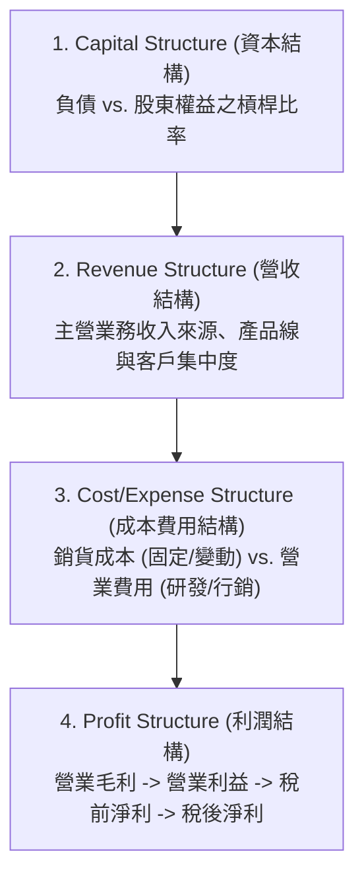

# W01 金融市場概論與財報架構 (Introduction to Financial Markets & Financial Statements)

> [!NOTE] 課程資訊與學習目標
> - **授課教師**：楊屯山
> - **核心目標**：理解金融本質與市場三大要素（定價、交易量、波動性）、掌握公司財報四大結構診斷體系、精通到期殖利率（YTM）定義與債券價格反向變動機制、理解美國國債之基準地位。

---

## 1. 金融市場本質與三大要素

- **金融的真諦**：「金」是資金與資產；「融」是交易與流通。**金融即是「有價資產的整合與跨期跨區配置」**。
- **信用的重要性**：信用（Credit）是金融運作的根本通貨；一旦信用鏈斷裂，便引發系統性金融危機。
- **金融機構的核心定位**：金融機構本身不直接創造實體商品，其核心價值在於**「協助、撮合、銷售」**，大幅降低交易成本與資訊不對稱。

### 金融市場三大維度：
1. **Valuation (資產定價)**：金融市場的核心靈魂。資產價格反映市場對其未來現金流之現值預期。
2. **Volume (交易量)**：流動性（Liquidity）的具體體現。缺乏交易量的市場無法提供公允定價。
3. **Volatility (波動性)**：價格變動劇烈程度，**在金融學中直接等同於「風險」的代名詞**。

---

## 2. 公司財報分析與診斷四大結構

> [!IMPORTANT] 企業經營體質診斷地圖（課堂重點 #重要）
> 評估一間公司的真實價值，必須自財報四大結構逐層剖析：

1. **Capital Structure (資本結構)**：公司資產負債表中「負債（Debt）」與「股東權益（Equity）」的配比。過高的負債比帶來財務槓桿風險，過低則可能資金運用缺乏效率。
2. **Revenue Structure (營收結構)**：公司營收來源組成。本業主營收入是否穩健？是否有單一客戶佔比過高之隱患？
3. **Cost / Expense Structure (成本與費用結構)**：
   - 銷貨成本（COGS）：直接生產成本（原物料、工廠工資）。
   - 營業費用（OPEX）：研發、銷售、行政管理費用。
4. **Profit Structure (利潤結構)**：
   - **營業毛利 (Gross Profit)** = 營業收入 - 營業成本（反映商品本體競爭力）。
   - **營業利益 (Operating Income)** = 營業毛利 - 營業費用（反映企業核心營運獲利能力）。
   - **稅後淨利 (Net Income)** = 最終歸屬於股東的淨報酬。

---

## 3. 債券市場與到期殖利率 (Yield to Maturity, YTM)

### (1) 殖利率定義（修正錯字：Yield！）
- **YTM (到期殖利率)**：投資人以當前市場價格買入債券並**持有至到期日（Maturity）**，且中間收到的所有票面債息皆能以此報酬率再投資時，所獲得的**實質年化內部報酬率（IRR）**。

### (2) 債券定價評價公式
設債券面額為 $F$、每期票面債息為 $C$、期數為 $n$、當前市價為 $P$：
$$P = \sum_{t=1}^n \frac{C}{(1 + \text{YTM})^t} + \frac{F}{(1 + \text{YTM})^n}$$

> [!TIP] 債券蹺蹺板效應（必考直覺）
> **債券市場價格與到期殖利率呈「反向變動」關係**！
> - 當市場利率（殖利率）上升時 $\rightarrow$ 債券價格**下跌**。
> - 當市場利率（殖利率）下降時 $\rightarrow$ 債券價格**上漲**。

### (3) 美國國債 (US Treasury Bonds)
- 被全球金融市場公認為**「無風險資產（Risk-free Asset）」**。
- 美國國債殖利率即為全球資產定價的「定海神針（錨定利率）」，其他所有公司債或金融商品之殖利率皆以其為基準加上**信用風險貼水（Credit Spread）**。

---

## 📌 隨堂註記 / 老師口述補充

> [!NOTE] 隨堂筆記區
> - 上課即時補充重點區。
