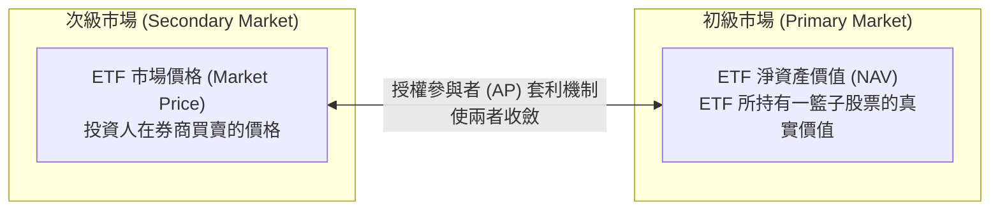

# W02 公司內在價值與 ETF 評價機制 (Valuation and ETFs)

> [!NOTE] 課程資訊與學習目標
> - **授課進度**：第 2 週課程
> - **核心目標**：深入理解公司內在價值（Intrinsic Value）三大成分、掌握股價形成的雙軌機制（短期投票機 vs 長期體重計）、解析帳面/市場/清算價值之時空轉換、透徹精通 ETF 折溢價與套利機制。

---

## 1. 什麼是企業內在價值？ (Intrinsic Value)

在價值投資大師葛拉漢與巴菲特的理論中，公司的真實內在價值由三大成分構築而成：

1. **淨資產清算價值 (Asset Value)**：公司目前擁有的土地、廠房、設備、存貨與現金，扣除全部負債後的「股東權益」。這是最底層的資產安全墊。
2. **獲利能力與自由現金流 (Free Cash Flow, FCF)**：企業利用現有資產創造實質現金的本領。唯有能帶回源源不絕自由現金流的公司才具備持續擴展的能力。
3. **經濟護城河與未來成長性 (Economic Moat)**：品牌忠誠度、專利技術、獨家特許權、規模優勢或高轉換成本，決定了公司未來 5~10 年抵禦競品入侵的能力。

---

## 2. 股價如何形成？ (葛拉漢經典名言)

> *"In the short run, the market is a voting machine, but in the long run, it is a weighing machine."*
> —— Benjamin Graham

- **短期形成機制：投票機 (Voting Machine)**
  - 由**資金供需關係、市場情緒、籌碼面、群體心理**主導。短期間受消息面與恐慌貪婪情緒推動，股價可能嚴重偏離真實價值。
- **長期形成機制：體重計 (Weighing Machine)**
  - 由**基本面、實質獲利能力、現金流產出**主導。時間拉長後，市場終究會精確秤出企業的真實份量，股價必然向內在價值收斂。

---

## 3. 三大價值形態的時間與狀態轉換

| 價值形態 | 衡量視角 | 核心意涵 |
|:---|:---|:---|
| **Book Value (帳面價值)** | **記錄「過去」** | 資產負債表上的歷史成本扣除累計折舊後的淨值。 |
| **Market Value (市場價值)** | **反映「現在與預期」**| 股票市場當前交易價格 $\times$ 總發行股數（市值），反映當下情緒與未來成長期望。 |
| **Liquidation Value (清算價值)** | **面臨「終點與解體」**| 企業宣告破產清算時，資產在拍賣市場變現後扣除債務的剩餘殘值（通常低於帳面價值）。 |

---

## 4. ETF 折價、溢價與套利平抑機制

- **淨值 (Net Asset Value, NAV)**：ETF 所持有一籃子股票總市值扣除費用後，除以發行總單位數。
- **溢價 (Premium)**：$\text{市價} > \text{淨值}$（市場追價過熱，買貴了）。
  - **套利操作**：授權參與者（AP）在初級市場以淨值申購新份額，並在次級市場以高價市價賣出，賣壓促使市價回跌貼近淨值。
- **折價 (Discount)**：$\text{市價} < \text{淨值}$（市場恐慌拋售，變便宜了）。
  - **套利操作**：AP 在次級市場低價收購 ETF 份額，向發行投信申請贖回一籃子現貨股票並賣出，買盤促使市價回升貼近淨值。

---

## 📌 隨堂註記 / 老師口述補充

> [!NOTE] 隨堂筆記區
> - 上課即時補充重點區。
