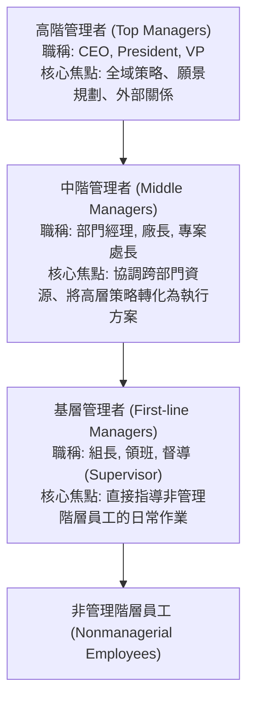
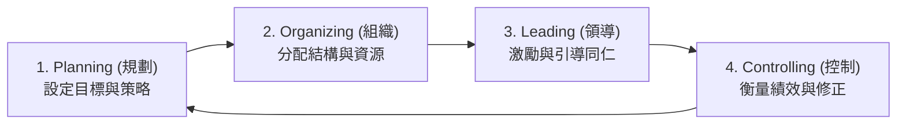

# Ch01 管理者與管理思維 (Managers and Management)

> [!NOTE] 課程資訊與學習目標
> - **授課教師**：陳振東
> - **核心目標**：理解管理者的定義與分層架構、修正錯字掌握效率（Efficiency）與效能（Effectiveness）之本質差異、熟練四大管理功能（POLC）、掌握 Mintzberg 十大管理者角色與 Katz 三大管理技能。

---

## 1. 誰是管理者？ (Who Are Managers?)

- **管理者的經典定義**：
  > *"Individuals in organizations who direct and oversee the activities of others."*
  > 組織中**指導（Direct）**並**監督（Oversee）**他人活動，以協同達成組織整體目標的人員。

### 管理階層分類架構：



- **專案領導者 (Team Leaders / Project Managers)**：現代敏捷與專案型組織常見的新型角色，負責跨部門任務型團隊的溝通協調與進度排除。

---

## 2. 效率 (Efficiency) vs. 效能 (Effectiveness)

> [!IMPORTANT] 管理學最核心的兩大支柱（修正拼寫：Effective！）

| 比較維度 | 效率 (Efficiency) | 效能 (Effectiveness) |
|:---|:---|:---|
| **核心定義** | **「把事情做對」 (Doing things right)** | **「做對的事情」 (Doing the right things)** |
| **關注導向** | **手段導向 (Means)** | **目標與結果導向 (Ends)** |
| **衡量指標** | 資源利用率、成本控制、產出投入比（極小化浪費） | 組織目標達成率、顧客滿意度、市場地位 |
| **日常隱喻** | 用最快的速度與最少的油耗爬梯子 | 確認梯子是否架在正確的牆面上！ |

### 效率與效能四象限矩陣：

```
           高效能 (High Effectiveness)
                   ^
    高效率但做對事   |   目標正確且浪費極少
    [最佳營運狀態]  |   【組織長青之道】
<-------------------+-------------------> 高效率 (High Efficiency)
    目標錯誤且浪費極多 |   浪費極少但做錯事
    [最快破產退場]  |   [徒勞無功]
                   v
           低效能 (Low Effectiveness)
```

---

## 3. 四大管理功能 (Management Functions - POLC)



1. **Planning（規劃）**：確立組織願景與目標、擬定全盤策略以達成目標、發展階層式計畫協調各項活動。
2. **Organizing（組織）**：決定組織需要完成哪些任務、由誰來做、如何將任務分組、向誰報告以及決策權歸屬。
3. **Leading（領導）**：激勵部屬、指導他人活動、挑選最有效的溝通管道、化解團隊成員衝突。
4. **Controlling（控制）**：持續監控實際作業績效、比對預先設定的標準、在發生偏差時採取矯正行動。

---

## 4. Mintzberg 十大管理者角色 (Managerial Roles)

加拿大管理大師 Henry Mintzberg 將管理者日常行為歸納為三大範疇、共十種角色：

1. **人際角色 (Interpersonal Roles)**：
   - **代表人物 (Figurehead)**：出席象徵性儀式、主持剪綵或簽署公文。
   - **領導者 (Leader)**：負責激勵與培育部屬。
   - **聯絡人 (Liaison)**：與外部利益相關者建立網絡關係。
2. **資訊角色 (Informational Roles)**：
   - **監視者 (Monitor)**：尋求並接收外部與內部各類市場情報。
   - **傳播者 (Disseminator)**：將關鍵情報轉達給組織內部其他成員。
   - **發言人 (Spokesperson)**：向組織外部發表官方聲明與政策。
3. **決策角色 (Decisional Roles)**：
   - **企業家 (Entrepreneur)**：主動尋求組織變革機會，發起新專案。
   - **危機處理者 (Disturbance Handler)**：應對非預期的危機與勞資爭議。
   - **資源分配者 (Resource Allocator)**：決定預算、人力與時間分配。
   - **談判者 (Negotiator)**：代表組織參與重大商業或合約協商。

---

## 5. Robert Katz 三大管理技能 (Management Skills)

- **技術技能 (Technical Skills)**：特定專業領域的知識與熟練度（**基層管理者最關鍵**）。
- **人際技能 (Human Skills)**：與他人和諧共處、溝通協作與激勵的能力（**所有管理階層皆同等重要！**）。
- **概念技能 (Conceptual Skills)**：將複雜抽象情境抽象化、看清全局架構與跨組織因果關係的能力（**高階管理者最不可或缺**）。

---

## 📌 隨堂註記 / 老師口述補充

> [!NOTE] 隨堂筆記區
> - 上課即時補充重點區。
