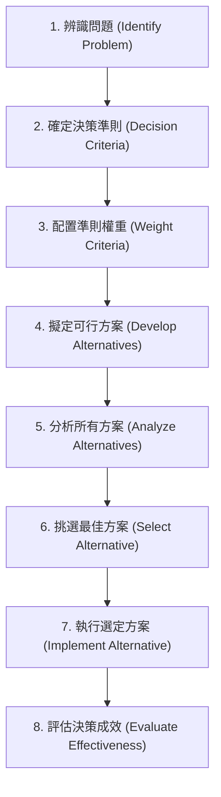

# Ch02 決策制定與決策情境 (Decision Making) - 初步筆記

> [!NOTE] 課程資訊與學習目標
> - **授課進度**：第 2~3 週課程
> - **核心目標**：掌握決策制定 8 大步驟、理解理性決策與有限理性（Bounded Rationality）之差異、分析三大決策情境（確定性、風險、不確定性）、認識常見決策偏誤。

---

## 1. 決策制定 8 大步驟流程

---

## 2. 三大決策觀點

1. **理性決策 (Rationality)**：
   - 假設決策者完全客觀且具備完全資訊，無個人偏好，追求組織利益最大化。
2. **有限理性 (Bounded Rationality & Satisficing)**：
   - 現實中人類的資訊處理能力有限。
   - 決策者不會窮盡所有可能尋求「最佳解」，而是挑選**「滿意解（Satisficing）」**（足夠好即可）。
3. **直覺決策 (Intuition)**：
   - 奠基於過往經驗、感受與累積判斷的潛意識決策。

---

## 3. 決策情境分析

- **確定性情境 (Certainty)**：所有可能結果與代價皆 100% 確定。
- **風險情境 (Risk)**：雖無法保證結果，但能評估各種結果出現的**客觀機率**（以預期值 Expected Value 輔助決策）。
- **不確定性情境 (Uncertainty)**：連機率分佈都完全未知。
  - **MaxiMax (樂觀準則)**：大中取大（追求最高報酬）。
  - **MaxiMin (悲觀準則)**：小中取大（在最壞情況中選傷害最小者）。
  - **MiniMax (悔恨準則)**：極小化最大遺憾。

---

## 📌 隨堂註記 / 老師口述補充

> [!NOTE] 隨堂筆記區
> - 上課即時補充重點區。
