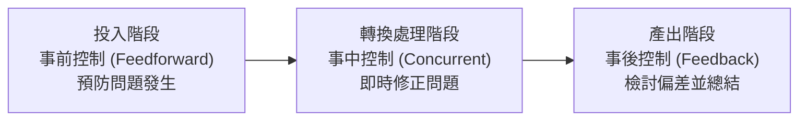

# 👔 管理學 Ch08: 管理控制系統與績效衡量 (Managerial Control Systems)

> **授課教師**：陳振東 教授  
> **教材對齊**：Robbins & Coulter 16th Ed. Ch14/Ch18、進度大綱第 14～15 週  
> **核心主題**：控制三部曲 (衡量實際績效、對比標準、採取管理行動)、事前控制 (Feedforward) vs 事中控制 (Concurrent) vs 事後控制 (Feedback)、平衡計分卡 (Balanced Scorecard, BSC) 四大構面

---

## 1. 控制的三大類型 (Three Types of Control)



1. **事前控制 (Feedforward Control)**：在活動開始前執行，旨在**預防問題發生**（如原物料檢驗、嚴格面試徵才）。
2. **事中控制 (Concurrent Control)**：在活動進行當下同步執行，**即時監控修正**（如現場走動管理 MBWA、產線自動感測）。
3. **事後控制 (Feedback Control)**：在活動結束後執行，針對**產出結果進行評估**（如財務報表分析、期末顧客滿意度調查）。

---

## 2. 平衡計分卡 (Balanced Scorecard, BSC - Kaplan & Norton)

傳統績效衡量過度偏重短期財務指標，BSC 從四大相互平衡的構面綜合評估企業健康度：
1. **財務構面 (Financial)**：「為了股東權益，我們應呈現何種財務成果？」
2. **顧客構面 (Customer)**：「為了實現願景，我們應如何對待顧客？」
3. **內部流程構面 (Internal Business Processes)**：「為了滿足顧客與股東，我們哪些流程必須做到世界頂尖？」
4. **學習與成長構面 (Learning and Growth)**：「為了達成目標，我們的員工與系統如何持續精進與創新？」

---

## 🎯 課堂速記與期末考檢核重點

```markdown
<!-- 上課重點即時填寫區 -->
> [!note] 課堂速記 (隨堂記錄陳老師補充)
> - 
```
