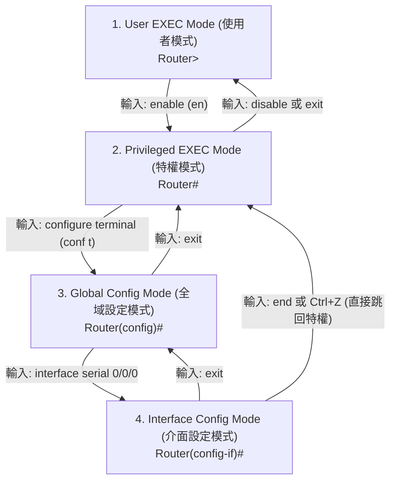

# W01 Cisco CLI 操作模式與常用指令 (Cisco IOS Navigation & Essentials)

> [!NOTE] 課程資訊與學習目標
> - **授課教師**：張朝旭
> - **核心目標**：熟練掌握 Cisco IOS 三大操作模式切換階層、掌握手寫筆記重點「中斷 DNS 卡死快捷鍵」與「保存配置至 NVRAM」、熟悉路由器主機名稱與密碼加密設定。

---

## 1. Cisco IOS 三大操作模式階層



| 模式名稱 | 提示符號 (Prompt) | 進入指令 | 權限範圍與主要操作 |
|:---|:---|:---|:---|
| **使用者模式 (User EXEC)** | `Router>` | 登入後的預設模式 | 僅能進行基礎檢視與 Ping 測試，無法修改設定 |
| **特權模式 (Privileged EXEC)** | `Router#` | `enable`（簡寫 `en`） | 檢視完整除錯與執行組態（`show run`）、重啟路由器、備份 |
| **全域設定模式 (Global Config)** | `Router(config)#` | `configure terminal`（簡寫 `conf t`） | 修改整台設備的全局參數（Hostname、路由協定、密碼） |
| **介面設定模式 (Interface Config)** | `Router(config-if)#` | `interface <名稱>`（如 `int fa0/0`） | 設定特定通訊埠的 IP 位址、時脈頻率、子網路遮罩與啟用 |

---

## 2. 課堂手寫筆記救命必殺技 (必考除錯技巧)

> [!TIP] 手寫稿核心重點整理（★）
> 1. **輸入錯誤導致卡死之強制中斷**：
>    - 在特權模式下若不小心打錯單字，路由器會誤以為該單字是網域名稱，進而發送廣播尋找 DNS 伺服器，導致終端畫面**卡死 1~2 分鐘**！
>    - **救命強制中斷快捷鍵**：按下 **`Ctrl + Shift + 6`**（手寫特別圈註）！
> 2. **一勞永逸法（關閉網域名稱查詢）**：
>    ```cisco
>    Router(config)# no ip domain-lookup
>    ```
>    *強烈建議進入 Packet Tracer 或實體機後，第一件事就是下此指令！*
> 3. **關閉電源不流失的儲存指令**：
>    - 正在執行的設定存放於揮發性記憶體（RAM, Running-config）。
>    - 若未儲存直接關閉電源，重開機後設定全數歸零！
>    - **保存設定至非揮發性記憶體 (NVRAM)**：
>      ```cisco
>      Router# copy running-config startup-config  ! 簡寫: copy run st
>      ! 或直接輸入簡寫:
>      Router# write
>      ```
> 4. **檢視路由表捷徑**：
>    ```cisco
>    Router# show ip route   ! 簡寫: sh ip ro
>    ```

---

## 3. 設備基礎安全性配置範本

```cisco
Router> enable
Router# configure terminal
Router(config)# no ip domain-lookup             ! 關閉 DNS 查詢卡死

! 1. 設定設備主機名稱
Router(config)# hostname R1-Gateway

! 2. 設定特權加密密碼 (採用 MD5 雜湊加密，等級最高)
R1-Gateway(config)# enable secret Cisco123!

! 3. 設定主控台 (Console) 連線密碼
R1-Gateway(config)# line console 0
R1-Gateway(config-line)# password ConsolePass123
R1-Gateway(config-line)# login
R1-Gateway(config-line)# exit

! 4. 將設定檔中所有明文密碼進行全面雜湊加密
R1-Gateway(config)# service password-encryption

! 5. 立即保存至 NVRAM
R1-Gateway(config)# end
R1-Gateway# copy run st
```

---

## 📎 課堂手寫原稿對照

> [!NOTE] 手寫講義原稿存檔
> 課堂第一週手寫筆記重點 PDF 已收錄於 `assets/`：
> `assets/CCNA.pdf`

---

## 📌 隨堂註記 / 老師口述補充

> [!NOTE] 隨堂筆記區
> - 上課即時補充重點區。
