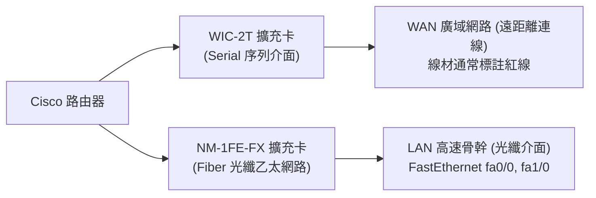

# W02 光纖與序列介面設定實作 (Fiber and Serial Interfaces Setup)

> [!NOTE] 課程資訊與學習目標
> - **授課進度**：第 2 週課程
> - **核心目標**：熟練區分 WAN（Serial）與 LAN（Ethernet/Fiber）硬體模組、精通 DCE（時脈提供端）與 DTE 之判斷與設定、熟記介面啟用與清除 IP 指令、解讀 Ping 測試符號。

---

## 1. 介面硬體擴充模組選用 (手寫筆記重點)

路由器出廠通常僅具備乙太網路介面，建構 WAN 廣域網路連線時，需於背板插槽擴充模組：



- **序列模組 (WIC-2T)**：提供高速序列通訊埠（如 `Serial 0/0/0`、`Serial 0/0/1`），專門用於連接 ISP 或跨縣市 WAN 專線。
- **光纖模組 (NM-1FE-FX)**：提供 100Mbps 單模/多模光纖乙太網路介面。

---

## 2. 序列介面核心觀念：DCE vs. DTE

> [!IMPORTANT] 序列連線兩端的關鍵差異
> 序列纜線兩端具有物理方向性：
> - **DCE (Data Communications Equipment, 資料通訊設備)**：
>   - 代表 ISP 數據機端或電信端。
>   - **必須提供時脈同步訊號（Clock Rate）**！若未下時脈指令，介面 Line Protocol 永遠無法達到 `UP`。
> - **DTE (Data Terminal Equipment, 資料終端設備)**：
>   - 代表客戶端路由器。
>   - 被動接收 DCE 傳來的時脈訊號，**絕不可手動設定 clock rate**。

### 如何判斷介面是 DCE 還是 DTE？
在特權模式下使用以下指令（支援 Tab 補齊）：
```cisco
Router# show controllers serial 0/0/0   ! 簡寫: sh con s 0/0/0
```
- 若畫面出現 `DCE V.35, clock rate 9600`，表示此端為 DCE，必須設定 clock rate。
- 若畫面出現 `DTE V.35`，表示此端為 DTE。

---

## 3. 介面設定標準作業程序 (SOP)

### (1) 序列介面（DCE 端實作）

```cisco
Router# configure terminal
Router(config)# interface serial 0/0/0       ! 進入介面
Router(config-if)# ip address 10.0.0.1 255.255.255.252  ! 設定 /30 介面 IP
Router(config-if)# encapsulation ppp         ! 封裝協定設為 PPP
Router(config-if)# clock rate 9600           ! DCE 端必須設定時脈 (或 64000)
Router(config-if)# no shutdown               ! 喚醒啟用 Port (預設為 Administratively Down)
Router(config-if)# exit
```

### (2) 光纖乙太網路介面（NM-1FE-FX）
光纖介面屬於乙太網路家族，不需設定時脈與特定 WAN 封裝：

```cisco
Router(config)# interface fastethernet 1/0
Router(config-if)# ip address 192.168.1.254 255.255.255.0
Router(config-if)# no shutdown
```

---

## 4. 實戰檢驗與除錯指令備忘

1. **檢視所有介面簡短狀態**：
   ```cisco
   Router# show ip interface brief
   ```
   - 確保 `Status` 為 **up** 且 `Protocol` 為 **up**（俗稱雙 UP，代表實體層與資料鏈結層皆正常）。
2. **介面 IP 設錯清除法（手寫筆記提示）**：
   ```cisco
   Router(config)# interface fastethernet 0/0
   Router(config-if)# no ip address             ! 移除既有 IP，重置介面
   ```
3. **連通測試 Ping 符號解讀**：
   ```cisco
   Router# ping 10.0.0.2
   ```
   - `!`（驚嘆號）：成功收到回應（Echo Reply）。
   - `.`（句號）：連線逾時（Request Timed Out，可能是路由未通或被阻擋）。
   - `U`：目的端無法到達（Destination Unreachable）。

---

## 📌 隨堂註記 / 老師口述補充

> [!NOTE] 隨堂筆記區
> - 上課即時補充重點區。
