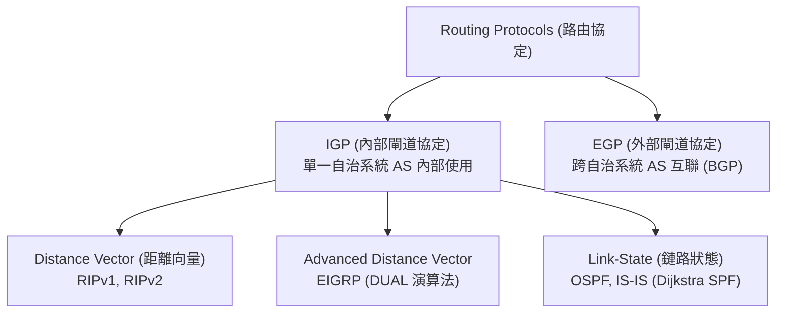

# W04 動態路由協定概論 (Dynamic Routing Protocols Overview) - 初步筆記

> [!NOTE] 課程資訊與學習目標
> - **授課進度**：第 4~5 週課程
> - **核心目標**：理解自治系統（AS）與 IGP/EGP 分類、掌握距離向量（Distance Vector）與鏈路狀態（Link-State）之本質差異、熟記各路由協定之管理距離（AD）優先序。

---

## 1. 路由協定階層分類

---

## 2. 距離向量 vs. 鏈路狀態核心對比

| 評估維度 | 距離向量 (Distance Vector) | 鏈路狀態 (Link-State) |
|:---|:---|:---|
| **基本思維** | **傳聞路由 (Routing by Rumor)**，僅依賴鄰居通告 | 掌握**全網拓撲地圖 (LSDB)**，自行計算最佳路徑 |
| **通告內容** | 週期性發布整張路由表 | 僅在網路異動時發送增量 LSA（觸發更新） |
| **演算法** | Bellman-Ford 演算法 | Dijkstra 最短路徑優先（SPF）演算法 |
| **收斂速度** | 較慢，易產生暫態迴圈 | **極快**，無迴圈隱患 |
| **硬體資源消耗**| 極低 CPU 與記憶體開銷 | 較高（需維護全域拓撲樹與龐大 LSDB） |
| **典型代表** | **RIPv1, RIPv2** | **OSPF, IS-IS** |

---

## 3. 管理距離 (Administrative Distance, AD) 優先序表

> [!IMPORTANT] 必考數值對照表（決定不同協定同時存在時由誰勝出）
> AD 數值越小，代表該路由來源**越值得信任**：

| 路由來源代碼 | 路由協定類型 | 預設管理距離 (AD) |
|:---:|:---|:---:|
| `C` | Directly Connected (直連介面) | **0** |
| `S` | Static Route (靜態路由) | **1** |
| `D` | EIGRP Summary Route (彙總路由) | **5** |
| `B` | External BGP (eBGP) | **20** |
| `D` | EIGRP Internal (內部 EIGRP) | **90** |
| `O` | OSPF | **110** |
| `R` | RIP (v1 / v2) | **120** |
| `D EX` | EIGRP External (外部重分配) | **170** |
| `B` | Internal BGP (iBGP) | **200** |

---

## 📌 隨堂註記 / 老師口述補充

> [!NOTE] 隨堂筆記區
> - 上課即時補充重點區。
