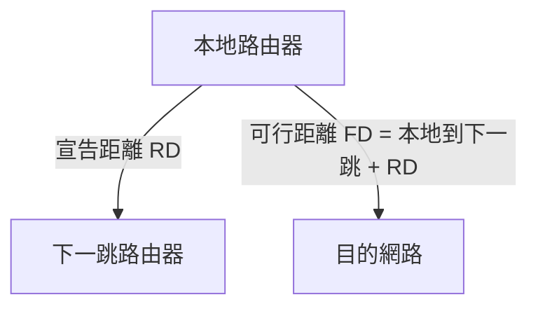

# W07 EIGRP 繞送協定與 DUAL 演算法 (EIGRP and DUAL Algorithm) - 初步筆記

> [!NOTE] 課程資訊與學習目標
> - **授課進度**：第 13~14 週課程
> - **核心目標**：理解 EIGRP 複合度量值公式、精通 DUAL 擴散更新演算法之核心名詞、掌握可行性條件（Feasibility Condition: $RD < FD$）、理解不等成本負載平衡。

---

## 1. EIGRP 核心特色

- **進階距離向量 (Advanced Distance Vector)**：結合鏈路狀態的快速收斂與距離向量的低資源開銷。
- **無迴圈備援**：透過 DUAL 演算法，預先在路由表中備妥**備援路徑（Feasible Successor）**，主線路斷線時可於**數毫秒內瞬間切換**，無須重新運算！
- **度量值計算要素**：預設主要考量路徑上的**最小頻寬 (Bandwidth)** 與**累積延遲 (Delay)**。

---

## 2. DUAL 演算法四大核心名詞

1. **宣告距離 (Reported Distance / Advertised Distance, RD / AD)**：
   - 下一跳鄰居路由器通告它自己到達目的網路的度量值距離。
2. **可行距離 (Feasible Distance, FD)**：
   - 本地路由器到達目的網路的當前**最佳總度量值距離**。
3. **最佳路徑 (Successor)**：
   - 具備最小 FD 的下一跳路由器（這條路徑會直接被安裝進路由表）。
4. **可行備援路徑 (Feasible Successor, FS)**：
   - 備援的下一跳路由器，隨時可無縫接替。

> [!IMPORTANT] 可行性條件 (Feasibility Condition, FC - 必考證明題)
> 一個備援鄰居要成為合格的 Feasible Successor，其通告的宣告距離（RD）必須**嚴格小於**當前 Successor 的可行距離（FD）：
> $$\text{RD}_{\text{Candidate}} < \text{FD}_{\text{Current Successor}}$$
> *本質邏輯：保證備援鄰居到達目的地的距離比我自己的最佳距離還要短，因此該鄰居絕對不可能再把封包繞回給我，徹底杜絕路由迴圈！*

---

## 📌 隨堂註記 / 老師口述補充

> [!NOTE] 隨堂筆記區
> - 上課即時補充重點區。
