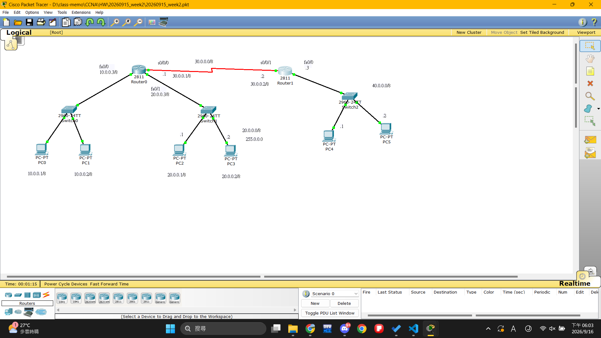
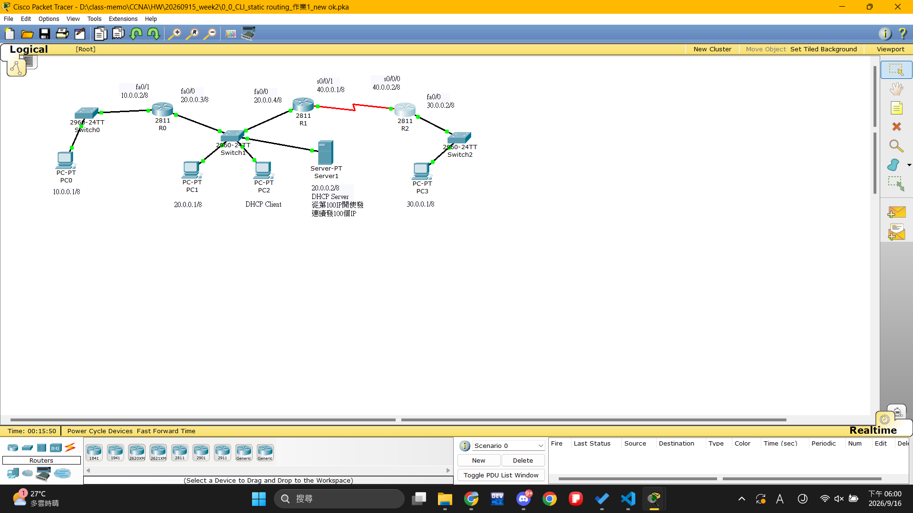

# 第 2 週：serial。fiber

- 日期：2056-10-8
- 單元：第 02 週
- Packet Tracer 檔案：`week-02-topic.pkt`
- 作業目標：使用CLI指令令網路互連

## 一、作業需求與拓撲規劃


## 二、實作截圖

> 將圖片存放於與本筆記同名的資料夾，例如 `images/week-XX/`。

### 作業結果
- 作業1.



- 作業2.



## 三、CLI 指令紀錄


### serial/Routr 如何加上IP


- DCE(資料電路中終端設備)

    - 需要設定脈衝(本課程統一設定9600)脈衝越強，資料傳輸速度越快

    - 須設定通訊協定(PPP)
- DTE(資料終端設備)
    - 和普通ROUTER設定步驟相同
    - 但也須設定通訊協定(PPP)

```cisco
en //進入特權模式(#)

# copy running-config //若要關閉電源務必先儲存，否則roter需重新設定
其實等同於wr

# sh con+Tab s0/0/0 //可查詢該端口是否為DCE(DCE端需設定協定與同步訊號)
(sh controllers s0/0/0 )
sh ip interface br 看到的比較多

# conf t//前往全域模式

```
#### seril - DCE端 
```cisco
Router(config)# int s0/0/0 
Router(config-if)#ip add 30.0.0.1 255.0.0.0 
Router(config-if)#enc
Router(config-if)#encapsulation ppp
Router(config-if)#clo ra 9600
Router(config-if)#no shut
%LINK-5-CHANGED: Interface Serial0/0/0, changed state to down
```


#### seril - DTE端 

```cisco

Router(config)#int s0/0/1
Router(config-if)#ip add 30.0.0.2 255.0.0.0 
Router(config-if)#no shut
Router(config-if)#encapsulation ppp//記得一定要DTE/DCE都要，不然會自動關閉port且模擬畫面還是會亮綠燈(找這個錯花了我好記個小時)
%LINK-5-CHANGED: Interface Serial0/0/1, changed state to up

```
### 給路由加上靜態路線(手動)
```
Router#sh ip ro //檢查缺乏的路徑
Codes: C - connected, S - static, I - IGRP, R - RIP, M - mobile, B - BGP
       D - EIGRP, EX - EIGRP external, O - OSPF, IA - OSPF inter area
       N1 - OSPF NSSA external type 1, N2 - OSPF NSSA external type 2
       E1 - OSPF external type 1, E2 - OSPF external type 2, E - EGP
       i - IS-IS, L1 - IS-IS level-1, L2 - IS-IS level-2, ia - IS-IS inter area
       * - candidate default, U - per-user static route, o - ODR
       P - periodic downloaded static route

Gateway of last resort is not set

C    10.0.0.0/8 is directly connected, FastEthernet0/0
C    20.0.0.0/8 is directly connected, FastEthernet0/1
Router#conf t //全域模式
Enter configuration commands, one per line.  End with CNTL/Z.
Router(config)#ip ro 40.0.0.0 255.0.0.0 30.0.0.2 //手動加上靜態路線
```

>以此類推
>記得定期wr否則偶爾輸錯指令或不小心退出可能會沒存到前面的
，Ctrl + Shift + 6 可跳出網域查詢


## 四、具體操作步驟

1. 在 Cisco Packet Tracer 新增所需的路由器、交換器與終端設備。
2. 依網路拓撲使用正確線材連接設備與介面。
3. 按照 IP 位址規劃設定各裝置的介面位址與預設閘道。
4. 依本週作業需求輸入 CLI 設定指令。
5. 使用驗證指令、`ping` 或 `traceroute` 測試設定結果。


## 七、本週重點整理

- 記得兩邊一定要有相同協定

