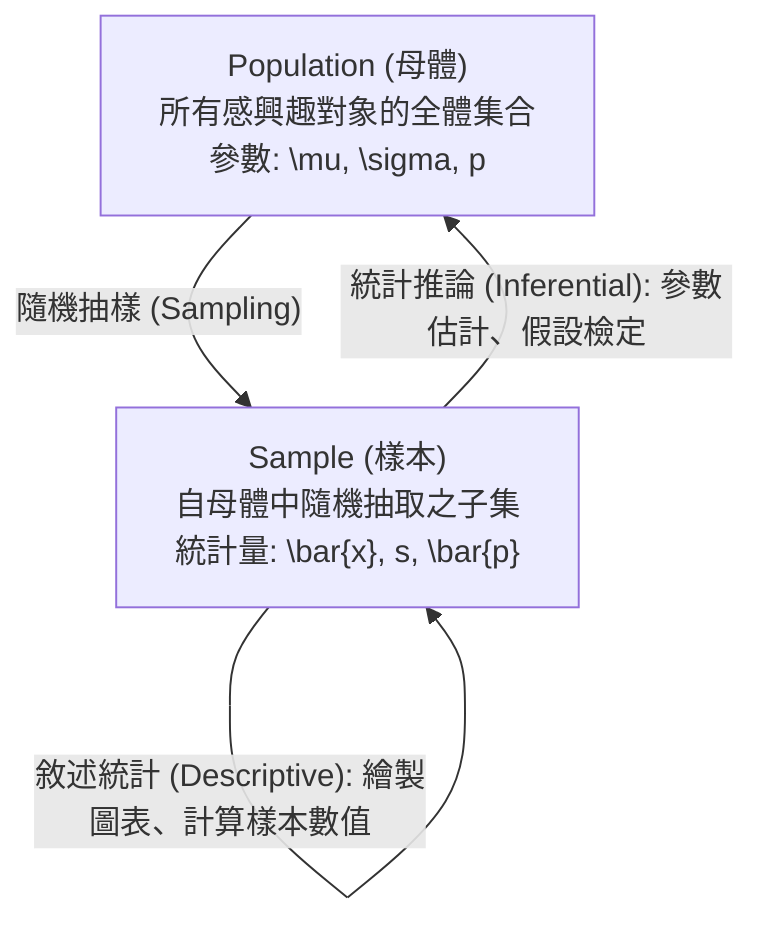

# Ch01 資料與統計導論 (Data and Statistics)

> [!NOTE] 課程資訊與學習目標
> - **授課教師**：張志信
> - **核心目標**：理解統計學在六大商業領域的應用、掌握資料集核心三要素（元素、變數、觀測值）之數量恆等關係、熟練四大測量尺度（名目、次序、區間、比例）之數學運算限制、辨析橫斷面資料與時間序列資料、掌握統計推論與大數據分析架構。

---

## 1. 統計學六大商業與生活應用領域

依據課堂手寫筆記架構，統計學深入各行各業決策核心：
1. **Accounting (會計)**：抽樣審計客戶應收帳款餘額與查核內部控制。
2. **Finance (財務)**：評估金融資產投資組合風險、計算股票 Beta 係數、預測投資報酬率。
3. **Information Systems (資訊系統)**：網路流量負載監控、伺服器效能分析、雲端資源排程。
4. **Production (生產與製造)**：六標準差品質管制（SPC）、產線良率監測、瑕疵率抽檢。
5. **Marketing (行銷)**：消費者滿意度調查、A/B 測試、市場區隔與廣告成效分析。
6. **Economics (經濟學)**：總體經濟指標預測（通膨率、失業率、GDP 成長趨勢）。

---

## 2. 資料集核心架構 (Data, Elements, Variables, Observations)

```
        Columns (直欄) -> Variables (變數: V1, V2, V3)
Rows    +--------------+-----------+-----------+-----------+
(橫列)  | 學生姓名(ID) | 身高 (cm) | 體重 (kg) | 血型      |
+-------+--------------+-----------+-----------+-----------+
Element | 小明 (E1)    | 170       | 65        | A         | <- Observation 1 (小明的所有數據)
Element | 小華 (E2)    | 160       | 50        | O         | <- Observation 2 (小華的所有數據)
Element | 小美 (E3)    | 165       | 52        | B         | <- Observation 3 (小美的所有數據)
+-------+--------------+-----------+-----------+-----------+
```

### (1) 核心名詞定義
- **Element（元素）**：資料蒐集的對象主體（表格中的每一橫列 Row，例如：學生、客戶、公司）。
- **Variable（變數）**：我們感興趣並進行測量的特定屬性或特徵（表格中的每一直欄 Column，例如：身高、體重、營收）。
- **Observation（觀測值）**：針對特定單一元素，蒐集其所有變數數值的完整集合。

> [!IMPORTANT] 必考數量恆等式（手寫筆記精華）
> 1. **$\text{元素數量 (Elements)} \equiv \text{觀測值數量 (Observations)}$**（$n$ 個元素必然對應 $n$ 個觀測值）。
> 2. **$\text{總資料格數 (Total Data Values)} = \text{元素數量} \times \text{變數數量}$**。
>    *例如上表：$3 \text{ 個元素} \times 3 \text{ 個變數} = 9 \text{ 個資料格數}$。*

---

## 3. 四大測量尺度 (Scales of Measurement)

> [!TIP] 期中考高頻觀念大題（對照手寫筆記系統梳理）
> 統計學依數據內涵與數學特性，將測量層次由低至高劃分為四大尺度：

| 測量尺度 | 資料類別 | 排序意義 | 數值差距意義 | 真實零點 (True Zero) | 允許之數學運算 | 經典代表範例 |
|:---|:---|:---:|:---:|:---:|:---|:---|
| **名目尺度<br>(Nominal)** | 類別資料<br>(Categorical) | 無 | 無 | 無 | 計數、計算次數與百分比 (不可加減乘除) | 身份證字號、血型、郵遞區號、性別、車輛品牌 |
| **次序尺度<br>(Ordinal)** | 類別資料<br>(Categorical) | **有** | 無 (差距無固定單位) | 無 | 排序、大於/小於比較、中位數、百分位數 | 滿意度問卷 (滿意/普通/不滿意)、名次 (前三名)、信用評等 |
| **區間尺度<br>(Interval)** | 數量資料<br>(Quantitative) | **有** | **有** (具固定測量單位) | **無** (沒有絕對零點，0 只是一個代號) | **可加、減**<br>(**不可乘、除！**) | **攝氏/華氏溫度** ($20^\circ\text{C}$ 不等於 $10^\circ\text{C}$ 的 2 倍熱)、年份 (西元 2026 年) |
| **比例尺度<br>(Ratio)** | 數量資料<br>(Quantitative) | **有** | **有** (具固定測量單位) | **有** (0 代表完全不存在) | **可加、減、乘、除** (乘除比率有物理意義) | 身高、體重、年齡、營業額、距離、價格 ($100 元是 $50 元的 2 倍) |

### 數量資料的進一步二分：
- **離散型 (Discrete)**：以計數方式產生，數值通常為整數且有限或可數無限（例如：家庭人口數、瑕疵品個數）。
- **連續型 (Continuous)**：在特定連續區間內可取任意無限多個數值，通常由儀器測量產生（例如：時間、重量、體積）。

---

## 4. 資料形態與蒐集來源

### (1) 橫斷面資料 vs. 時間序列資料
- **Cross-Sectional Data（橫斷面資料）**：在**同一個特定時間點**，蒐集**多個不同對象**的資料（例如：2026 年台灣各縣市失業率比較）。
- **Time Series Data（時間序列資料）**：在**多個連續的時間點**，蒐集**同一對象**的資料，著重歷史趨勢與週期波動（例如：台灣近 10 年來的每月失業率走勢）。

### (2) 資料來源三途徑
1. **現有來源 (Existing Sources)**：公部門開放資料（政府開放平台）、公司內部 ERP/CRM 資料庫、彭博（Bloomberg）金融終端。
2. **觀察性研究 (Observational Study)**：不人為介入或干擾研究對象，僅客觀觀察並記錄數據（例如：消費者在超商動線調查）。
3. **實驗研究 (Experiment)**：研究者主動操縱自變數（處理組 vs 對照組），以確立因果關係（例如：新藥臨床雙盲試驗、新網頁介面 A/B 測試）。

---

## 5. 統計學兩大範疇與現代數據分析



### (1) 敘述統計 vs. 統計推論
- **Descriptive Statistics（敘述統計）**：將蒐集到的樣本資料透過表格、圖形或數值量數進行彙整與呈現，使其易於理解。
- **Statistical Inference（統計推論）**：利用樣本所提供的資訊，對未知的**母體特徵（母體參數）進行估計（Estimation）或假設檢定（Hypothesis Testing）**。

### (2) Analytics 與 Analysis 的現代意涵剖析
- **Analysis（傳統數據分析）**：著重事後分析（Hindsight），針對歷史資料探討「**過去發生了什麼？（What happened?）**」與「**為什麼會發生？（Why did it happen?）**」，主要仰賴敘述統計。
- **Analytics（現代商業數據分析）**：宏觀大數據架構，將數據轉化為深度見解（Insight），進一步預測未來（Predictive）並提供最佳決策指引（Prescriptive），核心立足於統計推論與機器學習模型。

---

## 📎 課堂手寫原稿對照

> [!NOTE] 手寫講義原稿存檔
> 課堂第一週手寫筆記重點 PDF 已收錄於 `assets/`：
> `assets/統計_260920_142008.pdf`

---

## 📌 隨堂註記 / 老師口述補充

> [!NOTE] 隨堂筆記區
> - 上課即時補充重點區。
