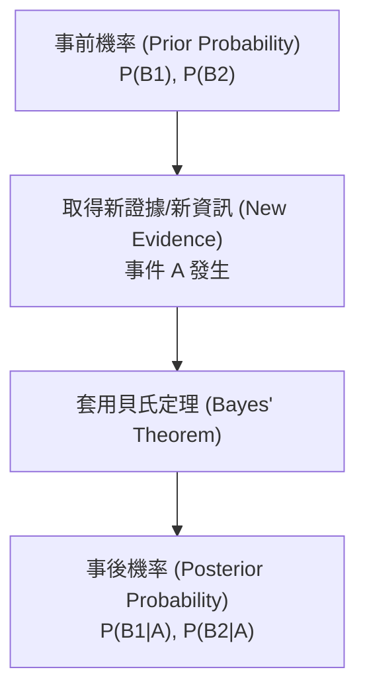

# Ch04 機率論與貝氏定理 (Introduction to Probability) - 初步筆記

> [!NOTE] 課程資訊與學習目標
> - **授課進度**：第 5 週課程
> - **核心目標**：掌握隨機試驗與樣本空間、精通加法法則、條件機率、事件獨立性判定，熟練運用全機率定理與貝氏定理（Bayes' Theorem）進行逆向機率更新。

---

## 1. 機率基礎概念

1. **隨機試驗 (Random Experiment)**：結果無法精確預測，但所有可能結果集合已知的試驗過程。
2. **樣本空間 (Sample Space, $S$)**：隨機試驗所有可能結果的集合。
3. **事件 (Event)**：樣本空間的子集合。
4. **計數法則**：
   - 多步驟計數：$n_1 \times n_2 \times \dots \times n_k$
   - 排列數 (Permutations)：$P_r^n = \frac{n!}{(n-r)!}$
   - 組合數 (Combinations)：$C_r^n = \binom{n}{r} = \frac{n!}{r!(n-r)!}$

---

## 2. 機率核心運算法則

1. **餘事件法則**：$P(A^c) = 1 - P(A)$
2. **加法法則 (Addition Law)**：
   $$P(A \cup B) = P(A) + P(B) - P(A \cap B)$$
   若 $A$ 與 $B$ 為**互斥事件（Mutually Exclusive, $A \cap B = \emptyset$）**，則 $P(A \cup B) = P(A) + P(B)$。
3. **條件機率 (Conditional Probability)**：
   已知事件 $B$ 發生的條件下，事件 $A$ 發生的機率：
   $$P(A|B) = \frac{P(A \cap B)}{P(B)}, \quad (P(B) > 0)$$
4. **乘法法則**：$P(A \cap B) = P(B) \cdot P(A|B) = P(A) \cdot P(B|A)$。
5. **獨立事件判定 (Independence)**：
   若且唯若滿足以下任一條件，$A$ 與 $B$ 互為獨立事件：
   - $P(A|B) = P(A)$
   - $P(B|A) = P(B)$
   - **$P(A \cap B) = P(A) \cdot P(B)$**

---

## 3. 全機率定理與貝氏定理 (Bayes' Theorem)

### (1) 全機率定理 (Law of Total Probability)
設 $B_1, B_2, \dots, B_k$ 為樣本空間 $S$ 的一組分割（互斥且聯集為 $S$），則對任意事件 $A$：
$$P(A) = \sum_{i=1}^k P(B_i) \cdot P(A|B_i)$$

### (2) 貝氏定理計算公式 (Bayes' Formula)
$$P(B_j | A) = \frac{P(B_j) \cdot P(A|B_j)}{\sum_{i=1}^k P(B_i) \cdot P(A|B_i)}$$

> [!EXAMPLE] 經典醫療篩檢偽陽性問題
> 設某罕見疾病盛行率 $P(D) = 0.001$（健康者 $P(D^c) = 0.999$）。
> 篩檢陽性準確率（敏感度）$P(+|D) = 0.99$；偽陽性率 $P(+|D^c) = 0.02$。
> 某人篩檢呈現陽性，求其真正罹病的機率：
> $$P(D|+) = \frac{P(D)P(+|D)}{P(D)P(+|D) + P(D^c)P(+|D^c)} = \frac{0.001 \times 0.99}{0.001 \times 0.99 + 0.999 \times 0.02} \approx \frac{0.00099}{0.00099 + 0.01998} \approx 4.72\%$$
> *驚人結論：即使檢驗工具看似極準確，但因罕見疾病的事前機率極低，陽性確診者真正罹病的機率不到 5%！*

---

## 📌 隨堂註記 / 老師口述補充

> [!NOTE] 隨堂筆記區
> - 上課即時補充重點區。
