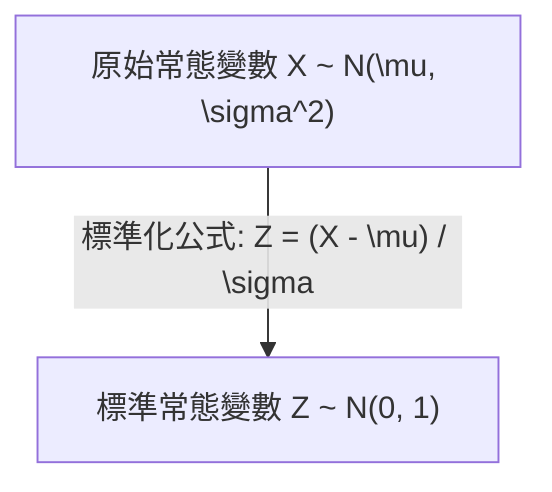

# Ch06 連續型機率分配與常態分配 (Continuous Probability Distributions) - 初步筆記

> [!NOTE] 課程資訊與學習目標
> - **授課進度**：第 10~11 週課程
> - **核心目標**：理解機率密度函數（PDF）面積意涵、熟練均勻分配、精通常態分配與標準常態分配（Z 轉換與查表法）、掌握指數分配與無記憶性。

---

## 1. 連續型隨機變數基本概念

- **機率密度函數 (Probability Density Function, PDF $f(x)$)**：
  - $f(x) \ge 0$
  - 曲線下總面積為 1：$\int_{-\infty}^{\infty} f(x) dx = 1$
- **機率等於面積**：$P(a \le X \le b) = \int_a^b f(x) dx$。
- **單點機率恆為零**：對任意常數 $c$，$P(X = c) = 0$。因此 $P(a \le X \le b) = P(a < X < b)$。

---

## 2. 常態分配 (Normal Distribution)

自然界與商業統計中最重要的對稱鐘形曲線，$X \sim N(\mu, \sigma^2)$：

### (1) 標準化公式 (Z-Transformation)
$$Z = \frac{X - \mu}{\sigma}$$
將任意平均數 $\mu$、標準差 $\sigma$ 的常態分配，統一轉換為平均數為 0、標準差為 1 的**標準常態分配 $Z \sim N(0, 1)$**。

### (2) 查表法關鍵原則
- 標準常態分配表通常給出累積機率 $\Phi(z) = P(Z \le z)$。
- **對稱性**：$P(Z \le -z) = P(Z \ge z) = 1 - P(Z \le z)$。
- **雙邊區間**：$P(a \le Z \le b) = P(Z \le b) - P(Z \le a)$。

---

## 3. 均勻分配與指數分配

1. **均勻機率分配 (Uniform Distribution)**：$f(x) = \frac{1}{b - a}$（$a \le x \le b$）。
   - 期望值 $E(X) = \frac{a + b}{2}$，變異數 $\text{Var}(X) = \frac{(b - a)^2}{12}$。
2. **指數機率分配 (Exponential Distribution)**：
   - 常用於描述設備壽命或服務等候時間。
   - $f(x) = \frac{1}{\mu} e^{-x/\mu}$（$x \ge 0$）。
   - 累積機率：$P(X \le x) = 1 - e^{-x/\mu}$。
   - **無記憶性 (Memoryless Property)**：$P(X > s + t \mid X > s) = P(X > t)$。

---

## 4. 對應 Excel 函數

- 常態累積機率：`=NORM.DIST(x, mean, standard_dev, TRUE)`
- 標準常態累積：`=NORM.S.DIST(z, TRUE)`
- 反查常態臨界值：`=NORM.INV(probability, mean, standard_dev)`
- 反查標準常態 Z 值：`=NORM.S.INV(probability)`

---

## 📌 隨堂註記 / 老師口述補充

> [!NOTE] 隨堂筆記區
> - 上課即時補充重點區。
